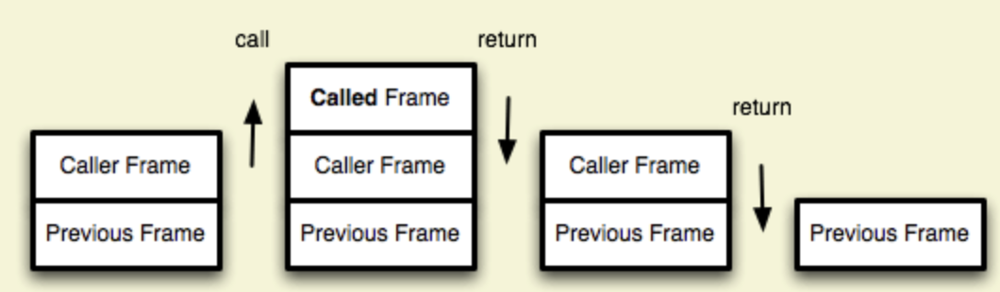

# 算法思想

## 递归

所有的递归问题都可以用递推公式来表示

### 递归需要满足的三个条件

- 一个问题的解可以分解为几个子问题的解

- 这个问题与分解之后的子问题，除了数据规模不同，求解思路完全一样

- 存在递归终止条件

### 递归框架

```js
const recursive = (level, x) => {
  // 结束条件
  if (endCondition) {
    return
  }

  // 当前层逻辑
  curLevelProcess()

  // 下一层逻辑
  recursive(level + 1)
}

```

### 尾递归调用

函数调用会在内存形成一个"调用记录"，又称"调用帧"（call frame），保存调用位置和内部变量等信息。



在递归中，如果尾调用自身，就称为尾递归。递归非常消耗内存，因为需要同时保存成千上百个调用记录，很容易发生"栈溢出"错误（stack overflow）。对于尾递归来说，由于只存在一个调用记录，所以永远不会发生"栈溢出"错误。

```js
function factorial(n) {
  if (n === 1) return 1;
  return n * factorial(n - 1);
}
```

上面代码是一个阶乘函数，计算n的阶乘，最多需要保存n个调用记录，复杂度 O(n) 。
如果改写成尾递归，只保留一个调用记录，复杂度 O(1) 。

```js
function factorial(n, total) {
  if (n === 1) return total;
  return factorial(n - 1, n * total);
}
```

## 贪心算法

取最大值，经典题目买 [卖股票的最佳时机](https://leetcode.cn/problems/best-time-to-buy-and-sell-stock-ii/description/)

```js
// 终点代码
let max = 0

max = Math.max(prev, cur)
```

## 双指针法

前后双指针，有时也叫快慢指针，通常可实现O(n)级别的时间复杂度。用处很多，不做示例

## 归并

归并排序，自下而上，经典题归并排序

## 分治

大问题化解为小问题

## 滑动窗口

用于寻找字符串中的某些特性的子字符串

经典题目

```js
function lengthOfLongestSubstring(s) {
  let rk = -1
  const n = s.length
  for(let i = 0; i < n; i++) {
    while(rk + 1 < n && condition()) {
      // 不断地移动右指针
      ++rk;
    }
  }
}
```

## 回溯

可以理解为回归树

```js
let res = []
function backtrack(path, condition, ...) {
  if (judge(condition)) { //满足条件
    res.push(path)
    return
  }
  for (let select of selectList) {
    if(condition) break;
    path.push(select);  // 走某条路
    backtrack(path, newSelectList);
    path.pop(); //返回上一个十字路口
  }
}
```

## 哈希缓存

利用额外空间，空间换时间，将O(n^2)转换为O(n)。示例题目

### 示例：[两数之和](https://leetcode-cn.com/problems/two-sum/)

``` javascript
var twoSum = function(nums, target) {
 const temp = {}
 for (var i = 0; i < nums.length; i++) {
  var diff = target - nums[i];
  if (temp[diff] != undefined) {
   return [temp[diff], i]
  }
  temp[nums[i]] = i
 }
};
```

### 示例：[公平的糖果交换](https://leetcode-cn.com/problems/fair-candy-swap/description/)

``` javascript
var fairCandySwap = function(A, B) {
 let sumA = 0
 let sumB = 0
 for (const item of A) {
  sumA += item
 }
 const set = new Set()
 for (const item of B) {
  sumB += item
  set.add(item)
 }
 const target = sumA - sumB
 for (const j of A) {
  const myMap = j - target/2
  if(set.has(myMap)){
   return [j, myMap]
  }
 }
};
```

## 运算符技巧

### 交换两个数

```js
// 常规
int tmp = x;
x = y;
y = tmp;

// 位运算
x = x ^ y   // （1）
y = x ^ y   // （2）
x = x ^ y   // （3）
```

### 判断奇偶数

```js
// 普通判断
if(n % 2 == 1) {
 // n 是个奇数。
}
// 位运算
if(n & 1 == 1){
  // n 是个奇数。
}
```

### ^= 异或

二进制对比，在两次对比以后会是原来的值

4 ^= 5

```js
100 //4
101 //5
001 //异或后得到
```

#### 示例：[只出现一次的数字](https://leetcode-cn.com/problems/single-number/)

``` javascript
let ans = 0
 for (const num of nums) {  
  ans ^= num;
 }
 return ans
```

### 移位>>和>>>

`>>>` 是无符号的
`>>` 是有符号的

#### 示例

通过寻找二分的中间点

```js
const mid = (start + end) >> 1
```

## 数组中的位置交换

i，j两个位置的交换

```js
function swap(i, j, arr) {
  if(i == j) {
    return
  }
  arr[i] = arr[i] + arr[j]
  arr[j] = arr[i] - arr[j]
  arr[i] = arr[i] - arr[j]
}
```
