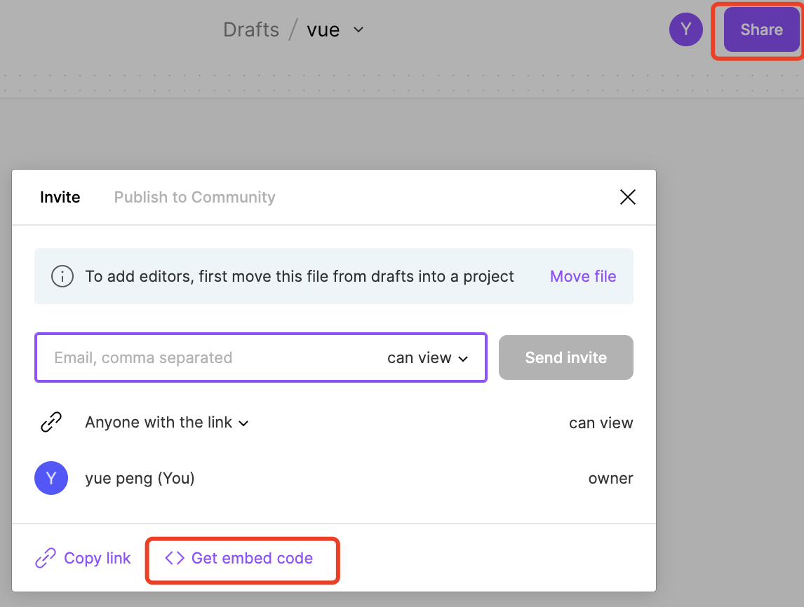
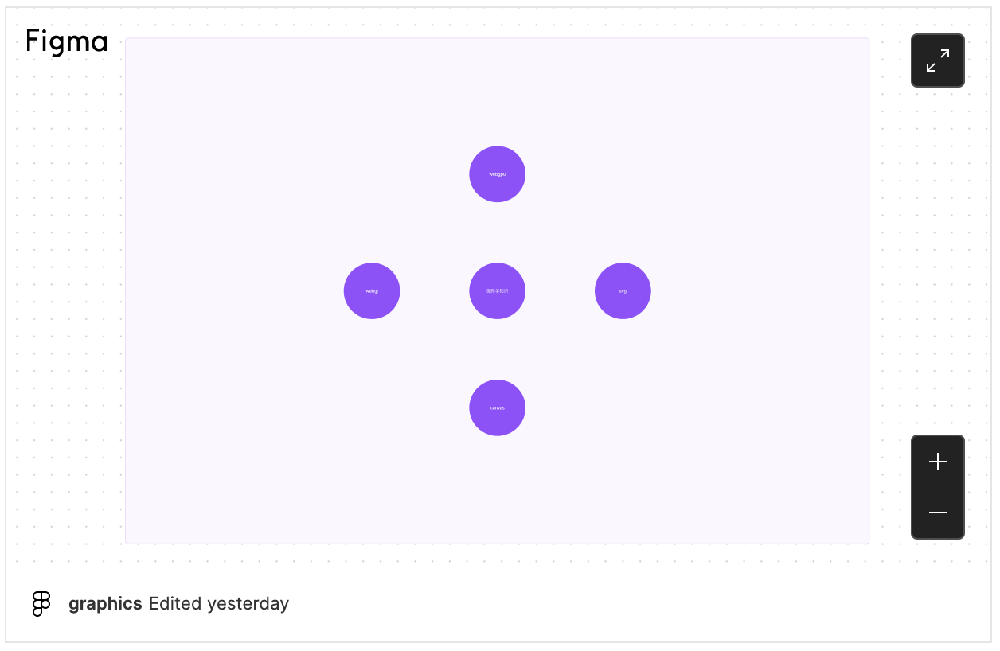

# Blog 翻新记录

浅记录一下 `blog` 翻新的过程。

## Why

- 第一点：自从用了 `vite` 以后实在是忍不了热更新的速度。基本上个人的所有技术栈都在往 `vite` 迁移。所以想把 `blog` 翻新一下, 强迫症。
- 第二点：之前的 `blog` 就是文档+图片，比较生硬，且都是学习记录。新的 `blog` 想做点新能力进来，另外就是把以前的学习内容再好好整理一下。
- 第三点：感觉 `vue` 的新官网挺好看的，想用 `@vue/theme` 折腾一下。

## How

- setup：新的 `blog` 决定了用 `vue` 新官网的配色，那就直接站在巨人的肩膀上吧，于是乎 `fork` 一份 [docs-zh-cn](https://github.com/vuejs-translations/docs-zh-cn)。这也是对于 `@vue/theme` 的最佳实践吧。
- 文件资源：迁移老站点的文档，这个时候遇到了一个问题，之前的图片全部都是放到 `gitee` 的图床，有一天突然全部挂了，那天腾讯云 `cos` 还专门做了一个活动来迁移。不过为了避免后面再发生这样的事情，还是直接把图片资源存在github吧。
- 部署：部署还是用[github-pages-deploy-action](https://github.com/JamesIves/github-pages-deploy-action) 这个很成熟的库，当然还有很多种免费的部署资源可以去看 [vite-static-deploy](https://vitejs.dev/guide/static-deploy.html)。

## Other

- figma: 脑图会迁移到 `figjam` 里面去，`figma` 的 `embed` 可以生成一个 `iframe`, 做一个 `figma-container` 组件后可以直接嵌入到文档里面来。体验会比之前的脑图截图好很多。之前画的脑图比较多，会慢慢去做迁移。

> 分享按钮

> 文档嵌入效果

- xmind: 是迄今为止很优秀的脑图软件了，对比百度脑图，腾讯文档等，体验确实好不少。但是在协同办公浪潮中，`xmind` 对在线协同编辑的能力支持确实不足，存在很多不方便的地方，且web版本的不支持对在线文件的打开预览，不符合个人需求。可以去体验 [web-xmind](https://xmind.works/#/)，可以存储文件到云盘里面，然后在 `web-xmind` 里面打开。缺点就是整个链路没有打通，没有类似 `figma embed` 这种东西。

## Summarize

总结下来，整个流程没有很大的难点，但是也花了一些时间在这上面，博客站点确实可以很快去搭建，还是想提升一下可玩性。个人把博客当作一个记录的载体，重要的还是坚持写点东西。另外还有 `alogia` 没有去弄，对面上的翻新只是一个起点，后面还有很多可玩儿的地方，之前的站点确实让自己没有欲望去更新和写东西，投入一些时间在新 `blog` 里面，让自己更有动力去做这件事情。
