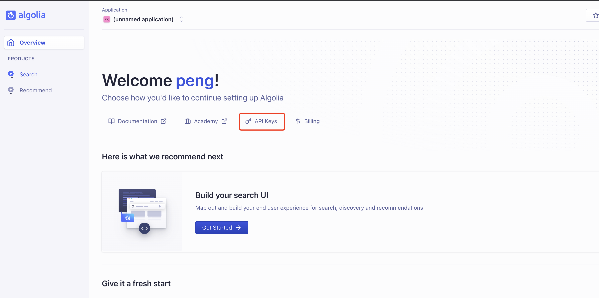
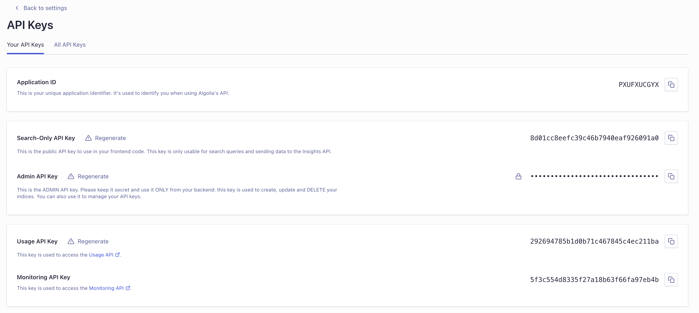
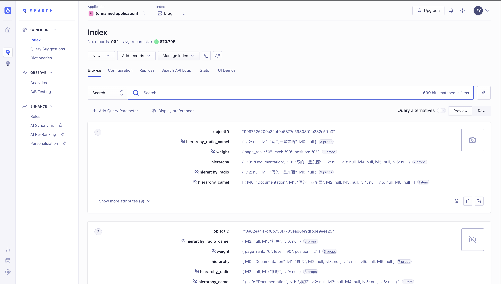

# Blog 翻新记录

浅记录一下 `blog` 翻新的过程。

## Why

- 第一点：自从用了 `vite` 以后实在是忍不了热更新的速度。基本上个人的所有技术栈都在往 `vite` 迁移。所以想把 `blog` 翻新一下, 强迫症。
- 第二点：之前的 `blog` 就是文档+图片，比较生硬，且都是学习记录。新的 `blog` 想做点新能力进来，另外就是把以前的学习内容再好好整理一下。
- 第三点：感觉 `vue` 的新官网挺好看的，想用 `@vue/theme` 折腾一下。

## How

- setup：新的 `blog` 决定了用 `vue` 新官网的配色，那就直接站在巨人的肩膀上吧，于是乎 `fork` 一份 [docs-zh-cn](https://github.com/vuejs-translations/docs-zh-cn)。这也是对于 `@vue/theme` 的最佳实践吧。
- 文件资源：迁移老站点的文档，这个时候遇到了一个问题，之前的图片全部都是放到 `gitee` 的图床，有一天突然全部挂了，那天腾讯云 `cos` 还专门做了一个活动来迁移。不过为了避免后面再发生这样的事情，还是直接把图片资源存在github吧。
- 部署：部署还是用[github-pages-deploy-action](https://github.com/JamesIves/github-pages-deploy-action) 这个很成熟的库，当然还有很多种免费的部署资源可以去看 [vite-static-deploy](https://vitejs.dev/guide/static-deploy.html)。

## Other

- figma: 脑图会迁移到 `figjam` 里面去，`figma` 的 `embed` 可以生成一个 `iframe`, 做一个 `figma-container` 组件后可以直接嵌入到文档里面来。体验会比之前的脑图截图好很多。之前画的脑图比较多，会慢慢去做迁移。

> 分享按钮


> 文档嵌入效果


- xmind: 是迄今为止很优秀的脑图软件了，对比百度脑图，腾讯文档等，体验确实好不少。但是在协同办公浪潮中，`xmind` 对在线协同编辑的能力支持确实不足，存在很多不方便的地方，且web版本的不支持对在线文件的打开预览，不符合个人需求。可以去体验 [web-xmind](https://xmind.works/#/)，可以存储文件到云盘里面，然后在 `web-xmind` 里面打开。缺点就是整个链路没有打通，没有类似 `figma embed` 这种东西。

## Summarize

总结下来，整个流程没有很大的难点，但是也花了一些时间在这上面，博客站点确实可以很快去搭建，还是想提升一下可玩性。个人把博客当作一个记录的载体，重要的还是坚持写点东西。另外还有 `algolia` 没有去弄，对面上的翻新只是一个起点，后面还有很多可玩儿的地方，之前的站点确实让自己没有欲望去更新和写东西，投入一些时间在新 `blog` 里面，让自己更有动力去做这件事情。

## 续

最近发现 `vitepress` 发布 `1.0` 了，而且 `ui` 和 `@vue/theme` 差不多，甚至更适合一点，最近 `vitest` `vite` 这些库的官网也都换了新装。决定放弃 `@vue/theme` 这一套，直接改到简单的模式的 `vitepress`，之前那一套有过多的定制化的东西，包括 `logo` 都是魔改的。接入 `vitepress` 的过程很简单，基本上就是复制，然后删掉一些没用的包。发现一个 `logo` 点击跳转的 `bug`, 官方也很快就解决了。然后解决了麻烦的 `algolia` 配置问题。

## algolia

Algolia 是一个数据库实时搜索服务，能够提供毫秒级的数据库搜索服务，并且其服务能以 API 的形式方便地布局到网页、客户端、APP 等多种场景。

### 申请

algolia 也提供了一个专门用于文档搜索服务的 `docsearch`，需要进行申请。

[搜索服务申请地址](https://docsearch.algolia.com/apply/)

申请完以后发现需要花很长时间等待审批，于是直接用标准化的服务了。

### 设置 apikey




进入主界面，点击 API Keys。

这时候API Keys默认提供了四个，分别对应不同的权限，我们只需要用到两个即可:

- Search-Only API Key: 只能用于搜索，在生产中使用。
- Admin API Key: 管理员API，可用作所有事情，在爬取数据的时候使用。



### 爬取数据

新建文件夹和对应文件目录如下：

```text
- algoliaConfig
-- .env
-- config.js
```

#### .env文件配置

 `appid` 和 `api-key`,这里使用的是 `admin api key`.切记不要泄漏，也不要传到 `github` 上面，本地跑完即可。

```shell
APPLICATION_ID=PXUFXUCGYX
API_KEY=xxx
```

#### config.json 配置问题


```json
{
  "index_name": "blog",
  "start_urls": [
    "https://pengyyyyy.github.io/blog" //线上地址
  ],
  "stop_urls": [],
  "selectors": { //词条级别,对应的HTML标签
    "lvl0": {
      "selector": "sidebar-links sidebar-group-items",
      "global": true,
      "default_value": "Documentation"
    },
    "lvl1": "h1", 
    "lvl2": "h2" 
  },
  "strip_chars": " .,;:#",
  "custom_settings": {
    "attributesForFaceting" : ["language", "version"]
  },
  "conversation_id": [
    "809666386"
  ],
  "scrap_start_urls": false,
  "nb_hits": "OUTPUT OF THE CRAWL"
}
```

#### 利用 algolia/docsearch-scraper 爬去线上页面

使用 `docker` 爬取数据。进入文件夹下运行如下命令即可，爬去的数据会自动上传到 `algolia` 的服务器

```shell
docker run -it --env-file=.env -e "CONFIG=$(cat ./config.json)" algolia/docsearch-scraper 
```

### 数据列表



接下来可以在面板中看到所有爬取上来的数据词条。如果内容不够好，可以删除，然后重新配置再爬取就好了。

### vitepess 配置

```js
// .vitepress/config.ts
import { defineConfig } from 'vitepress'

export default defineConfig({
  themeConfig: {
    algolia: {
      appId: 'xxx',
      apiKey: 'xxx', // 一定要使用 Search-Only API Key
      indexName: 'blog'
    }
  }
})
```
