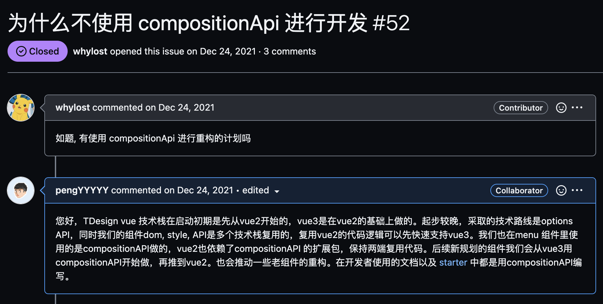
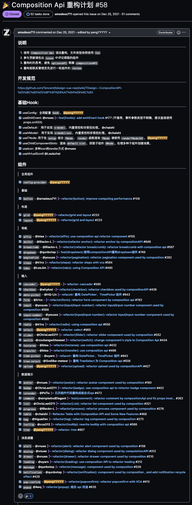
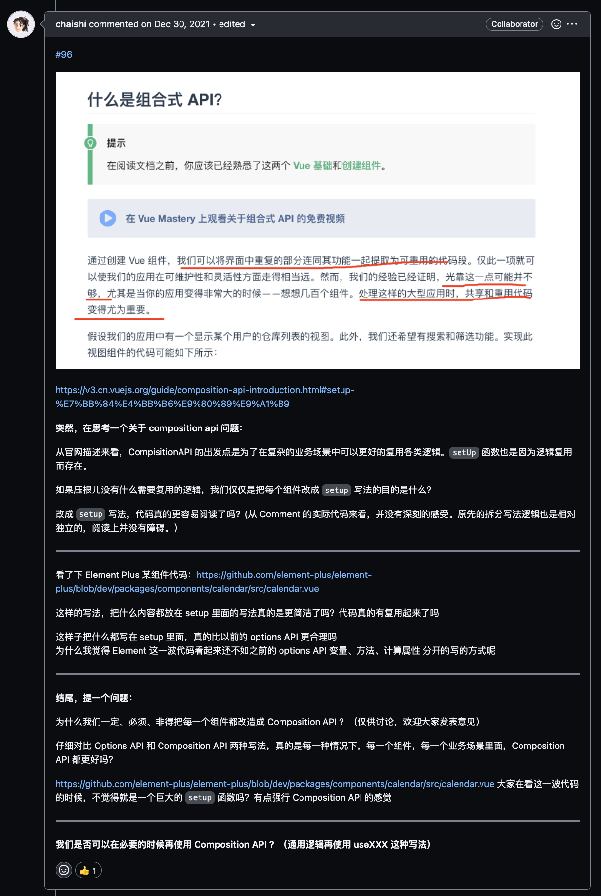

# TDesign CompositionAPI 重构之路

[Tdesign-vue-next](https://github.com/Tencent/tdesign-vue-next) 的 [Composition Api 重构计划](https://github.com/Tencent/tdesign-vue-next/issues/58) 经过了五个月的时间完成对 **44** 个组件的重构，共有 **20** 名开发者参与组件重构。

## 先上线再优化

[Tdesign-vue-next](https://github.com/Tencent/tdesign-vue-next) 仓库是从 [Tdesign-vue](https://github.com/Tencent/tdesign-vue) `fork` 过来，并开始做 `vue-next` 的适配（那时候叫`vue-next`,成为vue的正式版后叫`core`了），当时的首要工作就是是对 `options` 写法兼容，工具函数差异抹平、组件库构建兼容等，让它能最快的跑起来，能让用户用起来即可。

### 市面流行库对比

以下是几个库对 `vue3` 升级的策略对比：

| ui库 | 仓库策略 | `compositionAPI` 使用情况 |
|  ----  | ---- | ---- |
| [antd-vue](https://github.com/vueComponent/ant-design-vue)  | 同仓库,不同分支 | 除 `color-picker` 以外全部使用 |
| [naive](https://github.com/TuSimple/naive-ui)  | 同仓库,不同分支 | 全部组件使用 |
| [vuetify](https://github.com/vuetifyjs/vuetify)  | 同仓库,不同分支 | 进行中, 处于 `beta` 阶段，仓库 [Checklist](https://github.com/vuetifyjs/vuetify/issues/14984) |
| [element](https://github.com/element-plus/element-plus)  | 新仓库 `element-plus`| 无历史包袱，全新的仓库，使用 `sfc` 开发 |
| [iview](https://github.com/view-design/ViewUIPlus)  | 新仓库 `view-ui-plus` | 处于较早期，使用 `sfc` + `optionsAPI` |

可以看到，除 `iview` 以外的所有库都在往 `compositionAPI` 做重构。以上的库因为存在时间久，组件数量也比较全，`vue2` 的版本经过了长时间的打磨，在一定程度上会比较成熟。与这些存在时间比较久的库相比，`TD` 的处境比较特殊，`TD` 的 `vue2` 版本起步时间也比较晚，处于长期的迭代当中，目前还处于 `beta` ，我们也会长期支持对 `vue2` 的迭代。

所以在 `td-vue3` 库开始开发的时候，`vue2` 的库并不是十分完善，处于并行向前，在一段时间里，往往 `td-vue2` 改了一个问题，`td-vue3` 也得改一遍。且内部的协同开发者资源基本上都在 `td-vue2` 上面，在那个阶段是 `td-vue2` 向 `td-vue3` 输血。 并且 `vue2` 库，对组件内的实现并没有一个很强的要求，可以在组件库内部看到不同的开发范式和设计模式，代码结构是比较混乱的，没有一个基本的标准。而 `td-vue3` 师承 `td-vue2`，基本上继承了所有的问题。

随后我们在 `2021` 年底开源了，走出去，听到更多社区的声音。

## 社区的声音

上面是开源之初来自社区的声音，这个问题再开源之前就已经想到了肯定会有人问，这个 `issue` 提上来的时候，心里想的是，终于来了。

### 贡献者

当时存量的 `44` 个组件依靠现有的开发资源去做肯定是不现实的。开源之初的计划就是 `tdesign-vue3` 需要借助开源社区的力量，吸纳更多的外部开发者。因为内部使用 `vue3` 的团队并没有那么多，很多团队只会在新业务上会使用`vue3`。且在内部经过了一年多的孵化以后，协同开发者的增量空间不多了。

之后在和 [amadeus711](https://github.com/amadeus711) 进行了一些交流以后，在社区发起了重构的招募 [Composition Api 重构计划](https://github.com/Tencent/tdesign-vue-next/issues/58)。

另外，在与 `PMC` [chaishi](https://github.com/chaishi) 进行了了一些交流以后，通过她去推动后续组件先从 `vue3` 开始，再向 `vue2` 输血，同时推动长期贡献的内部协同开发者向 `vue3` 做转化，要求后面的组件都用 `compositionAPI` 开发。

上面是整个重构过程中的记录，每一个 `PR` 都非常有意义。感谢以上贡献者的付出。

### 重构的意义

当重构开始一段时间后，一些代码也被提交上来了，中间经过了一些比较激烈的讨论，也引起了大家的思考，重构的意义是什么，如果仅仅是简单的将之前的写法换一下，耗时耗力。

来自 [chaishi](https://github.com/chaishi) 的疑问

在这个阶段，比较迷茫的点是，为什么要做这件事情，这件事情带来的好处在那儿。

站在当时的角度上来看，代码层面上，之前我们的代码存在各种范式，并且组件之间的聚合也没有做到很多，通过组件之间的聚合以及开发范式的统一，会为后面的维护工作带来很大的帮助。

另外一点，整个 `vue` 社区都在拥抱 `compositionAPI`，开源需要紧跟社区的步伐。重构非常重要，我们的代码会被人家深入去看，如果人家上来一看，全是旧的东西，没有任何吸引力。代码开源只是一个开始，需要从社区不断吸收新的东西。

### vue3的正式版

尤雨溪也在 1月20日 宣布：`Vue3` 将在2月7日成为新的默认版本, 也更加坚定大家了在 `vue3` 上面的投入。

## 框架底座

随着重构的开始，主要从以下两个方面入手

### 基础hook

在基础 `hook` 方面，对不同类别的逻辑编写了相应的hook：

- 子组件插槽： `useChildComponentSlots`,
- TNode渲染：`useTNode`, `useTNodeDefault`,  `useContent`, `useKeepAnimation`
- 全局配置： `useCommonClassName`, `useConfig`, `usePrefixClass`
- 受控与非受控：`useDefaultValue`, `useVModel`
- 拖拽：`useDragSort`
- 事件：`useListener`，`useResize`
- 点击动画：`useKeepAnimation`，`getRippleColor`
- 虚拟滚动：`useVirtualScroll`

### 组件内聚

我们新输出了 `TagInput`，`SelectInput`, 并内聚了相关的组件： `cascader`, `select`, `tree-select` , `date-picker`, `time-picker`。

对于已存在的组件，最大可能进行复用，整个组件库的内聚关系如下：

### 组件开发规范

其中 **7** 名开发者成为了 `TD` 的核心开发者。

### 高阶函数的移除

### 更好的类型支持

## 社区新动向

### setup script

### pinia

### vitest

## 总结

这一路下来对 `vue` 的开发范式有了更深刻的理解。同时对开源也有了更深刻的认识。`TDesign` 还很年轻，还有很长的路要走，核心团队有一群人做后盾，大家都很靠谱，期待我们越来越好。后续会在组件质量上做更多的探索，期待正式版的发布。
