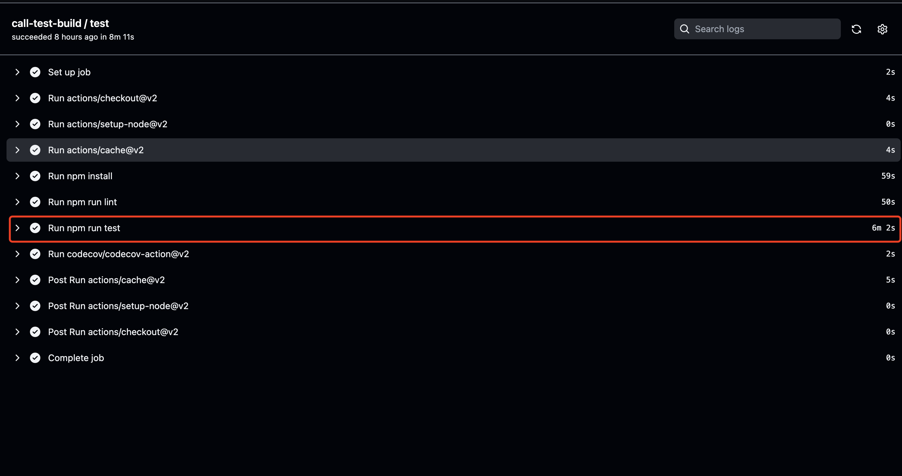
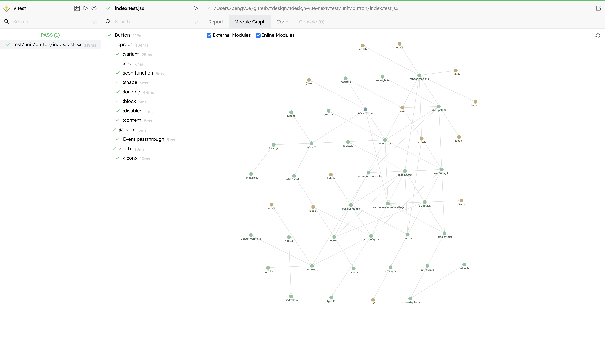
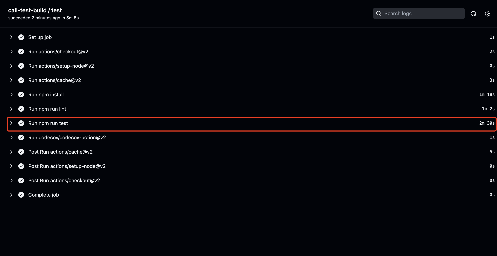
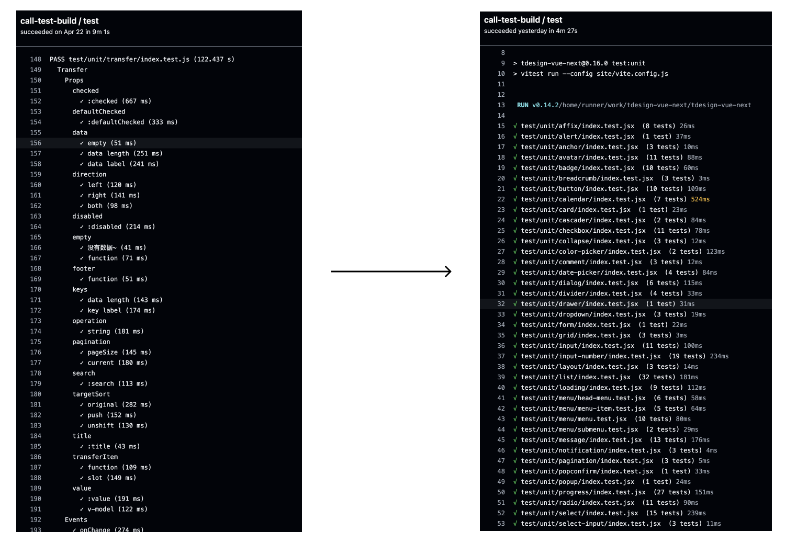

# TDesign 在 vitest 的实践

## 起源

在 `tdesign-vue-next` 的 `CI` 流程中，单元测试模块的执行效率太低，每次在单元测试这个环节都需要花费 `6m` 以上。加上依赖按照，`lint` 检查等环节，需要花费 `8m` 以上。

加上之前在单元测试这一块只是简单的处理了一下，对开发者提交的组件也没有相应的要求，只是让它能跑起来就好。另一方面单元测试目前是 TD 发布正式版的一个卡点，所以准备对其进行一次大的梳理和重构，为后续的重点工作做准备。



## 痛点与现状

- 单元测试执行效率太低，上面已经讲到了，这个速度是无法忍受。
- 单元测试规范不明确，开发者没有对应的单测规范可以遵循，不知道怎么写。
- 单元测试中 `snapshot` 占据了大多数，每个组件的单元测试中其所有 `demo` 都做了一次 `snapshot`。这部分的代码由脚本输出。在一定程度上属于集成测试，但执行过程融合在人工写的单元测试当中，需要做集成测试的整合。

## vitest

最开始注意到 `vitest` 是在 `evan you` 的分享里面。`vitest` 的特性如下:

- 与 `Vite` 的配置、转换器、解析器和插件通用，免去了额外对 `jest` 的配置
- 对 `TypeScript / JSX`` 支持开箱即用的，像写组件一样写测试
- 多线程通过 `tinypool` 使用 `Worker` 线程尽可能多地并发运行测试。隔离了每个测试文件的运行环境，因此一个文件中的运行环境改变不会影响其他文件。
- `watch` 模式下极速热更，在单元测试开发时更友好
- 与 `Jest` 几乎相同的 `API`，极少量的差异
- 更清晰的 `C8`` 生成测试覆盖率
- 源码内联测试
- 非常酷的 `GUI`



## 迁移

### 配置文件改造

依赖，上面说到，`vitest` 的配置文件和 `vite` 的配置文件共用，且插件也是共用，所以不需要像配置 `jest` 一样去配置 `babel-jest`, `vue-jest`, `jest-serializer-vue` 这些插件。

### 开发环境#境的执行命令

```shell
vitest --config site/vite.config.js 
```

单测开发的过程中，需要过滤对应的测试文件，则只需要加上对应的文件路径即可，具体如下：

```shell
#执行button组件的单测
vitest --config site/vite.config.js button
#执行button的index.test.jsx测试文件
vitest --config site/vite.config.js button/index.test.jsx 
```

另外还有 `GUI` 的选项

```shell
vitest --config site/vite.config.js --ui
```

## 集成测试

之前我们继承测试环境有两套 `ssr` 环境和 `csr` 环境。

### ssr 环境

对 `ssr` 环境的测试需要做一个 `setup` 用来做组件 `render`，此部分和之前保持一致。

**ssr-setup**

```js
import { config } from '@vue/test-utils';
import { createApp } from 'vue';
import { renderToString } from '@vue/server-renderer';
import TDesign from '@/src/index';

config.global.plugins = [TDesign];

// global挂载createSSRApp方法，挂载render环境的配置
config.global.createSSRApp = (comp) => {
  const app = createApp(comp);
  app.config.globalProperties.$route = {};
  app.use(TDesign);
  const html = renderToString(app);
  return html;
};
```

之前的执行环境是 `commonjs` 引入组件使用的是 `require`, 在 `vite` 中需要替换为 `es` 规范的 `import`

```js
const demo = require(`../.${file}`);
```

**ssr.test.js**

```js
import glob from 'glob';
import MockDate from 'mockdate';
import { config } from '@vue/test-utils';

MockDate.set('2020-12-28 00:00:00');

function runTest() {
  const files = glob.sync('./examples/**/demos/*.vue');
  const { createSSRApp } = config.global;

  describe('ssr snapshot test', () => {
    files.forEach((file) => {
      it(`ssr test ${file}`, async () => {
        const demo = await import(`../.${file}`); //此部分
        const realDemoComp = demo.default ? demo.default : demo;
        const html = await createSSRApp(realDemoComp);
        expect(html).toMatchSnapshot();
      });
    });
  });
}
runTest();
```

### csr 环境

`csr` 环境的集成测试在之前使用的是脚本输出一个如下的标准文件，分散在每个组件的单元测试里面。这样做影响单元测试的执行效率，对每个组件都开一个 `describe`, 这些代码会影响单元测试的代码结构。所以合并在一个文件执行是最合理的。其实现思路与`ssr`基本一致，只是 `render` 不一样而已。

```js
/**
 * 该文件为由脚本 `npm run test:demo` 自动生成，如需修改，执行脚本命令即可。请勿手写直接修改，否则会被覆盖
 */
import { mount } from '@vue/test-utils';
import baseVue from '@/examples/affix/demos/base.vue';
import containerVue from '@/examples/affix/demos/container.vue';

const mapper = {
  baseVue,
  containerVue,
};

describe('Affix', () => {
  Object.keys(mapper).forEach((demoName) => {
    it(`Affix ${demoName} demo works fine`, () => {
      const wrapper = mount(mapper[demoName]);
      expect(wrapper.element).toMatchSnapshot();
    });
  });
});
```

**csr.test.js**

```js
import glob from 'glob';
import MockDate from 'mockdate';
import { mount } from '@vue/test-utils';

MockDate.set('2020-12-28 00:00:00');

function runTest() {
  const files = glob.sync('./examples/**/demos/*.vue');

  describe('csr snapshot test', () => {
    files.forEach((file) => {
      it(`csr test ${file}`, async () => {
        const demo = await import(`../.${file}`);
        const realDemoComp = demo.default ? demo.default : demo;
        realDemoComp.name = `test-csr-${realDemoComp.name}`;
        const wrapper = mount(realDemoComp);
        expect(wrapper.element).toMatchSnapshot();
      });
    });
  });
}
runTest();

```

## 配置文件

`vitest` 的配置文件如下，下面这一段 `config` 只需要挂在 `vite.config.js` 的 `test` 选项即可.

```js
const testConfig = {
  include:
    process.env.NODE_ENV === 'test-snap'
      ? ['test/snap/**/*.{test,spec}.{js,mjs,cjs,ts,mts,cts,jsx,tsx}']
      : ['test/unit/**/*.{test,spec}.{js,mjs,cjs,ts,mts,cts,jsx,tsx}'],
  globals: true,
  environment: 'jsdom',
  testTimeout: 5000,
  setupFiles: process.env.NODE_ENV === 'test-snap' ? path.resolve(__dirname, '../script/test/test-setup.js') : '',
  transformMode: {
    web: [/\.[jt]sx$/],
  },
  coverage: {
    reporter: ['text', 'json', 'html'],
  },
};
```

## 兼容性

因为我们老的测试方案基于 `jest`，相应的 `API` 都有。所以在迁移过程中，兼容性问题基只有一些从 `jest` 中的函数，切换到 `vi`，其他问题没有遇到。

**before**

```js
const fn = jest.fn();
```

**after**

```js
import { vi } from 'vitest';
const fn = vi.fn();
```

## 结果

### CI测试速度提升

在 `CI` 中从原来的 `6m` 提升到 `2m30`, 执行效率提升百分之 `60%`，在开发机的执行效率更高（不同配置的机器执行效率不同，用 `ci` 中的标准执行做对比测试）。



### 更清爽的日志信息



`jest` 这一部分的 `log` 只是单个组件的日志，而整个 `log` 记下来是非常长的，导致我们在开发中会忽略掉很多日志的告警。因为本地的 `terminal` 输出的长度是有限制的。

- [源码传送门](https://github.com/Tencent/tdesign-vue-next/)
- [TDesign单元测试规范](https://github.com/Tencent/tdesign-vue-next/wiki/TDesign-%E5%8D%95%E5%85%83%E6%B5%8B%E8%AF%95%E8%A7%84%E8%8C%83)