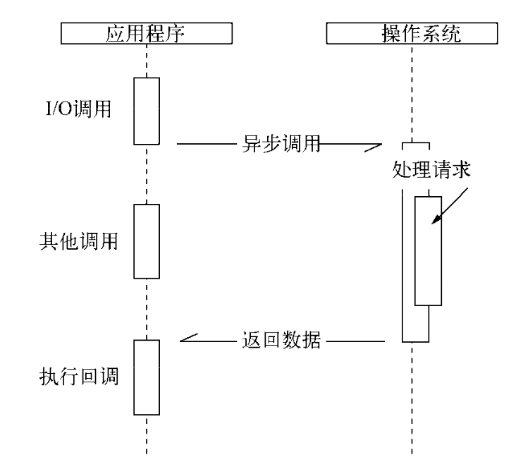
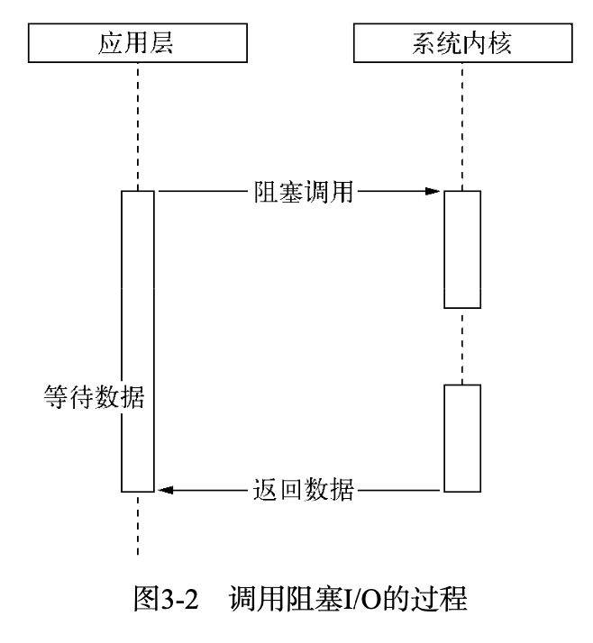
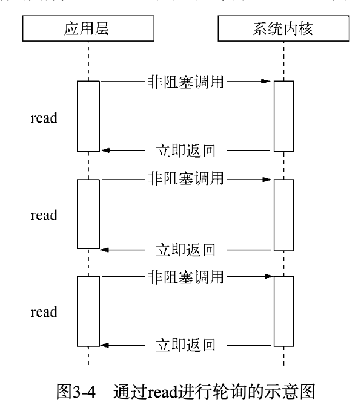
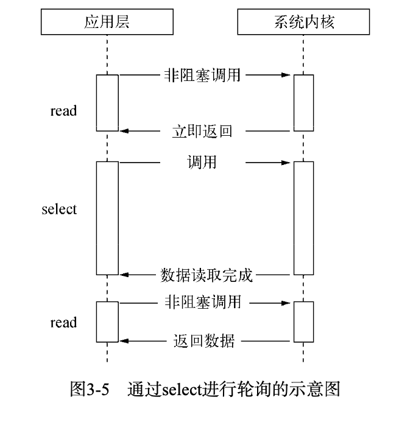
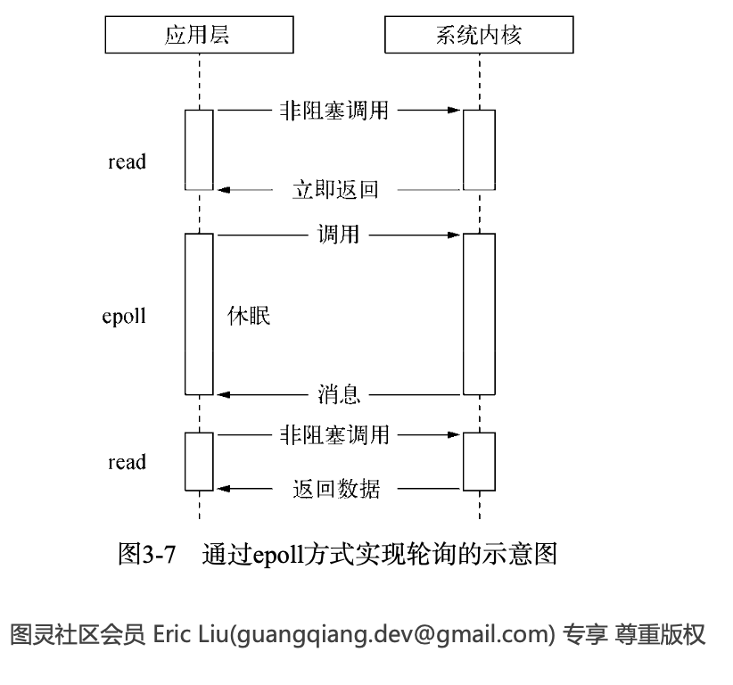

# node基础

读深入浅出 node.js 笔记与总结

## node的特点

node 作为一个后端 JavaScript 的运行平台，保留了 js 的语法，基于作用域和原型链。

### 异步IO模型


### 事件与回调函数

在 node 中创建一个网络服务

```js
var http = require('http')

http.createServer(function(req, res) => {
  var postData = ''
  req.setEncoding('utf8');
  req.on('data', function (trunk) {
    postData += trunk;
  });
  req.on('end', function () {
    res.end(postData);
  });
}).listen(8080);
```

node 采用事件的编程方式来进行具有轻量级，松耦合，只关注事物点等优势，但是在多个异步任务的场景下面，事件与事件是相互隔离的。从事件编程演进来的就是回调函数，从而在流程控制当中，会存在一些问题。

### 单线程

node 保持了 js 在浏览器中的单线程特点。在 node 中，js 无法与其余线程进行状态共享，没有死锁，也没有线程上下文交换所带来的性能上面的开销。

单线程的弱点：

- 无法利用多核 CPU
- 大量计算占用 CPU 导致无法继续调用异步 IO
- 错误会引起整个应用的退出

不过 node 可以通过 child_process 来传递进程间的消息。通过 Master-worker 的管理方式，也可以很好的管理各个工作进程，以达到更高的健壮性。

### node应用场景

- I/O 密集型，擅长网络编程，node 面向网络且擅长并行 I/O,主要是利用了其事件循环的能力，资源占用极少。

## 模块机制

### CommonJS 规范

- 模块引用

```js
var math = require('math')
```

- 模块导出

```js
// 单个导出
exports.add = function() {
  xxx
}
// 模块导出
module.exports = {}
```

### Node 中的模块实现

node 中的模块实现经历了以下三个过程

1. 路径分析
2. 文件定位
3. 编译执行

在 node 中，模块分为两类：一类是 node 提供的模块，称为核心模块；另外一类是用户编写的模块，称为文件模块。

- 核心模块部分在 Node 源码过程中，编译进了二进制执行文件。在 node 进程启动时，部分核心模块被直接加载进了内存，这部分核心模块引入的时候，速度会非常快。
- 文件模块则是在运行时动态加载，需要完整的进行路径分析，文件定位，编译执行，速度要慢。

#### 优先从缓存加载

node 对引入的模块都会进行缓存，以减少二次引入时的开销。浏览器缓存的是文件，node 缓存的是编译和执行后的对象。

#### 模块编译

node 中，每个文件模块都是一个对象

```js
function Module(id, parent) {
  this.id = id
  this.exports = {}
  this.parent = parent
  if (parent && parent.children) {
    parent.children.push(this)
  }
  this.filename = null
  this.loaded = false
  this.children = []
}
```

## 异步IO



1. 利用单线程，远离多线程死锁，状态同步等问题。
2. 利用异步 I/O，让单线程远离阻塞，可以更好的使用 CPU

### 异步 I/O 和非阻塞 I/O

> 阻塞 I/O

阻塞 I/O 的特点是调用之后一定要等到系统内核层面完成所有操作后，调用才结束。



> 非阻塞I/O

### 轮询技术

- read：通过重复调用来检查 I/O 的状态来完成完整数据的读取。在得到最终数据之前，CPU 一直耗用在等待上。



- select: 它是在 read 的基础上改进的一种方案，通过对文件描述符上的事件状态来进行判断。



- epoll：该方案是 Linux 下效率最高的 I/O 事件通知机制，在进入轮询的时候如果没有检查到 I/O 事件，将会进行休眠，直到事件发生将其唤醒。它真实的利用了事件通知、执行回调的方式。



<!-- ## 内存控制

## 异步编程

## buffer

## 网络模块

## 进程 -->
