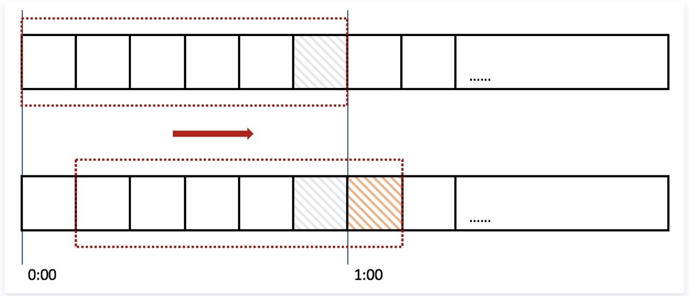
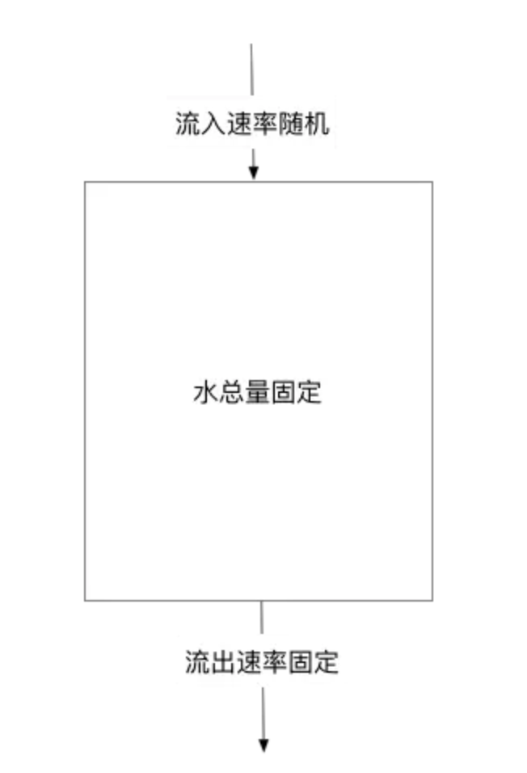
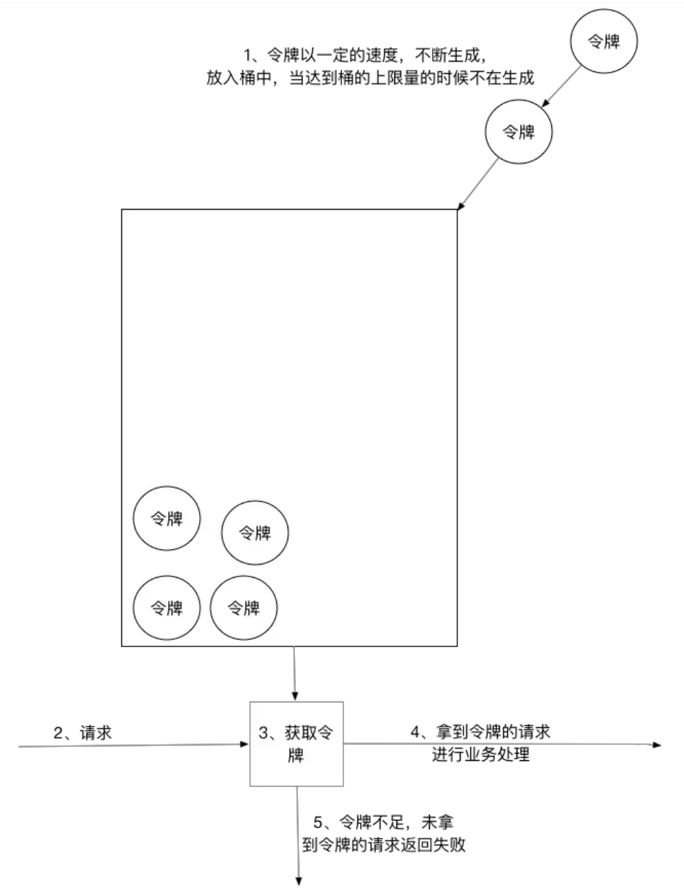

# 限流算法

今天和后端小哥哥聊天，问了一下我限流算法，简单了解了一下。

## 计数器算法

计数器算法(Counter) 就是一个计数器 , 在单位时间内可以通过 n 个请求 , 每进来一个请求, 就将计数器 +1 , 当计数器到达了 n,此时就不让请求过去 , 但是存在一个问题: 边界问题，比如在单位时间 -1000ms 的时候过来 100 个请求 , 当刚刚过了 1000ms 的时候重置了，但是又来了 100 个请求 , 此时就会发生实际上在这 2S 的时候处理了 200 个请求 , 严重超载了, 此时服务器处理不了就导致错误了。

```js
class CounterLimiter {
  constructor() {
    this.initFLow = 0;
    this.MAX_FlOW = 1000
    setTimeout(() => {
      initFlow = 0
    }, 10000)
  }

  request() {
    if (this.initFLow > this.MAX_FlOWv) {
      // 如果限流就拒绝
      return
    }
    this.initFlow ++
  }
}
```

## 滑动窗口算法

滑动窗口算法是将时间周期分为N个小周期，分别记录每个小周期内访问次数，并且根据时间滑动删除过期的小周期。

如下图，假设时间周期为1min，将1min再分为2个小周期，统计每个小周期的访问数量，则可以看到，第一个时间周期内，访问数量为75，第二个时间周期内，访问数量为100，超过100的访问则被限流掉了

由此可见，当滑动窗口的格子划分的越多，那么滑动窗口的滚动就越平滑，限流的统计就会越精确。

此算法可以很好的解决固定窗口算法的临界问题。



## 漏桶算法

漏桶算法是访问请求到达时直接放入漏桶，如当前容量已达到上限（限流值），则进行丢弃（触发限流策略）。漏桶以固定的速率进行释放访问请求（即请求通过），直到漏桶为空。



## 令牌桶算法

令牌桶算法是程序以r（r=时间周期/限流值）的速度向令牌桶中增加令牌，直到令牌桶满，请求到达时向令牌桶请求令牌，如获取到令牌则通过请求，否则触发限流策略


