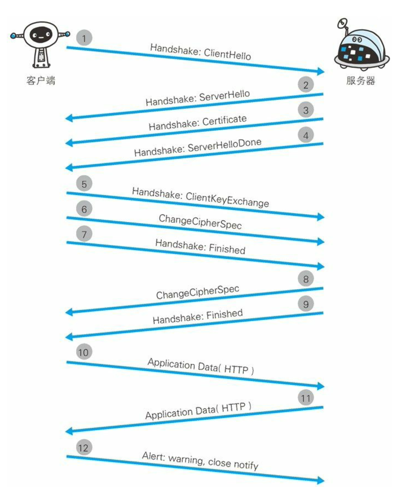
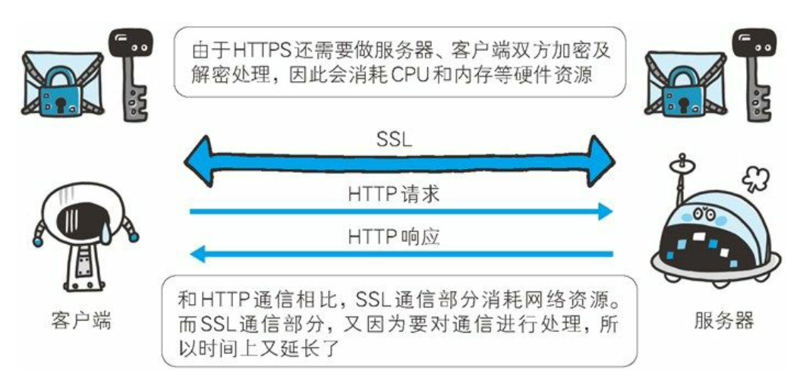

# HTTPS

SSL(Secure Socket Layer) 安全套接层
TLS(Transport Layer Security) 安全层传输协议

## 为什么有 HTTPS

`http` 的不足

- 通信使用明文(不加密)，内容可能会被窃听
- 不验证通信方的身份，因此有可能遭遇伪装
- 无法证明报文的完整性，所以有可能已遭篡改

`https` 就是加了一层 `ssl` 的 `http`。

报文首部不会被加密，报文主体会被加密。

## 加密方法

`SSL` 采用一种叫做公开密钥加密(Public-key cryptography)的加密处理方式。

近代的加密方法中加密算法是公开的，而密钥是保密的。通过这种方式得以保持加密方法的安全性。加密和解密都会用到密钥。没有密钥就无法对密码解密，反过来说，任何人只要持有密钥就能解密了。如果密钥被攻击者获得，那加密也就失去了意义。

### 共享密钥加密

加密和解密同用一个密钥的方式称为共享密钥加密(Common key crypto system)，也被叫做对称密钥加密。

以共享密钥方式加密时必须将密钥也发给对方。在互联网上转发密钥时，如果通信被监听那么密钥就可会落入攻击者之手，同时也就失去了加密的意义。另外还得设法安全地保管接收到的密钥。

### 使用两把密钥的公开密钥加密

公开密钥加密使用一对非对称的密钥。一把叫做私有密钥 (private key)，另一把叫做公开密钥(public key)。私有密钥不能让其他任何人知道，而公开密钥则可以随意发布，任何人都可以获得。使用公开密钥加密方式，发送密文的一方使用对方公开密钥进行加密处理，对方收到被加密的信息后，再使用自己的私有密钥进行解密。

### 混合加密方式

`HTTPS` 采用共享密钥加密和公开密钥加密两者并用的混合加密机制。若密钥能够实现安全交换，那么有可能会考虑仅使用公开密钥加密来通信。但是公开密钥加密与共享密钥加密相比，其处理速度要慢。

### 证明公开密钥正确性的证书

公开密钥加密方式无法证明公开密钥本身就是货真价实的公开密钥，使用由数字证书认证机构(CA，Certificate Authority)和其相关机关颁发的公开密钥证书。

公钥证书也可叫做数字证书或直接称为证书。接到证书的客户端可使用数字证书认证机构的公开密钥，对那张证书上的数字签名进行验证，一旦验证通过，客户端便可明确两件事:

- 认证服务器的公开密钥的是真实有效的数字证书认证机构。
- 服务器的公开密钥是值得信赖的。

### https的通信机制

1. 客户端通过发送 Client Hello 报文开始 SSL 通信。报文中包含客户端支持的 `SSL` 的指定版本、加密组件(Cipher Suite)列表(所使用的加密算法及密钥长度等)。
2. 服务器可进行 SSL 通信时，会以 Server Hello 报文作为应答。和客户端一样，在报文中包含 SSL 版本以及加密组件。服务器的加密组件内容是从接收到的客户端加密组件内筛选出来的。
3. 之后服务器发送 Certificate 报文。报文中包含公开密钥证书。
4. 最后服务器发送 Server Hello Done 报文通知客户端，最初阶段的 SSL 握手协商部分结束。
5. SSL 第一次握手结束之后，客户端以 Client Key Exchange 报文作为回应。报文中包含通信加密中使用的一种被称为 Pre-master secret 的随机密码串。该报文已用步骤 3 中的公开密钥进行加密。
6. 接着客户端继续发送 Change Cipher Spec 报文。该报文会提示服务器，在此报文之后的通信会采用 Pre-master secret 密钥加密。
7. 客户端发送 Finished 报文。该报文包含连接至今全部报文的整体校验值。这次握手协商是否能够成功，要以服务器是否能够正确解密该报文作为判定标准。
8. 服务器同样发送 Change Cipher Spec 报文。
9. 服务器同样发送 Finished 报文。
10. 服务器和客户端的 Finished 报文交换完毕之后，SSL 连接 就算建立完成。当然，通信会受到 SSL 的保护。从此处开始进行应用 层协议的通信，即发送 HTTP 请求。
11. 应用层协议通信，即发送 HTTP 响应。
12. 最后由客户端断开连接。断开连接时，发送 close_notify 报 文。上图做了一些省略，这步之后再发送 TCP FIN 报文来关闭与 TCP 的通信。

HTTPS 使用 SSL(Secure Socket Layer) 和 TLS(Transport Layer Security)这两个协议。
SSL 技术最初是由浏览器开发商网景通信公司率先倡导的，开发过 SSL3.0 之前的版本。目前主导权已转移到 IETF(Internet Engineering Task Force，Internet 工程任务组)的手中。
IETF 以 SSL3.0 为基准，后又制定了 TLS1.0、TLS1.1 和 TLS1.2。TSL 是以 SSL 为原型开发的协议，有时会统一称该协议 为 SSL。当前主流的版本是 SSL3.0 和 TLS1.0。
由于 SSL1.0 协议在设计之初被发现出了问题，就没有实际投入 使用。SSL2.0 也被发现存在问题，所以很多浏览器直接废除了该协议版本。

### HTTPS 比 HTTP 要慢 2 到 100 倍

- 通信慢
- 消耗大量 `CPU` 及内存等资源，导致处理速度变慢。
- `SSL` 必须进行加密处理。在服务器和客户端都需要进行 加密和解密的运算处理。因此从结果上讲，比起 `HTTP` 会更多地消耗服务器和客户端的硬件资源，导致负载增强。

## HTTPS 的加密流程

两个概念:

1. 对称加密：加密和解密的秘钥使用的是同一个.
2. 非对称加密：使用两把密钥，一把公钥（`publickey`）和私钥（`privatekey`）。
3. `Hash` 算法（摘要算法）：用户可以通过 `hash` 算法对目标信息生成一段特定长度的唯一 `hash` 值，却不能通过这个 `hash` 值重新获得目标信息。（`jwt`）

数据通过对称加密的方式来加密，对称加密的密钥是由客户端生成的随机字符串来充当，再通过非对称加密的方式加密后传递到服务端。

`https` 的三次握手：

- 服务端发送证书到客户端

服务端将证书发送给客户端，证书内包含服务器端的公钥，证书颁发机构，证书有效期，服务端域名等信息。

- 客户端对证书进行校验并且向服务端发送对称密钥

客户端收到证书后，会选择是否信任证书，这里是否信任可以根据域名，颁发机构，有效期等信息来判断，如果证书校验不通过，就给予风险提示并断开连接；如果校验通过，就生成一个随机数，用作对称加密的密钥，并取出证书中的公钥，用该公钥对随机数进行加密，将加密后的结果发送到服务端。

- 服务端用收到的对称密钥加密一段握手信息，发送到客户端

服务端收到客户端发来的密钥，先用自己的私钥解密，解密成功后，用该对称密钥发送一段握手信息到客户端。客户端收到后，解密成功，至此，`HTTPS` 连接成功，后续的数据传输就会使用该对称密钥来进行加密。
