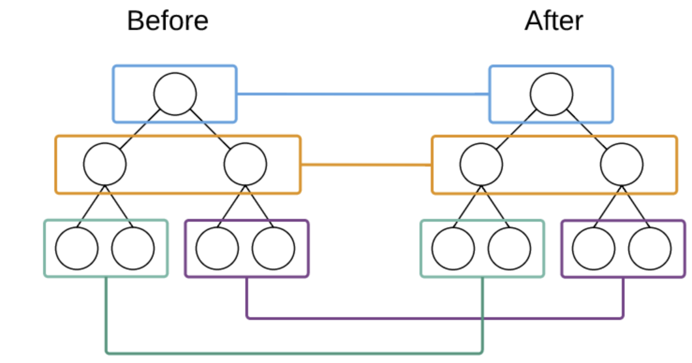

# diff 过程



两个框架都是同层比较，深度优先，可以参考树的前序遍历

```js
function dsf(root) {
  const dealFn = function(node) {
    if(!node) return

    // 处理当前节点
    dealFn(node.left)
    dealFn(node.right)
  }
  dealFn(root)
}
```

## vue 的 diff

优势：

- 新老两棵树：头尾两个节点，四节点间对比

key的作用：

复用节点

## react 的 diff 过程

### diff 策略

- 同级比较，Web UI 中 DOM 节点跨层级的移动操作特别少，可以忽略不计。
- 拥有不同类型的两个组件将会生成不同的树形结构。
- 可以通过 key 来暗示哪些子元素在不同的渲染下能保持稳定。

### diff 过程

- 删除: newVNode 不存在时
- 替换: VNode 和 newVNode 类型不同或 key 不同时
- 更新:有相同类型和 key 但 VNode 和 newVNode 不同时
