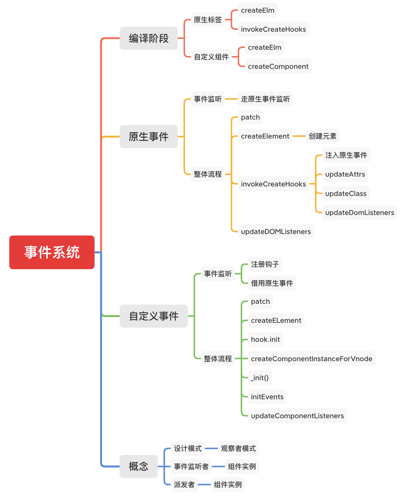

# 事件系统

## react

`React` 事件机制其实是使用了 **事件委托** 的方式，`React` 在内部自己实现了浏览器中对应事件的合成事件。在 `web` 浏览器中，浏览器在生成虚拟 `DOM` 树的时候，解析出的合成事件挂载到 `document` 上，部分事件仍然在 `DOM` 元素上，事件实现机制是插件机制，方便后续拓展。

### 特点

1. `React` 将事件都挂载在 `document` 上，减少了 `DOM` 节点上的事件信息，能够做到性能的优化；
2. `React` 事件机制其实和 `React Virtual DOM` 的功能相似，`React` 团队希望 `React` 能够在多端运行，而事件的挂载可以在不同运行环境挂载到不同的节点上，从而事件不同端的运行，只需要在事件机制中做兼容处理；
3. 事件分发：`React` 最新的调度算法 `Fiber` 会优化交互体验，内部优化浏览器渲染，干预事件分发也可以做更多的优化。

### 实现原理

`React` 事件机制我们主要分三部分来说：

1. **插件注册**：插件注册到一起，方便后面使用
2. **事件注册**：`DOM` 的 `props` 中有事件属性，将事件挂载到 `document`，注册相应的 `listener`
3. **事件分发**：在监听的 `listener` 中，关联到插件，执行对应事件，根据不同的事件类型，事件执行也有不同的方式

#### 插件注册

目前 `React` 一共有 6 个事件插件，但是目前版本中 `ChangeEventPlugin` 没有在使用，同时 `ResponderEventPlugin` 只有 RN 在使用。

每个插件内部包含很多事件，插件主要是用来组合事件信息，提取事件对象的。

* 左边和右边的插件区别在于，`simple` 就是简单，一般只有一个事件；而右边插件都是由多个事件组合成的事件；

* `SyntheticEvent` 是事件的构造函数，`SyntheticEvent` 对浏览器原生的事件进行 **包装**，生成一个新的 `event` 对象，里面有合成事件需要的参数，原声 `event` 变成了 `nativeEvent`，同时封装了 `preventDefault`、`stopPropagation` 等方法，提供了 `extend` 方法用来继承，采用寄生组合的方式，一些 `SyntheticEvent` 都是继承自这个构造函数；

    ```js
    this.dispatchConfig = dispatchConfig;
    this._targetInst = targetInst;
    this.nativeEvent = nativeEvent;
    ```

* `SyntheticEvent` 有一个 `pool` 的概念，为了避免每一次都是用构造函数创建实例，在一个实例使用过后清空自身属性（设置为 `null`），然后需要创建新的实例时，优先获取空实例，添加对应的属性；

* 每一个插件主要由两部分组成，一部分是 `eventTypes` 也就是插件包括的一些事件和事件依赖的一些事件（合成事件会依赖多个事件），另一部分是 `extractEvents` 获取事件对象，在事件触发时会调用这个方法获取事件对象

    ```js
    const plugin = {
      eventTypes: {
        change: {
          phasedRegistrationNames: {
            bubbled: 'onChange',
            captured: 'onChangeCapture'
          },
          dependencies: [TOP_BLUR]
        }
      },
      extractEvents: () => {}
    }
    ```

* 事件最后都会继承到 `EventHub` 上，本质上就是一个数组，只不过是固定顺序的数组，同时继承数组时生成一些 `Map` 方便以后使用

  * registrationNameDependencies: eventName -> eventDependencied
  * registrationNameModules: eventName -> plugin

#### 事件注册

这一步主要是针对 `DOM` 树解析，添加事件的流程。`Listener` 里面包含了事件获取执行。`registrationModules`、`registrationNameDependencies` 就是之前插件注册时生成的对象。

* 关于合成事件：其实多个事件组合成的事件，但是 `simpleEvent` 本质上并不算一个合成事件，因为它还是一对一的关系，其他的插件因为有对应多个的 `dependencies`，所以才是真正的合成事件
* 合成事件的监听：许多合成事件浏览器没有对应事件，所以我们需要伪装，其实就是监听事件 `dependencies` 中的事件
* 关于事件监听节点：是监听的节点其实是 `document`，但是在不同的运行环境下监听的节点可能不同，可能是 `iframe` 也可能是其他节点

#### 事件分发

`React16` 以后开始做浏览器的调度工作，其实调度工作不止 `DOM diff` 上，在事件上也做了部分调度。

`React` 把事件做了分类：

* DiscreateEvent：失焦、聚焦类事件，调用 `dispatchDiscreateEvent`
* UserBlockingEvent：用户连续行操作，比如鼠标移动、拖拽等，调用 `scheduler` 的 `runWithPriority`
* ContinuousEvent && default：连续性事件，直接执行

上面三种事件其实最后都是调用了 `dispatchEvent` 函数，但是因为优先级的原因，事件的调度方法不一样，最后执行的时间也不一样。

```js
// 事件优先级
export const DiscreteEvent: EventPriority = 0;
export const UserBlockingEvent: EventPriority = 1;
export const ContinuousEvent: EventPriority = 2;
```

### 对比 React 合成事件与 JavaScript 原生事件

下面我们从 4 个方面对比 `React` 合成事件与 `JavaScript` 原生事件。

#### 事件传播与阻止事件传播

浏览器原生 `DOM` 事件的传播可以分为 3 个阶段：事件捕获阶段、目标对象本身的事件处理程序调用以及事件冒泡。事件捕获会优先调用结构树最外层的元素上绑定的事件监听器，然后依次向内调用，一直调用到目标元素上的事件监听器为止。事件捕获并非是一个通用的技术，在低于 `IE9` 版本的浏览器无法使用。而事件冒泡则与事件捕获的表现相反，它会从目标元素向外传播事件，由内而外直到最外层。

可以看出，事件捕获在程序开发中的意义并不大，更致命的是它的兼容性问题。所以，React 的合成事件则并没有实现事件捕获，仅仅支持了事件冒泡机制。这种 API 设计方式统一而简洁，符合 “*二八原则*”。

阻止原生事件传播需要使用 `e.preventDefault()` ，不过对于不支持该方法的浏览器（IE9 以下），只能使用 `e.cancelBubble = true` 来阻止。而在 REact 合成事件中，只需要使用 `e.preventDefault()` 即可。

#### 事件类型

`React` 合成事件的事件类型是 `JavaScript` 原生事件类型的一个子集。

#### 事件绑定方式

受到 `DOM` 标准的影响，绑定浏览器原生事件的方式也有很多种，具体如下所示：

* 直接在 `DOM` 元素上写内联绑定：

    ```html
    <button onclick="alert(1);">
      Button
    </button>
    ```

* 在 `JavaScript` 中，通过元素的事件属性赋值的方式实现绑定：

    ```js
    el.onclick = e => {
      console.log(e)
    }
    ```

* 通过事件监听函数来实现

    ```js
    el.addEventListener('click', () => {}, false);
    el.attachEvent('onclick', () => {});
    ```

相比而言，`React` 合成事件的绑定方式则简单很多：

```html
<button onclick="this.handleClick">
  Button
</button>
```

#### 事件对象

原生 `DOM` 事件对象在 `W3C` 标准和 IE 标准下存在差异。在低版本的 `IE` 浏览器中，只能使用 `window.event` 来获取事件对象。而在 `React` 合成事件中，`React` 抹平了各个浏览器的差异，在事件处理函数中可以得到一个统一的合成事件对象。

## vue

`vue` 主要是观察者模式的实现


