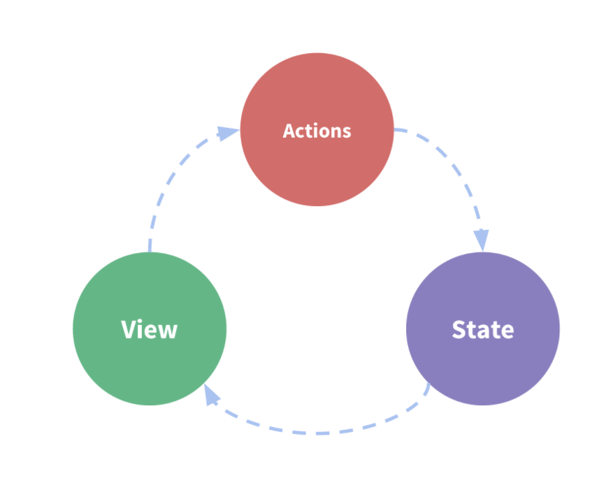
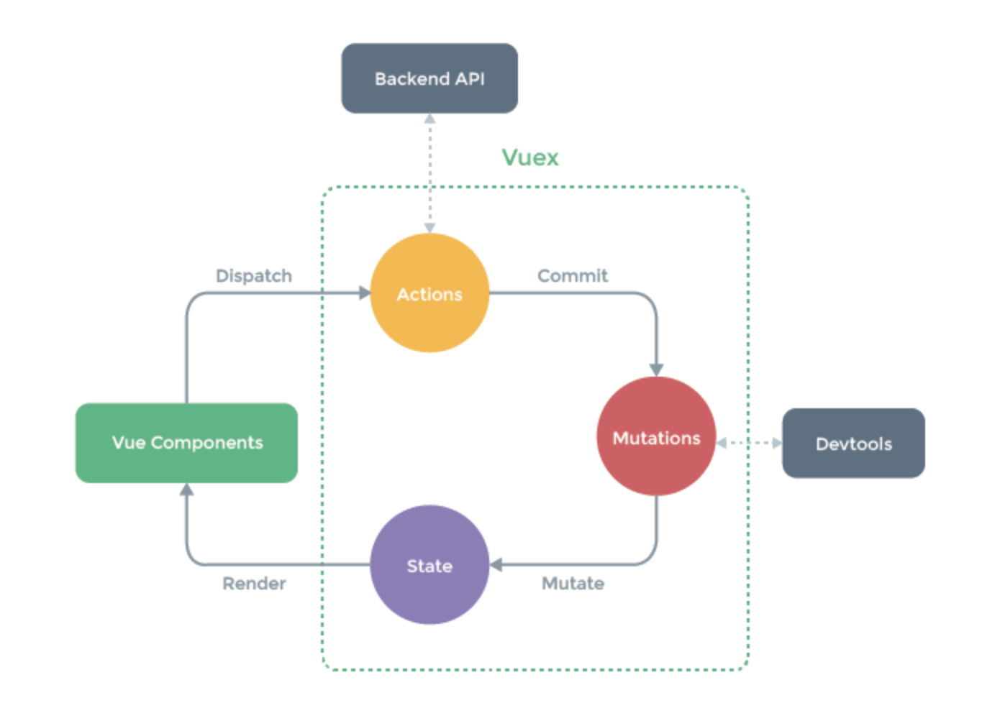
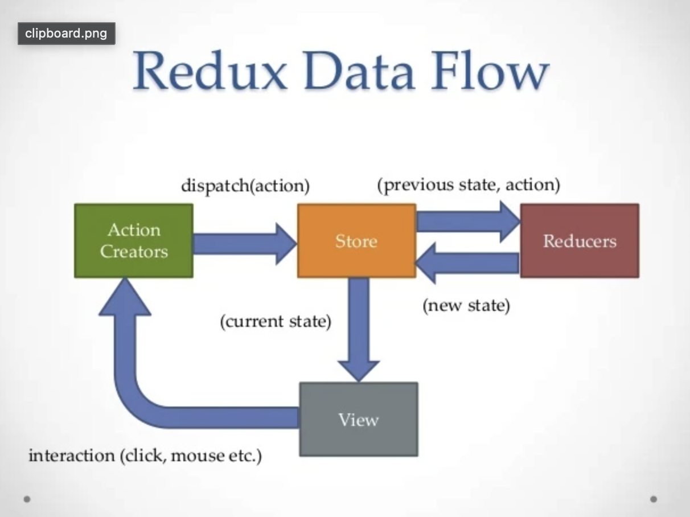

# 状态管理

Vuex 与 redux 都是 Flux 架构的一种实现。Flux 清晰确立了数据管理场景下各种职能单位，其主要准则有：

- 中心化状态管理
- 状态只能通过专门突变单元进行变更
- 应用层通过发送信号(一般称 action)，触发变更

## vuex

借用官网的定义，Vuex 是一个专为 Vue.js 应用程序开发的状态管理模式。它采用集中式存储管理应用的所有组件的状态，并以相应的规则保证状态以一种可预测的方式发生变化。

### 组件的数据流



当多组件共享视图时，单向数据流的简洁性很容易被破坏：

- 多个视图依赖于同一状态。
- 来自不同视图的行为需要变更同一状态。

因此需要一颗全局的状态管理树来统一管理数据流：



### 核心概念

vuex 的几大核心概念：

- state
- getters
- mutations
- actions
- moudles

### state

单一状态树，也可以理解为单例

- 组件中获取 vuex 的数据

```js
const Counter = {
  template: `<div>{{ count }}</div>`,
  computed: {
    count () {
      return this.$store.state.count
    }
  }
}
```

- mapState 辅助函数

```js
import { mapState } from 'vuex'

export default {
  // ...
  computed: mapState({
    // 箭头函数可使代码更简练
    count: state => state.count,

    // 传字符串参数 'count' 等同于 `state => state.count`
    countAlias: 'count',

    // 为了能够使用 `this` 获取局部状态，必须使用常规函数
    countPlusLocalState (state) {
      return state.count + this.localCount
    }
  })
}
```

当映射的计算属性的名称与 state 的子节点名称相同时，我们也可以给 mapState 传一个字符串数组。

```js
computed: mapState([
  // 映射 this.count 为 store.state.count
  'count'
])
```

### getter

Vuex 允许我们在 store 中定义 “getter”（可以认为是 store 的计算属性）。getter 的返回值会根据它的依赖被缓存起来，且只有当它的依赖值发生了改变才会被重新计算。

```js
const store = new Vuex.Store({
  state: {
    todos: [
      { id: 1, text: '...', done: true },
      { id: 2, text: '...', done: false }
    ]
  },
  getters: {
    doneTodos: state => {
      return state.todos.filter(todo => todo.done)
    }
  }
})
```

### mapGetters 辅助函数

mapGetters 辅助函数仅仅是将 store 中的 getter 映射到局部计算属性：

```js
import { mapGetters } from 'vuex'

export default {
  // ...
  computed: {
  // 使用对象展开运算符将 getter 混入 computed 对象中
    ...mapGetters([
      'doneTodosCount',
      'anotherGetter',
      // ...
    ])
  }
}
```

```js
...mapGetters({
  // 把 `this.doneCount` 映射为 `this.$store.getters.doneTodosCount`
  doneCount: 'doneTodosCount'
})
```

### Mutation

用于更改 Vuex 的 store 中的状态,每个 mutation 都有一个字符串的 事件类型 (type) 和 一个 回调函数 (handler).

```js
const store = new Vuex.Store({
  state: {
    count: 1
  },
  mutations: {
    increment (state) {
      // 变更状态
      state.count++
    }
  }
})
store.commit('increment')
```

- Mutation 必须是同步函数

当 mutation 触发的时候，回调函数还没有被调用，devtools 不知道什么时候回调函数实际上被调用——实质上任何在回调函数中进行的状态的改变都是不可追踪的。

### Actions

Action 类似于 mutation，不同在于：

- Action 提交的是 mutation，而不是直接变更状态。
- Action 可以包含任意异步操作。
- Action 通过 store.dispatch 方法触发

```js
const store = new Vuex.Store({
  state: {
    count: 0
  },
  mutations: {
    increment (state) {
      state.count++
    }
  },
  actions: {
    increment (context) {
      context.commit('increment')
    }
  }
})
store.dispatch('increment')
```

### Module

模块化：通过模块化让每个模块都拥有自己的 state、mutation、action、getter、甚至是嵌套子模块。

命名空间：`namespaced: true` 之后，它的所有 getter、action 及 mutation 都会自动根据模块注册的路径调整命名。

### 简易的vuex

```js
let _Vue
class Store {
  constructor(options) {
    this._mutations = options.mutations
    this._actions = options.actions
    this._wrappedGetters = options.getters

    // 定义computed选项
    const computed = {}
    this.getters = {}

    const store = this
    Object.keys(this._wrappedGetters).forEach(key => {
      // 获取用户定义的getter
      const fn = store._wrappedGetters[key]
      // 转换为computed可以使用的无参数行为
      computed[key] = function() {
        return fn(store.state)
      }
      Object.defineProperty(store.getters, key, {
        get: () => store._vm[key]
      })
    })
    // 创建响应式的state
    // this.$store.state.counter
    this._vm = new _Vue({
      data() {
        return {
          $$state: options.state // 不希望被代理，就加上$
        },
        computed
      },
    })

    // 修改this指向
    this.commit = this.commit.bind(this)
    this.dispatch = this.dispatch.bind(this)

  }

  get state() {
    return this._vm._data.$$state
  }

  set state(v) {
    console.error('please use replaceState to reset state');
  }

  // 修改state
  // this.$store.commit('add', 1)
  commit(type, payload) {
    // 获取tpe对应的mutation
    const fn = this._mutations[type]
    if (!fn) {
      console.error('unknown mutaion');
      return
    }
    // 传入state作为参数
    fn(this.state, payload)
  }

  dispatch(type, payload) {
    // 获取type对应的action
    const fn = this._actions[type]
    if (!fn) {
      console.error('unknown action');
      return
    }
    // 传入当前Store实例做上下文
    return fn(this, payload)
  }
}

function install(Vue) {
  _Vue = Vue

  // 混入
  Vue.mixin({
    beforeCreate() {
      if (this.$options.store) {
        Vue.prototype.$store = this.$options.store
      }
    }
  })
}

// 导出的对象就是Vuex
export default { Store, install }
```

## redux

redux是JavaScript应用的状态容器，提供可预测化的状态管理。



### 简单的计数器

- 创建store
- reducer初始化，修改函数状态
- getState获取状态值
- dispatch提交更新
- subscribe订阅变化

```js
// store.js
import { createStore } from "redux"

// 纯函数
function counterReducer(state, action) {
  switch(action.type) {
    case: "ADD":
      return state + 1
    case: "MINUS":
      return state - 1
    default:
      return state
  }
}
const store = createStore(counterReducer)
```

```js
// ReduxPage.js
import React, { Component } from "react"
import store from "store.js"

export default class ReduxPage extends Component {
  componentDidMount() {
    store.subscribe(() => {
      this.forceUpdate()
    })
  }
  render() {
    return (
      <div>
        <h3>{store.getState()}</h3>
        <button onClick=""></button>
      </div>
    )
  }
}
```

### react-redux

提供两个api

- Provider为后代组件提供store
- connect为组件提供数据和变更方法

```js
import React, { Component } from "react"
import { connect } from "react-redux"
export default connect(
  // mapStateProps把state映射到props
  state => ({ num: state }),
  // mapDispatchProps把dispatch映射到props
  {
    add: () => ({type: "ADD"})
  }
)(class ReactReduxPage extends Component {
  render() {
    const { num, add } = this.props
    console.log("props", this.props)
    return (
      <div>
        <h3>ReactReduxPage</h3>
        <button onClick={() => add }></button>
      </div>
    )
  }
})
```
