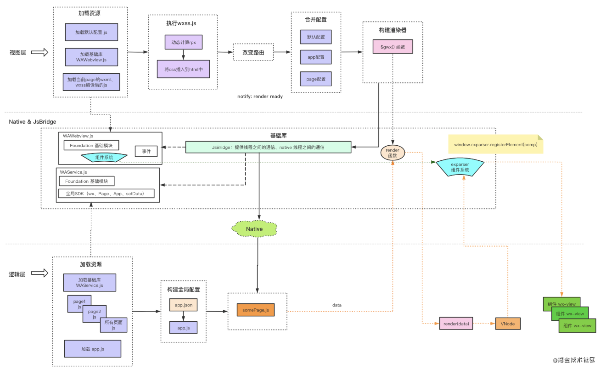
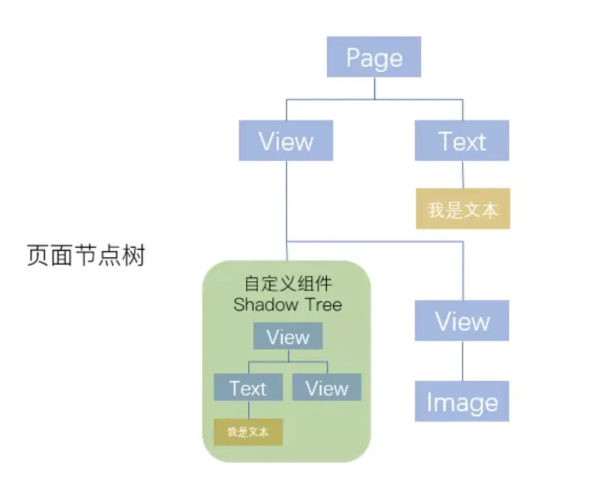

# 小程序原理

小程序是双线程应用，提高了渲染速度。通过两个 webview 来达到安全沙箱的目的，线程之间的通信则是通过 jsBridge 底层。

## 基本概念

### 逻辑层：业务处理

- 加载js => 业务、生命周期(Page、App)、事件、数据加载等处理
- 单独的线程: iframe（ios/jscore，安卓/v8）
- 只有一个逻辑层来维护一个 App 实例（多个 Page 实例维护在一个 App 实例中）
- 更新视图层数据：setData

### 渲染层：页面的基本结构、样式

- 单独的线程: webkit(iframe)
- wxml：视图内容 => html
- wxss: 视图样式 => css
- 多个视图层（一个 wxml => html 就是一个视图层）
- wxs：

## 运行时流程

[图片来源](https://juejin.cn/post/6900329244950609928)

### 逻辑层

- 提供注册实例/页面方法 App()、Page()
- 提供通信能力，js => wxml
- 生命周期维护能力
- 调用微信原生API能力
- 执行过程

### 视图层

- 事件处理
- 提供通信能力，wxml => js
- 数据渲染到页面能力
- webComponent / render能力
- 执行过程

### 与传统 web 页面显示流程的对比

#### 传统 web 页面显示需要经历一下几个步骤

- webview 初始化
- 加载 HTML, CSS, JS
- 编译 JS
- Render 计算
- DOM Path

#### 小程序架构运行流程

> webview部分

- webview 初始化
- 加载 HTML，CSS, JS (经过拆分后，体积大幅度减小)
- 编译 JS
- 等待页面需要的数据
- 反序列化数据
- 执行 Patch
- 渲染页面
- 等待更多消息

> jsCore部分

- 初始化
- 加载框架 js 代码
- 编译 js
- 加载业务逻辑 js 代码
- 编译 js
- 计算首屏虚拟 DOM 结构
- 序列化数据，传输
- 等待 webview 消息，或者 Native 消息

## 小程序的优点和缺点

### 优点

- 渲染进程和逻辑进程分离，并行处理：
- 加速首屏渲染速度；避免单线程模型下，js 运算时间过长，UI 出现卡顿。
- 完全采用数据驱动的方式，不能直接操作 DOM，避免低质量的代码。

### 缺点

- 不能灵活操作 DOM，无法实现较为复杂的效果
- 部分和 NA 相关的视图有使用限制，如微信的 scrollView 内不能有 textarea 和原生组件
- 页面大小、打开页面数量都受到限制
- 需要单独开发适配，不能复用现有代码资源。

## 启动加载性能优化

### 启动加载原理

小程序启动主要分为逻辑层的启动和视图层的启动。逻辑层执行js代码逻辑，视图层以 webview 为载体，完成页面内容的渲染和更新。

小程序启动前，客户端会对小程序的基础环境进行预加载，提升小程序加载的速度。在用户打开小程序的时，会首先进行代码包的下载，下载完成后分别在逻辑层和视图层注入执行开发者的业务代码，最终将执行结果聚合渲染出首屏内容。

启动过程三个阶段：

- 资源准备，代码包的下载和校验工作。
- 业务代码的注入以及落地页首次渲染，进行业务代码的注入和执行，等待首次渲染完成。
- 落地页请求时的网络加载状态

上面三个过程基本与传统 web 应用类似。

### 控制代码包大小

从加载原理上来看，代码包的大小最直接影响整个小程序加载启动性能。提升小程序的启动加载性能，最直接有效的就是减少代码包的大小。

- 开启“代码压缩”的选项。
- 编码时规范，减少层级等方式来做。
- 即时清理废弃的代码，尤其是比较大的第三方库，以及一些不使用的图片等资源文件。
- 减少本地图片等资源文件，必要时使用网络图片代码。

以上手段主要通过code的方式来减少代码量。

### 分包

#### 分包加载

根据业务场景，将用户访问率高的页面放在主包里，将访问率低的页面放入子包里，按需加载；
在小程序启动时，默认会下载主包并启动主包内页面，当用户进入分包内某个页面时，客户端会把对应分包下载下来，下载完成后再进行展示。

#### 独立分包

独立分包是小程序中一种特殊类型的分包，可以独立于主包和其他分包运行。从独立分包中页面进入小程序时，不需要下载主包。当用户进入普通分包或主包内页面时，主包才会被下载。
可以按需将某些具有一定功能独立性的页面配置到独立分包中。当小程序从普通的分包页面启动时，需要首先下载主包；而独立分包不依赖主包即可运行，可以很大程度上提升分包页面的启动速度。

#### 分包预下载

开发者可以通过配置，在进入小程序某个页面时，由框架自动预下载可能需要的分包，提升进入后续分包页面时的启动速度。对于独立分包，也可以预下载主包。

### 首屏优化加载

#### 提前请求

数据请求并不依赖页面结构完整，可以在页面加载时或代码注入时即 在页面 onload 就发起，而不需要等待页面渲染完成。用户等待请求返回的时间就会进一步缩短。

#### 利用缓存

利用storage API 对请求结果请进缓存，二次启动时，直接用缓存数据完成渲染。同时，即使在无网环境下，用户也可以使用小程序的部分功能。

#### 避免白屏

使用骨架屏幕，请求过程中，在页面中先展示一个基础的骨架和结合已有的数据进行展示。

## 渲染性能优化

### 小程序更新视图数据的通信流程

每当小程序视图数据需要更新时，逻辑层会调用小程序宿主环境提供的 setData 方法将数据从逻辑层传递到视图层，经过一系列渲染步骤之后完成UI视图更新。完整的通信流程如下：

- 小程序逻辑层调用宿主环境的 setData 方法。
- 逻辑层执行 JSON.stringify 将待传输数据转换成字符串并拼接到特定的JS脚本，并通过evaluateJavascript 执行脚本将数据传输到渲染层。
- 渲染层接收到后， WebView JS 线程会对脚本进行编译，得到待更新数据后进入渲染队列等待 WebView 线程空闲时进行页面渲染。
- WebView 线程开始执行渲染时，待更新数据会合并到视图层保留的原始 data 数据，并将新数据套用在WXML片段中得到新的虚拟节点树。经过新虚拟节点树与当前节点树的 diff 对比，将差异部分更新到UI视图。同时，将新的节点树替换旧节点树，用于下一次重渲染。

从架构上，逻辑层和视图层无法直接共享数据的，数据传输是一次跨进程的通信，会有一定的通信开销，这一开销与传输的数据量正相关。

### 正确使用 setData

- 避免在 data 中放置与渲染无关的数据，只在 data 中放置与页面渲染相关的数据。
- 避免使用 setData 一次性传输大量数据，只对发生变化的数据进行 setData。
- 不要在短时间内连续的频繁调用 setData，对连续的 setData 尽可能的进行合并，做切片。

### 使用自定义组件

自定义组件除了有利于代码复用，提升开发效率外，还可以有效的提升页面局部频繁更新时的性能。自定义组件的更新只在组件内部进行，不受页面其他部分内容的影响，可以大大降低页面更新的开销。

在页面引用自定义组件后，当初始化页面时，Exparser 会在创建页面实例的同时，也会根据自定义组件的注册信息进行组件实例化，然后根据组件自带的 data 数据和组件WXML，构造出独立的 Shadow Tree ，并追加到页面 Composed Tree 。创建出来的 Shadow Tree 拥有着自己独立的逻辑空间、数据、样式环境及setData调用：

### 减少数据结构的嵌套层数

时间开销大体上与节点树中节点的总量成正比例关系。因而减少 WXML 中节点的数量可以有效降低初始渲染和重渲染的时间开销，提升渲染性能。

初始渲染时，将初始数据套用在对应的 WXML 片段上生成节点树。最后根据节点树包含的各个节点，在界面上依次创建出各个组件。

### key 值在列表渲染中的作用

与各大框架的 key 值作用类似

### 参考

- [浅谈小程序性能优化](https://juejin.cn/post/6844903877041471502#heading-6https://juejin.cn/post/6844903877041471502)
- [小程序底层实现原理](https://mp.weixin.qq.com/s/o5MJHozQqCcwUl4yVgUGPA)
- [小程序架构原理](https://juejin.cn/post/6900329244950609928)
