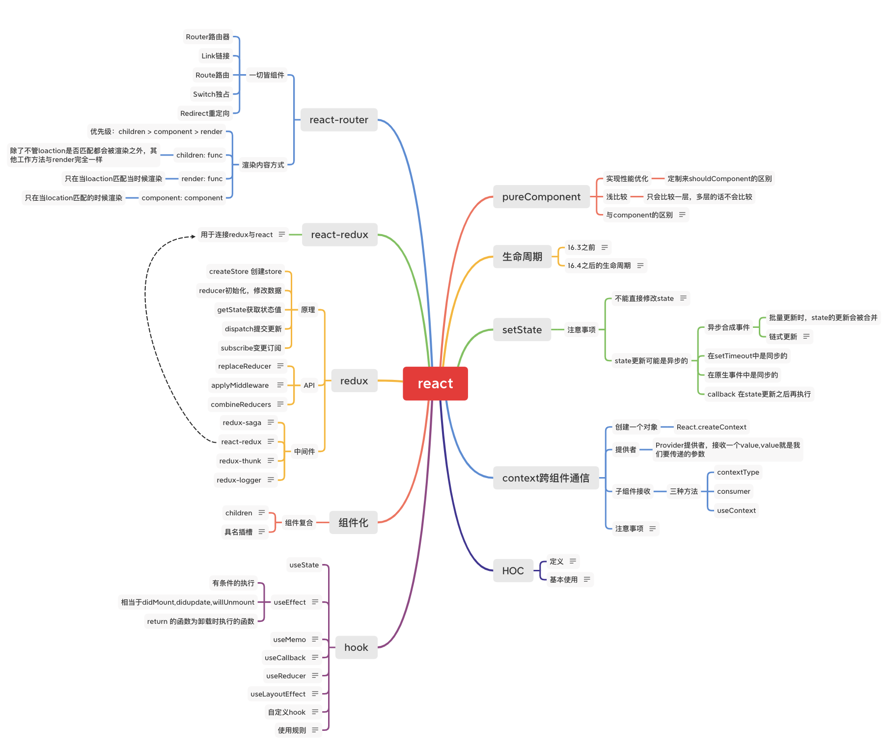
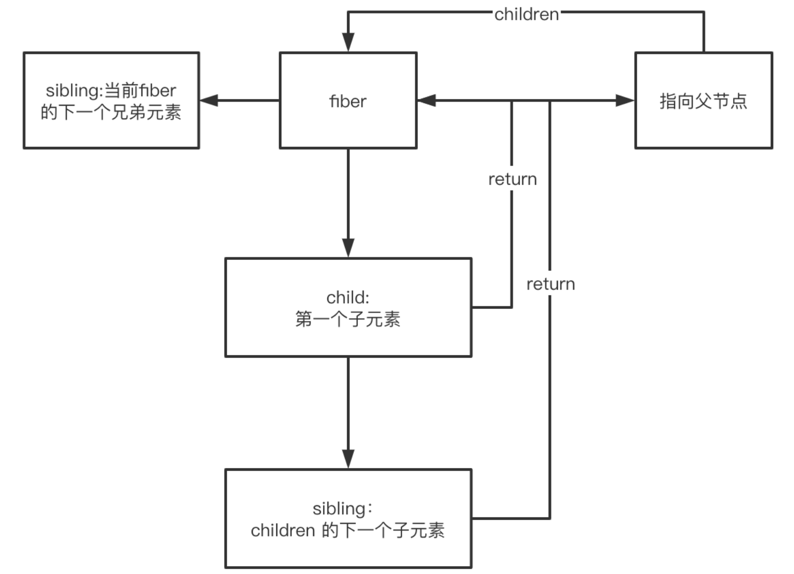

# React核心



## React原理

入口 `createElement`，其原理为 `babel-loader` 将jsx代码转换成 `createElement`.

createElement 有三个参数，type（节点类型），config（配置项），children（子项）

返回 `props` 和 `type`。

```js
function createElement(type, config, ...children) {

  // 生成props
  const props = {
    ...config,
    children: children.map(child =>
      typeof child === "object" ? child : createTextNode(child)
    )
  };

  return {
    type,
    props
  };
}

// 把文本节点变成对象的形式
function createTextNode(text) {
  return {
    type: "text",
    props: {
      children: [],
      nodeValue: text
    }
  };
}

export default { createElement };
```

- react-dom

`react-dom` 的 `render` 函数负责节点渲染。

```js
function render(vNode, container) {
  // vNode转node
  const node = createNode(vNode);
  // 添加到容器里面
  container.appendChild(node);
}
// 生成真实dom节点
function createNode(vNode) {
  let node = null;
  const { type, props } = vNode;
  // 创建文本节点
  if (type === "text") {
    node = document.createTextNode("");
  } else if (typeof type === "string") {
    // 证明是个html标签节点， 比如div、span
    node = document.createElement(type);
  } else if (typeof type === "function") {
    // 类组件或者函数组件
    node = type.isReactComponent
      ? updateClassComponent(vNode)
      : updateFunctionComponent(vNode);
  } else {
    // 空节点处理
    node = document.createDocumentFragment();
  }

  // 遍历children
  reconcileChildren(props.children, node);
  updateNode(node, props);
  return node;
}

// 遍历下子节点
function reconcileChildren(children, node) {
  for (let i = 0; i < children.length; i++) {
    let child = children[i];
    // child是vNode，那需要把vNode->真实dom节点，然后插入父节点node中
    render(child, node);
  }
}

// 添加节点属性
function updateNode(node, nextVal) {
  Object.keys(nextVal)
    .filter(k => k !== "children")
    .forEach(k => {
      node[k] = nextVal[k];
    });
}

// 类组件更新
function updateClassComponent(fiber) {
  const { type, props } = fiber;
  const cmp = new type(props);
  const vvNode = cmp.render()
  const children = [vvNode];
  reconcileChildren(fiber, children);
}

// 函数组件更新
function updateFunctionComponent(fiber) {
  const {type, props} = fiber;
  const children = [type(props)];
  reconcileChildren(fiber, children);
}

export default {render}; 
```

以上是 react 核心代码，未实现数据变化。

1. webpack+babel 编译时，替换 JSX 为 React.createElement(type,props,...children)
2. 所有 React.createElement() 执行结束后得到一个 JS 对象即 vdom，它能够完整描述 dom 结构
3. ReactDOM.render(vdom, container) 可以将 vdom 转换为 dom 并追加到 container 中
4. 转换过程需要经过一个 diff 过程

## diff 算法

### reconciliation 协调

在某一时间节点调用 React 的 render() 方法，会创建一棵由 React 元素组成的树。在下一次 state 或 props 更新时，相同的 render() 方法会返回一棵不同的树。React 需要基于这两棵树之间的差别来判断如何有效率的更新 UI 以保证当前 UI 与最新的树保持同步。在某一时间节点调用 React 的 render() 方法，会创建一棵由 React 元素组成的树。在下一次 state 或 props 更新时，相同的 render() 方法会返回一棵不同的树。React 需要基于这两棵树之间的差别来判断如何有效率的更新 UI 以保证当前 UI 与最新的树保持同步。就是更新UI

react 协调策略：

- 两个不同类型的元素会产生出不同的树;
- 可以通过 key 来暗示哪些子元素在不同的渲染下能保持稳定;

### diff 策略

1. 同级比较，Web UI 中 DOM 节点跨层级的移动操作特别少，可以忽略不计。
2. 拥有不同类型的两个组件将会生成不同的树形结构。
3. 可以通过 key 来暗示哪些子元素在不同的渲染下能保持稳定。

### diff过程

- 删除: newVNode 不存在时
- 替换: vNode 和 newVNode 类型不同或 key 不同时
- 更新:有相同类型和 key 但 vNode 和 newVNode 不同时

## Fiber

fiber 在组件渲染时使用，fiber 是指组件上将要完成或者已经完成的任务，每个组件可以一个或者多个. `fiber` 核心代码 `window.requestIdleCallback`。

### window.requestIdleCallback()

window.requestIdleCallback() 方法将在浏览器的空闲时段内调用的函数排队。这使开发者能够在主事件循环上执行后台和低优先级工作，而不会影响延迟关键事件，如动画和输入响应。函数一般会按先 进先调用的顺序执行，然而，如果回调函数指定了执行超时时间 timeout ，则有可能为了在超时前执行 函数而打乱执行顺序。

在空闲回调函数中调用 requestIdleCallback() ，以便在下一次通过事件循环之前调度另一个回调。

### Fiber 架构



### Fiber 核心代码

fiber 的数据结构如下：

- type: 标记当前节点的类型;
- props: 属性;
- key: 标记唯一性;
- child: 第一个子节点;
- sibling: 下一个兄弟节点;
- return: 指向父节点
- node: 真实的dom节点
- base: 记录下当前的节点

```js
let newFiber = {
  type: 'text',
  props: 'props',
  node: null,
  base: null,
  return: "",
};
```

使用 fiber 重写 render 函数

```js
// 下一个要执行的fiber，数据结构就是fiber
let nextUnitWork

// 正在进行中的fiber
let wipRoot = null;

function render(vNode, container) {

  wipRoot = {
    node: container,
    props: {
      children: [vNode]
    },
    base: null
  };
  nextUnitOfWork = wipRoot;
}

requestIdleCallback(workLoop);
function workLoop(deadline) {
  // 剩余时间
  while(nextUnitWork && deadline.timeRemaining() > 1) {
    // 执行更新当前fiber，并且返回下一个要执行的fiber
    nextUnitWork = performUnitOfWork(nextUnitOfWork);
    if (!nextUnitOfWork) {
    // 没有下一个任务了，执行提交
      commitRoot();
    }
  }
  // 不停执行此函数
  requestIdleCallback(workLoop);
}

// 执行work
function performUnitOfWork(fiber) {
  // step1:执行更新当前fiber
  const { type } = fiber;
  if (typeof type === "function") {
    type.isReactComponent
      ? updateClassComponent(fiber)
      : updateFunctionComponent(fiber);
  } else {
    // 更新原生标签
    updateHostComponent(fiber);
  }

  // step2:返回下一个需要执行的fiber
  if(fiber.child) {
    return fiber.child
  }
  // 无子节点,找兄弟节点
  let nextFiber = fiber
  while(nextFiber) {
    if(nextFiber.sibling) {
      return nextFiber.sibling
    }
    nextFiber = nextFiber.return
  }
}

// 添加节点属性
function updateNode(node, nextVal) {
  Object.keys(nextVal)
    .filter(k => k !== "children")
    .forEach(k => {
      node[k] = nextVal[k];
    });
}

// 生成真实dom节点
function createNode(vnode) {
  let node = null;
  const {type, props} = vnode;

  if (type === TEXT) {
    //创建文本节点
    node = document.createTextNode("");
  } else if (typeof type === "string") {
    // 证明是个html标签节点， 比如div、span
    node = document.createElement(type);
  }
  updateNode(node, props);
  return node;
}

// 处理原生标签
function updateHostComponent(fiber) {
  if (!fiber.node) {
    fiber.node = createNode(fiber);
  }
  const { children } = fiber.props;
  reconcileChildren(fiber, children);

  console.log("updateHostComponent", fiber); //sy-log
}

// 协调子节点
// 1. 给workInProgress添加一个child节点，就是children的第一个子节点形成的fiber
// 2. 形成fiber架构，把children里节点遍历下，形成fiber链表状
function reconcileChildren(workInProgress, children) {
  let prevSibling = null;
  for (let i = 0; i < children.length; i++) {
    let child = children[i];
    // 先写初次渲染
    let newFiber = {
      type: child.type,
      props: child.props,
      node: null,
      base: null,
      return: workInProgress,
      effectTag: PLACEMENT
    };

    if (i === 0) {
      workInProgress.child = newFiber;
    } else {
      prevSibling.sibling = newFiber;
    }

    prevSibling = newFiber;
  }
}

// 提交任务
function commitRoot() {
  commitWorker(wipRoot.child);
  wipRoot = null;
}

function commitWorker(fiber) {
  if (!fiber) return;
  let parentNodeFiber = fiber.return;
  while (!parentNodeFiber.node) {
    parentNodeFiber = parentNodeFiber.return;
  }
  const parentNode = parentNodeFiber.node;
  // fiber有node节点
  if (fiber.effectTag === PLACEMENT && fiber.node !== null) {
    parentNode.appendChild(fiber.node);
  }

  commitWorker(fiber.child);
  commitWorker(fiber.sibling);
}
```

## Hook

- 类组件，当把属性改变的时候 state 可以对组件进行更新，
- 函数组件，在 hook 出现时候，无法进行视图的更新，且函数组件无生命周期，导致函数组件无更广的使用面。

### hook 解决的问题

- 组件之间复用状态逻辑问题，避免了像类组件那种侵入式的组件结构。一个 hook 只做一件事情，面向过程编程，
- hook 可以让颗粒度较小，比如 `componentDidMount` 中进行多个接口调用，在 hook 中可以拆分成多个 `useEffect`，方便做逻辑拆分。
- 在类组件中，修改数据是做对象的合并，而 hook 当中是做数据的覆盖。

### hook类型

> 基础的hook

- useState
- useEffect
- useContext

> 额外的hook

- useReducer
- useCallback
- useMemo
- useRef
- useImperativeHandle
- useLayoutEffect
- useDebugValue

### useEffect

执行 state 中的副作用，在生命周期中类似于 class 组件里的，componentDidMount 和 componentDidUpdate。

- 条件执行

```js
// 依赖项xxx改变时执行
useEffect(() => {
  // do someThing
},[xxx])
```

```js
// 只有didMount的生活执行
useEffect(() => {
  // do someThing
},[])
```

- 清除

```js
const [date, setDate] = useState(new Date())
useEffect(() => {
  const timer = setInterval(() => {
    setDate(new Date())
    return () => clearInterval(timer)
  }, 1000)
},[])
```

### 自定义 Hook

实现时钟 Hook,名称以`use`开头，函数内部可以调用其他Hook

```js
function useClock() {
  const [date, setDate] = useState(new Date())
  useEffect(() => {
    const timer = setInterval(() => {
      setDate(new Date())
      return () => clearInterval(timer)
    }, 1000)
  },[])
  return date
}
```

- Hook 使用规则

1. Hook 就是 js 函数，只能在最外层定义 hook，不能在循环和嵌套函数里面去调用。
2. 只能在 react 的函数组件中调用，在自定义 hook 里面也可以调用 Hook

### useMemo 和 useCallBack

#### useMemo

类似于 vue 中的 computed。只有依赖项改变的时候，函数体内容才会执行

```js
const expensive = useMemo(() => {
  console.log("compute")
  let sum = 0;
  function factorial(n, total = 1) {
    if(n == 0) return total
    return factorial(n-1, total + n)
  }
}, [count])
```

#### useCallback

用于和子组件间的回调性能优化

```js
// 当依赖性xxx变化时才会执行
const addClick = useCallback(() => {

}, [xx])
```

### useState 的大概原理

```js
const stateArray = [] // 收集状态，这里用的是数组，实际上是链表,存在fiber节点里面
let cursor = 0
function myUseState(initialState) {
  const currentCursor = cursor
  stateArray[currentCursor] = stateArray[currentCursor] || initialState
  
  function setState(newState) {
    stateArray[currentCursor] = newState
    render()
  }

  cursor++

  return [state, setState]
}
```

### useEffect大致原理

```js
const allDeps = [] // 收集状态，这里用的是数组，实际上是链表结构
let effectCursor = 0 //游标

function myUseEffect(callBack: () => {}, depArray: []) {
  if(!depArray) {
    callBack()
    allDeps[effectCursor] = depArray
    effectCursor++
    return
  }
  
  const deps = allDeps[effectCursor]

  const flag = deps ? depArray.some((el, i) => el !== deps[i]) : true

  if (flag) {
    callBack()
    allDeps[effectCursor] = depArray
  }

  effectCursor++
}
```
