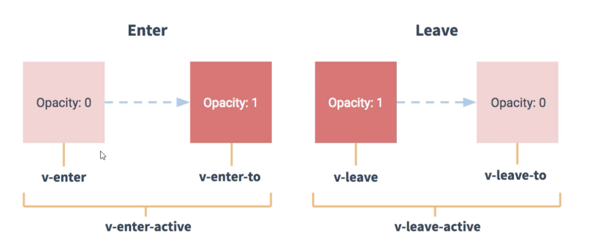

# Vue 常见问题

## 生命周期相关

### vue 的生命周期

beforeCreate：是 new Vue() 之后触发的第一个钩子，在当前阶段 data、methods、computed 以及 watch 上的数据和方法都不能被访问。

created：在实例创建完成后发生，当前阶段已经完成了数据观测，也就是可以使用数据，更改数据，在这里更改数据不会触发 updated 函数。可以做一些初始数据的获取，在当前阶段无法与 Dom 进行交互，如果非要想，可以通过 vm.$nextTick 来访问 Dom。

beforeMount：发生在挂载之前，也就是响应式数据发生更新，虚拟 dom 重新渲染之前被触发，你可以在当前阶段进行更改数据，不会造成重渲染。

mounted：在挂载完成后发生，在当前阶段，真实的Dom挂载完毕，数据完成双向绑定，可以访问到Dom节点，使用$refs属性对Dom进行操作。

beforeUpdate：发生在更新之前，也就是响应式数据发生更新，虚拟dom重新渲染之前被触发，可以在当前阶段进行更改数据，不会造成重渲染。

updated：发生在更新完成之后，当前阶段组件 Dom 已完成更新。要避免在此期间更改数据，因为这可能会导致无限循环的更新。

beforeDestroy：发生在实例销毁之前，在当前阶段实例完全可以被使用，我们可以在这时进行善后收尾工作。

destroyed：发生在实例销毁之后，这个时候只剩下了 dom 空壳。组件已被拆解，数据绑定被卸除，监听被移出，子实例也统统被销毁。

### Vue 组件中的 data 为什么必须是函数，而根实例没有此限制

此过程发生在 initData 函数中。

Vue 组件可能会存在多个实例，如果使用对象形式定义 data，则会导致它们共用一个 data 对象，状态的更新会影响所有组件实例。

当采用函数形式定义，在 initData 时会将其作为工厂函数返回全新 data 对象，每次都会创建新的对象，有效规避多实例之间状态污染问题。

而在Vue根实例创建过程中则不存在该限制，是单例的，也是因为根实例只能有一个，不需要担心这种情况。

在初始化过程中，会判断 data 的类型走不同的方式。根实例与组件实例走的逻辑不一样

```js
// 根例
mergeDataOrFn(parentVal, childVal, vm)

// 组件实例
mergeDataOrFn(parentVal, childVal )

function mergeDataOrFn (
  parentVal,
  childVal,
  vm
) {
  if (!vm) {
    if (!childVal) {
      return parentVal
    }
    if (!parentVal) {
      return childVal
    }
    return function mergedDataFn () {
      return mergeData(
        typeof childVal === 'function' ? childVal.call(this, this) : childVal,
        typeof parentVal === 'function' ? parentVal.call(this, this) : parentVal
      )
    }
  } else {
    return function mergedInstanceDataFn () {
      // instance merge
      var instanceData = typeof childVal === 'function'
        ? childVal.call(vm, vm)
        : childVal;
      var defaultData = typeof parentVal === 'function'
        ? parentVal.call(vm, vm)
        : parentVal;
      if (instanceData) {
        return mergeData(instanceData, defaultData)
      } else {
        return defaultData
      }
    }
  }
}
```

## 编译相关

### v-if 与 v-for 哪个优先级更高？如果两个同时出现，应该怎么优化得到更好的性能

在 `vue` 源码中的 `compiler/codegen/index.js` 中可以找到答案。

- 解决方案1

```js
<p v-for="child in children" v-if="isFolder">{{child.title}}</p>
```

由于在生成渲染函数的时候 `v-for` 的优先级高于 `v-if`, `v-if` 会在 `v-for` 生成渲染子项的内部。循环会在外面先执行,浪费了性能。

- 解决方案2

```js
<template v-if="isFolder">
  <p v-for="child in children" >{{child.title}}</p>
</template>
```

先判断函数再循环，当 `condition` 成立的时候才会去执行渲染列表，否则是个 `empty` 函数

::: tip
如果和渲染子项的数据有关,则把渲染数据放到 `computed` 里面做一次 `filter`，留下需要渲染的项目即可。
:::

::: tip
如果条件出现在循环内部，可通过计算属性提前过滤掉那些不需要显示的项
:::

### vue 模版渲染

`vue` 中的模版 `template` 会被 `vue-loader` 转换为 `render` 函数, 并渲染出对应的 `HTML` 元素，就可以让视图跑起来了。

模版编译分三个阶段：解析 `parse`，优化 `optimize`，生成 `generate`，最终生成可执行函数 `render`。

- `parse` 阶段：使用大量的正则表达式对 `template` 字符串进行解析，将标签、指令、属性等转换为 `AST`。
- `optimize` 阶段：遍历 `AST`, 找到其中的一些静态节点，并做标记，方便在页面重渲染的时候进行 `diff` 比较时，直接跳过这一些静态节点，优化 `runtime` 的性能。
- `generate` 阶段：将最终的 `AST` 转化为 `render` 函数字符串。

### template 预编译是什么

对于 `Vue` 组件来说，模板编译只会在组件实例化的时候编译一次，生成渲染函数之后在也不会进行编译。因此，编译对组件的 `runtime` 是一种性能损耗。

而模版编译的目的仅仅是将 `template` 转换为 `render function`,这个过程，正好可以在项目构建过程中完成，这样可以让实际组件在 `runtime` 过程中跳过模版渲染，进而提升性能，这个在项目构建的编译 `template` 的过程，就是预编译。

### template 和 jsx 有什么区别

对于 `runtime` 来说，只需要保证组件存在 `render` 函数即可，在预编译之后，只需要保证构建过程中生成 `render` 函数即可。

在 `webpack` 中，只需要保证组件存在 `render` 函数即可，而我们有了预编译之后，我们只需要保证构建过程中生成 `render` 函数就可以。

在 `webpack` 中，我们使用 `vue-loader` 编译 `.vue` 文件，内部依赖的 `vue-template-compiler` 模块，在 `webpack` 构建过程中，将 `template` 预编译成 `render` 函数。

在 `jsx` 中，添加了语法糖解析器 `babel-plugin-transform-vue-jsx` 之后，可以直接手写 `render` 函数。

所以，`template` 和 `jsx` 都是 `render` 的一种表现形式，不同的是：

`jsx` 相对于 `template` 会有更高的灵活性，在复杂组件中，更具有优势。`template` 在代码结构上更符合视图与逻辑分离的习惯，更简单、更直观、更好维护。

## 渲染与更新相关

### vue 中 key 的工作原理

`key` 的作用主要应用在更新阶段。有以下几点用处：

- `key` 的作用主要是为了高效的更新虚拟 `DOM`，其原理是 `vue` 在 `patch` 过程中通过 `key` 可以精准判断两个节点是否是同一个，从而避免频繁更新不同元素，使得整个 `patch` 过程更加高效，减少 DOM 操作量，提高性能。
- `vue` 中在使用相同标签名元素的过渡切换时，也会使用到 `key` 属性，其目的也是为了让 `vue` 可以区分它们，否则 `vue` 只会替换其内部属性而不会触发过渡效果。
- 在对节点进行 `diff` 的过程中，判断是否为相同节点的一个很重要的条件是 `key` 是否相等，如果是相同节点，则会尽可能的复用原有的 `DOM` 节点。所以 `key` 属性是提供给框架在 `diff` 的时候使用的，而非开发者。

总而言之就是为了在 `patch` 阶段更加高效。

### 怎么理解 vue 中的 diff 算法

- 为什么要 `diff` 算法

精确比较，当 `data` 发生变化，可能存在多个 `key`,执行新旧两次虚拟 `DOM` 的 `diff`。
`vue 2.x` 中为了降低 `Watcher` 粒度，每个组件只有一个 `Watcher` 与之对应，只有引入 `diff` 才能精确找到 发生变化的地方。

- 怎么执行

`patchVNode` 是 `diff` 发生的地方，整体策略：深度优先同层遍历。
vue 中 diff 执行的时刻是组件实例执行其更新函数时，它会比对上一次渲染结果 oldVNode 和新的渲染 结果 newVNode

- 高效

双路比较。发生在 `updateChildren`

- `diff` 算法是虚拟 `DOM` 技术的必然产物：通过新旧虚拟 `DOM` 作对比（即 diff），将变化的地方更新在真实 `DOM` 上；另外，也需要 `diff` 高效的执行对比过程，从而降低时间复杂度为 `O(n)`。
- `diff` 过程整体遵循深度优先、同层比较的策略；两个节点之间比较会根据它们是否拥有子节点或者文本节点做不同操作；比较两组子节点是算法的重点，首先假设头尾节点可能相同做4次比对尝试，如果没有找到相同节点才按照通用方式遍历查找，查找结束再按情况处理剩下的节点；借助 `key` 通常可以非常精确找到相同节点，因此整个 `patch` 过程非常高效。

在新老虚拟 `DOM` 对比时

- 首先，对比节点本身，判断是否是同一节点，如果不为相同节点，则删除该节点重新创建节点进行替换。
- 如果为相同节点，进行 `patchVNode`, 判断如何对该节点的子节点进行处理，先判断一方有子节点一方没有子节点的情况。(如果新的 `children` 没有子节点，将旧的子节点移除)
- 比较如果都有子节点，则进行 `updateChildren`，判断如何对这些新老节点的子节点进行操作
- 匹配时，找到相同的子节点，递归比较子节点

### 组件的本质

- 组件配置 => `VueComponent` 实例 => `render` => `Virtual Dom` => `Dom`

组件的本质就是产生虚拟 `Dom`

### 自定义模式

```js
vue.component('comp', {
  template: '<div>my component</div>'
})
```

- 组件化性能高，执行效率变高，`watcher`粒度化, `patch` 范围变小。
- 组件是独立和可复用的代码组织单元。组件系统是 `Vue` 核心特性之一，它使开发者使用小型、独立和通常可复用的组件构建大型应用。
- 组件化开发能大幅提高应用开发效率、测试性、复用性等。
- 组件使用按分类有：页面组件、业务组件、通用组件；
- `vue` 的组件是基于配置的，我们通常编写的组件是组件配置而非组件，框架后续会生成其构造函数。
- 合理的划分组件，有助于提升应用性能
- 组件应该是高内聚、低耦合的
- 遵循单向数据流的原则
- `vue` 中常见组件化技术有：属性 `prop`，自定义事件，插槽等，它们主要用于组件通信、扩展等。

### vue 异步更新流程

- 第一步

队列保存更新函数，一个 `key` 对应一个 `watcher`,如果对相同 `key` 进行操作，则只会更新一次

- 第二步

批量处理，利用微任务。

优先级：

1. Promise/MutationObserver
2. SetImmediate/SetTimeOut

## 重点API

### computed 与 watch 的区别

计算属性 `computed` 和监听器 `watch` 都可以观察属性的变化从而做出响应，不同的是：

- computed

计算属性 `computed` 更多是作为缓存功能的观察者，它可以将一个或者多个 `data` 的属性进行复杂的计算生成一个新的值，提供给渲染函数使用，当依赖的属性变化时，`computed` 不会立即重新计算生成新的值，而是先标记为脏数据，当下次 `computed` 被获取时候，才会进行重新计算并返回。

存取器的写法看上去就像设置一个属性一样了，而且我们还可以设置计算属性的值，上面的写法会影响到响应式属性 `n`,当设置 `vm.a` 时，`vm.n` 也会发生变化。
`computed` 默认有缓存效果，当计算属性没有发生变化时，不会重新计算更不会重新渲染。

- watch

而监听器 watch 并不具备缓存性，监听器 watch 提供一个监听函数，当监听的属性发生变化时，会立即执行该函数。watch 是异步函数，如果我们的属性需要在侦听后再执行某个变化,可以使用 $nextTick 这个API。

#### 属性值的不同影响 watch 结果

- 当属性值为简单数据类型时，以 `vm.a` 为例，由于此时属性值是简单数据类型，所以很容易监听到其发生变化。此时属性值 `!==` 改变后的属性值,就会触发 `watch`。
- 当属性值为复杂数据类型时，以 `vm.b` 为例子，它保存了 `{c:2}` 这个值。

如果它的内存地址发生变化，也就是说原先的 `{c:2}` 和我后来设置的 `{c:2}` 的内存地址不一致，所以就会触发b变了，

#### deep 和 immediate

`deep` 表示深侦听，也就是我设置的属性对应的属性值即使是复杂数据类型，加上 `deep`，就全方位侦听，包括地址、内层属性的地址、内层属性的属性值。

`immediate` 是表示当侦听开始时就先触发 `callback` 函数，默认为一开始不会触发 `watch` 效果，而仅仅是侦听。

### watch 的实现原理

watch的分类：

- deep watch（深层次监听）
- user watch（用户监听）
- computed watcher（计算属性）
- sync watcher（同步监听）

watch 实现过程：

- `watch` 的初始化在 `data` 初始化之后（此时的 `data` 已经通过 `Object.defineProperty` 的设置成响应式）
- `watch` 的 `key` 会在 `Watcher` 里进行值的读取，也就是立马执行 `get` 获取 `value`（从而实现 `data` 对应的 `key` 执行 `getter` 实现对于 `watch` 的依赖收集），此时如果有 `immediate` 属性那么立马执行 `watch` 对应的回调函数
- 当 `data` 对应的 `key` 发生变化时，触发 `user watch` 实现 `watch` 回调函数的执行

### 数组数据的响应化过程

```js
const originalProto = Array.prototype
const arrProto = Object.create(originalProto)
const methodsToPatch = [
  'push',
  'pop',
  'shift',
  'unshift',
  'splice',
  'sort',
  'reverse'
]
methodsToPatch.forEach(method => {
  arrProto[method] = function() {
    originalProto[method].apply(this, arguments)
  }
})
```

### transition 动画

name：用于自动生成 `CSS` 过渡类名。例如：name: 'fade' 将自动拓展为 `.fade-enter`，`.fade-enter-active` 等。默认类名为 `"v"`



### keep-alive 组件有什么作用

如果你需要在组件切换的时候，保存一些组件的状态防止多次渲染，就可以使用 keep-alive 组件包裹需要保存的组件。

对于 `keep-alive` 组件来说，它拥有两个独有的生命周期钩子函数，分别为 `activated` 和 `deactivated` 。用 `keep-alive`包 裹的组件在切换时不会进行销毁，而是缓存到内存中并执行 `deactivated` 钩子函数，命中缓存渲染后会执行 `actived` 钩子函数。

源码中：`core/components/keep-alive`

### 创建 vue 节点的两种方式

- vue-extend

```js
function create(Component, props) {
  // 继承组件
  const Ctor = Vue.extend(Component)
  // 传参
  const comp = new Ctor({
    propsData: props
  })
  // 挂载
  comp.$mount()
  document.body.appendChild(comp.$el)
  comp.remove = function() {
    document.body.remove(comp.$el)
    comp.$destory()
  }
}
```

- 实例化

```js
function create(Component, props) {
  const vm = new Vue({
    // h是createElement, 返回VNode，是虚拟dom
    // 需要挂载才能变成真实dom
    render: h => h(Component, {props})
  }).$mount()// 不指定宿主元素，则会创建真实dom，但是不会追加操作

  // 获取真实dom
  document.body.appendChild(vm.$el)

  const comp = vm.$children[0]

  // 删除
  comp.remove = function() {
    document.body.remove(vm.$el)
    vm.$destroy()
  }
  
  return comp
}

```

### watch 与 watchEffect 的区别

`watch` 指定某一个，`watchEffect` 是一个 `callback` 函数，是一个收集依赖的过程。

## 概念性问题

### 组件化的理解

定义：组件是可复用的 `vue` 实例，准确的来说他们是 `VueComponent` 的实例，继承自 `vue`
优点：软件工程中，高内聚，低耦合的一种体现。

### 使用组件

- 定义：Vue.component(), new vue中的 components选项，sfc.
- 分类：有状态组件，函数式组件（functional），抽象组件（abstract，完成特定的功能）
- 通信：$on/$emit, props, provide/inject, $children/$parent/$root/$listeners
- 内容分发：slot, template, v-slot
- 使用和优化：is，keep-alive，异步组件

### vue 的性能优化

- 路由懒加载

```js
const router = new VueRouter({ 
  routes: [ 
    { path: '/foo', component: () => import('./Foo.vue') }   ] 
})
```

- keep-alive 缓存页面

```vue
<template> 
  <div id="app"> 
    <keep-alive> 
      <router-view/>
    </keep-alive> 
  </div> 
</template>
```

- 使用 v-show 复用 DOM

```vue
<template> 
  <div class="cell"> 
    <!--这种情况用v-show可以复用DOM-->
    <div v-show="value" class="on"> 
      <Heavy :n="10000"/> 
    </div> 
    <section v-show="!value" class="off"> 
      <Heavy :n="10000"/> 
    </section> 
  </div> 
</template>
```

- 数据冻结

不变的大数据使用 `object.freeze()` 让数据变成不可响应，增加性能。

- 事件销毁

`vue` 组件销毁时，会自动解绑它的全部指令和事件监听器，但是仅限于组件本身的事件。

- 无状态的组件标记为函数组件

```vue
<template functional>
  <div class="cell"></div>
</template>
<script>
export default {

}
</script>
```
