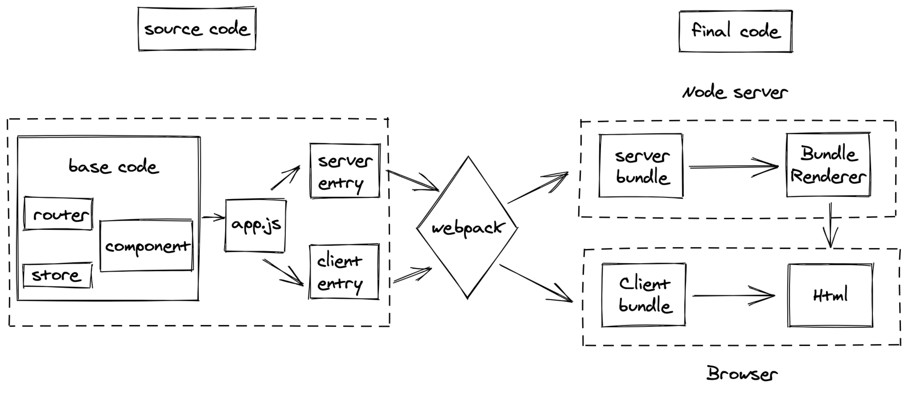
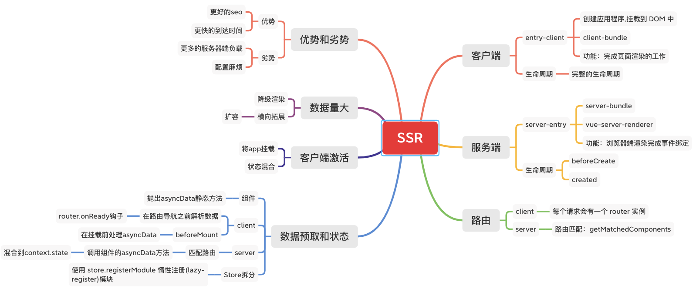

# SSR

## SSR 的架构图





### 主要流程

createApp , createStore , createRouter

entry-server: 路由匹配，

client-server: 路由与数据状态挂载。

## SSR 中的一些要点

总结了一些 SSR 中的要点

### 为什么需要使用 `createAp` 工厂函数

`node.js` 是一个长期运行的进程。当代码进入该进程时，它将进行一次取值并留存在内存中。这意味着如果只创建一个单例对象，它将在每个传入的请求之间共享。所以需要为每个请求创建一个新的根 `Vue` 实例。这与每个用户在自己的浏览器中使用新应用程序的实例类似。如果我们在多个请求之间使用一个共享的实例，很容易导致交叉请求状态污染 (cross-request state pollution)。

同样的规则也适用于 `router`、`store` 和 `event bus` 实例。

### webpack 的作用

提供工程化能力，打包 `bundle`。

- 服务器端 `bundle`，用于服务器端渲染(`SSR`)
- 客户端 `bundle`，用于混合静态标记。

### 入口文件

分两个入口，`enrty-client.js` 和 `entry-server.js`。

> entry-server

- 执行服务器端路由匹配 (server-side route matching)
- 执行数据预取逻辑 (data pre-fetching logic)

### 状态预取

> 服务器预取

```js
// entry-server.js
import { createApp } from './app'

export default context => {
  return new Promise((resolve, reject) => {
    const { app, router, store } = createApp()

    router.push(context.url)

    router.onReady(() => {
      const matchedComponents = router.getMatchedComponents()
      if (!matchedComponents.length) {
        return reject({ code: 404 })
      }

      // 对所有匹配的路由组件调用 `asyncData()`
      Promise.all(matchedComponents.map(Component => {
        if (Component.asyncData) {
          return Component.asyncData({
            store,
            route: router.currentRoute
          })
        }
      })).then(() => {
        // 在所有预取钩子(preFetch hook) resolve 后，
        // 我们的 store 现在已经填充入渲染应用程序所需的状态。
        // 当我们将状态附加到上下文，
        // 并且 `template` 选项用于 renderer 时，
        // 状态将自动序列化为 `window.__INITIAL_STATE__`，并注入 HTML。
        context.state = store.state

        resolve(app)
      }).catch(reject)
    }, reject)
  })
}
```

> 客户端预取

## SSR 解决的问题

`spa` 颠覆了前端的开发模式，但是 `spa` 的缺点是首次需要加载大量的资源，当然可以用分包来缩小包体积。`spa` 的首屏确实是存在问题的。

并且 `spa` 首个被加载的 `html` 内容并不是用户看到的内容，不利于 `ssr`.

## SSR 的优点和缺点

### 优点

#### 更好的 SEO

爬虫只会爬取源码。使用了 `Vue` 或者其它 `MVVM` 框架之后，页面大多数 `DOM` 元素都是在客户端根据 `js` 动态生成，可供爬虫抓取分析的内容大大减少。另外，浏览器爬虫不会等待我们的数据完成之后再去抓取我们的页面数据。服务端渲染返回给客户端的是已经获取了异步数据并执行`JavaScript`脚本的最终`HTML`，网络爬中就可以抓取到完整页面的信息。

#### 更快首屏的渲染

首屏的渲染是 `node` 发送过来的 `html` 字符串，并不依赖 `js` 文件,这就会使用户更快的看到页面的内容。大型的单页应用，打包后体积很大，客户端渲染加载所有所需文件时间较长，首页就会有一段白屏时间。

#### 降级渲染

当服务器负载过大时，我们需要做降级渲染，将渲染过程放到客户端中。实现方式很简单，通过node服务器中的开关，走不同的渲染模式即可。

### 缺点

#### 服务端压力大

统一到服务端`node`做渲染，会大量占用服务端`CPU`资源.

#### 更大的迁移成本

除了对 `webpack`、`Vue` 要熟悉，还需要掌握 `node`、`Express` 相关技术。相对于客户端渲染，项目构建、部署过程更加复杂。

### 只是首屏加载快

只是首屏加载快，对用户已经看过的页面没有优势，每次都要请求服务端数据

### 开发成本

某些声明周期钩子函数（如beforeCreate、created）能同时运行在服务端和客户端，因此第三方库要做特殊处理，才能在服务器渲染应用程序中运行。而前端开发的发展的主线一直在解决开发效率的问题。

## 其他代替方案

### nuxt

`nuxt` 约定配置过多，适合从 `0` 开始开发一个新的应用，有 `ssr` 的需求，并且会带来一些学习成本，主要是各种约定。开发体验足够好。这得从公司技术栈的方向上来决定是否使用 `nuxt`。

### 预渲染

如果只是单方面对 `seo` 的要求的话,可以使用 `pre-render-plugin` 这个组件，将重要的需要 `seo` 的页面单独打出来，这也是官方推荐的一种方式。

### html loading

同时在用户体验方面来说，也可以使用 `html` 中塞入 `loading` 片段达到首屏快速呈现 `loading` 动画的效果。

## 总结

从 `0` 开始做一套新的 `ssr` 架构的话，带来的技术难度是成倍增加的。但是很多时候 `SSR` 又是必须的，如果产品经理和你说，我不接受一开始一个 `loading` 动画，连骨架屏我也不接受，这时候如果系统架构不支持 `SSR` 的话，就歇菜了，架构师就要被开会了。
