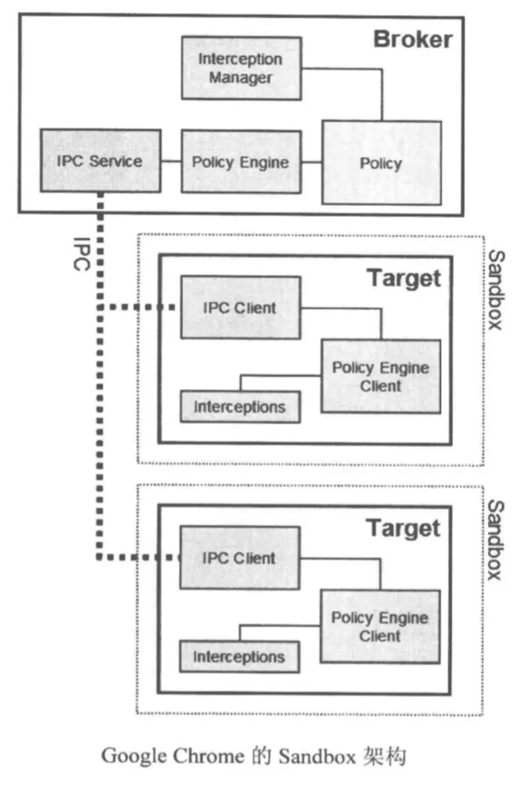
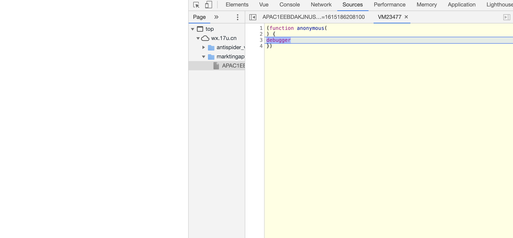

# 浏览器安全

## 浏览器安全

浏览器的安全由浏览器控制，主要从浏览器运行机制的安全，同源策略体现出来

### 同源策略

[跨域](./cross-domain.html)

如果两个 `URL` 的协议、域名和端口都相同，我们就称这两个 `URL` 同源。

两个相同的源之间是可以相互访问资源和操作 DOM ,两个不同的源之间若想要相互访问资源或者操作 DOM，那么会有一套基础的安全策略的制约。
同源策略表现在DOM、Web 数据和网络这三个层面。

- DOM层面：同源策略限制了来自不同的Javascript脚本对当前DOM读写的操作。
- 数据层面：同源策略限制了不同源的站点读取当前站点的 Cookie、IndexDB、LocalStorage 等数据。
- 网络层面：同源策略限制了通过 XMLHttpRequest 等方式将站点的数据发送给不同源的站点。

### 浏览器沙箱机制

Google Chrome 是第一个采取多进程架构的浏览器，其主要进程分为：浏览器进程、渲染进程、插件进程、扩展进程。

插件进程与浏览器进程严格隔离，互不影响。

渲染引擎由 Sandbox 隔离，网页代码要与浏览器内核进程通信、与操作系统通信都需要通过 IPC channel，在其中会进行一些安全检查。

Sandbox 目的：让不可信任的代码运行在一定的环境中，限制其访问隔离区外的资源，如果一定要跨域边界产生数据交换，则只能通过指定的数据通道，比如经过封装的 API 来完成，在这些 API 中会严格检查请求的合法性。



## 跨站脚本攻击（XSS）

XSS(Cross-Site Scripting)跨站脚本攻击，黑客通过“HTML注入”篡改了网页，插入了恶意的脚本，从而在用户浏览网页时，控制用户浏览器的一种攻击。
跨站脚本攻击有可能造成以下影响:

- 利⽤虚假输⼊表单骗取⽤户个⼈信息。
- 利⽤脚本窃取⽤户的Cookie值，被害者在不知情的情况下，帮助攻击者发送恶意请求。
- 显示伪造的⽂章或图⽚。
- 窃取 Cookie 信息
- 监听用户行为
- 可以通过修改 DOM伪造假的登录窗口，用来欺骗用户输入用户名和密码等信息。
- 在页面内生成浮窗广告

### 反射型XSS

也称“非持久型XSS”，简单的把用户输入的数据“反射”给浏览器，即黑客往往需要诱使用户“点击”一个恶意链接才能攻击成功。

- 恶意 JavaScript 脚本属于用户发送给网站请求中的一部 分
- 随后网站又把恶意 JavaScript 脚本返回给用户
- 当恶意 JavaScript 脚本在用户页面中 被执行时，黑客就可以利用该脚本做一些恶意操作。

### 存储型XSS

也称“持久型XSS”，把用户输入的数据“存储”在服务器，具有很强的稳定性。例如在富文本中加入一些 JavaScript 代码的博客文章，黑客把恶意脚本保存到服务端。

存储型 XSS 攻击大致需要经过如下步骤:

- 首先黑客利用站点漏洞将一段恶意 JavaScript 代码提交到网站的数据库中;
- 然后用户向网站请求包含了恶意 JavaScript 脚本的页面;
- 当用户浏览该页面的时候，恶意脚本就会将用户的 Cookie 信息等数据上传到服务器。

### XSS攻击的危害

利用脚本特性，干脚本能干的一切

- 获取⻚⾯数据
- 获取Cookies
- 劫持前端逻辑
- 发送请求
- 偷取⽹站的任意数据
- 获取用户信息
- 用户欺骗

### 防范手段

> X-XSS-Protection

使用`ctx.set("X-XSS-Protection", 1)`来禁止xss过滤

- 0:禁止XSS过滤
- 1:启用XSS过滤（通常浏览器是默认的）。 如果检测到跨站脚本攻击，浏览器将清除页面（删除不安全的部分）。
- 1;mode=block: 启用xss过滤。如果检测到攻击，浏览器不会清除页面，而是阻止页面加载
- 1; report= `<reporting-URI />`  (Chromium only): 启用XSS过滤。 如果检测到跨站脚本攻击，浏览器将清除页面并使用CSP report-uri (en-US)指令的功能发送违规报告。

> csp

内容安全策略（Content Security Policy）是一个附加的安全层，用于检测和缓解某些类型的攻击，包括跨站脚本攻击（xss）和数据注入等攻击，

csp的本质就是建立白名单，开发者明确告诉浏览器有哪些外部资源是可以加载和执行，我们只需要配置规则，如何拦截是浏览器自己实现的。我们可以通过这种方式来尽量减少XSS攻击。

```js
Content-Security-Policy: default-src 'self'
Content-Security-Policy: img-src 'self'
Content-Security-Policy: child-src 'none'
```

> cookie

在 Set-Cookie 时给关键 Cookie 植入 HttpOnly 标识；

> 存储性xss

服务器对输入脚本进行过滤或转码，转译字符

- 充分利用 CSP，
- 把 Cookie 与客户端IP绑定
  - 构造 GET 和 POST 请求
  - XSS 钓鱼
  - 识别用户浏览器
  - 识别用户安装的软件
  - 获取用户的真实 IP 地址

#### CSP

内容安全策略 (CSP, Content Security Policy) 是⼀个附加的安全层，⽤于帮助检测和缓解某些类型的攻击，包括跨站脚本 (XSS) 和数据注⼊等攻击。 这些攻击可⽤于实现从数据窃取到⽹站破坏或作为恶意软件分发版本等⽤途。

CSP 本质上就是建⽴⽩名单，开发者明确告诉浏览器哪些外部资源可以加载和执⾏。我们只需要配置规则，如何拦截是由浏览器⾃⼰实现的。我们可以通过这种⽅式来尽量减少 XSS 攻击。

```js
// 只允许加载本站资源
Content-Security-Policy: default-src 'self'
// 只允许加载 HTTPS 协议图⽚
Content-Security-Policy: img-src https://*
// 不允许加载任何来源框架
Content-Security-Policy: child-src 'none'
```

实施严格的 CSP 可以有效地防范 XSS 攻击，具体来讲 CSP 有如下几个功能:

- 限制加载其他域下的资源文件，这样即使黑客插入了一个 JavaScript 文件，这个 JavaScript 文件也是无法被加载的;
- 禁止向第三方域提交数据，这样用户数据也不会外泄;
- 禁止执行内联脚本和未授权的脚本;

### HttpOnly Cookie

这是预防XSS攻击窃取⽤户cookie最有效的防御⼿段。Web应 ⽤程序在设置cookie时，将其属性设为HttpOnly，就可以避免该⽹⻚的cookie被客户端恶意JavaScript窃取，保护⽤户cookie信息。

#### ⿊名单

⽤户的输⼊永远不可信任的，最普遍的做法就是转义输⼊输出的内容，对于引号、尖括号、斜杠进⾏转义

## CSRF（Cross Site Request Forgery）

它利⽤⽤户已登录的身份，在⽤户毫不知情的情况下，以⽤户的名义完成⾮法操作。

1. ⽤户已经登录了站点 A，并在本地记录了 cookie
2. 在⽤户没有登出站点 A 的情况下（也就是 cookie ⽣效的情况下），访问了恶意攻击者提供的引诱危险站点 B (B 站点要求访问站点A)。
3. 站点 A 没有做任何 CSRF 防御

Cross-site request forgery(跨站请求伪造)，指的是黑客引诱用户打开黑客的网站，在黑客的网站中，利用用户登录状态发起跨站请求。

### 攻击流程

- 用户发起登录请求，服务器返回一些登录状态给浏览器，这些信息包括了cookie,session等，这样用户在浏览器中就属于登录状态了。

- 接着，黑客通过各种手段去引诱用户打开他的链接，在黑客的链接中，黑客会编写好一个邮件过滤器，通过邮件网站提供的HTTP设置设置好新的邮件过滤功能。该过滤会将所有邮箱都转发到黑客的邮箱中。

- 最后，去服务商重置用户的密码。

### 攻击方案

- 自动发起get请求，将接口放到img标签中，加载页面时自动发起get请求.

- 自动发起post请求，直接提交一个表单。

- 引诱用户点击恶意链接。

### 发起CSRF的三个必要条件

- 目标站点一定有CSRF漏洞
- 用户要登录过目标站点，并且在浏览器上保持该站点的登录状态
- 需要用户打开一个第三方站点，可以是黑客站点，也可以是一些论坛。

### 防御CSRF攻击

#### 利用 Cookie 的 SameSite 属性

Cookie 正是浏览器和服务器之间维护登录状态的一个关键数据，通常 CSRF 攻击都是从第三方站点发起的，要防止 CSRF 攻击，我们最好能实现从第三方 站点发送请求时禁止 Cookie 的发送，因此在浏览器通过不同来源发送 HTTP 请求时，有如下区别:

- 如果是从第三方站点发起的请求，那么需要浏览器禁止发送某些关键 Cookie 数据到服务器。
- 如果是同一个站点发起的请求，那么就需要保证 Cookie 数据正常发送。

SameSite 选项通常有 Strict、Lax 和 None 三个值。

- Strict 最为严格。如果 SameSite 的值是 Strict，那么浏览器会完全禁止第三方 Cookie。简言之，如果你从极客时间的页面中访问 InfoQ 的资源，而 InfoQ 的某些 Cookie 设置了 SameSite = Strict 的话，那么这些 Cookie 是不会被发送到 InfoQ 的服 务器上的。只有你从 InfoQ 的站点去请求 InfoQ 的资源时，才会带上这些 Cookie。
- Lax 相对宽松一点。在跨站点的情况下，从第三方站点的链接打开和从第三方站点提交 Get 方式的表单这两种方式都会携带 Cookie。但如果在第三方站点中使用 Post 方法， 或者通过 img、iframe 等标签加载的 URL，这些场景都不会携带 Cookie。
- 而如果使用 None 的话，在任何情况下都会发送 Cookie 数据。

#### 验证请求的来源站点

在服务器端验证请求来源的站点，服务器可以禁止来自第三方站点的请求来阻止CSRF攻击：

Referer 是 HTTP 请求头中的一个字段，记录了该 HTTP 请求的来源地址。

Referrer-Policy的值:

- no-referrer
整个Referrer首部会被移除。访问来源信息不随着请求一起发送。

- origin

请求源为引用地址

- origin-when-cross-origin

对于同源的请求，会发送完整的URL作为引用地址，但是对于非同源请求仅发送文件的源

- same-origin

对于同源的请求会发送引用地址，对于非同源请求则不发生引用地址信息。

- strict-origin

在同等安全级别的情况下，发送文件的源作为引用地址（http>https），但是在降级的情况下不会发送（https>http）.

- strict-origin-when-cross-origin

对于同源的请求，会发送完整的URL作为引用地址；在同等安全级别的情况下，发送文件的源作为引用地址(HTTPS->HTTPS)；在降级的情况下不发送此首部 (HTTPS->HTTP)。

- unsafe-url

无论是同源请求还是非同源请求，都发送完整的 URL（移除参数信息之后）作为引用地址。（最不安全的策略了）

> origin

Origin 属性只包含了域名信息，并没有包含具体的 URL 路径，这是 Origin 和 Referer 的一个主要区别。Origin 的值之所以不包含详细路径信息，是有些站点因为安全考虑，不想把源站点的详细路径暴露给服务器。
因此，服务器的策略是优先判断 Origin，如果请求头中没有包含 Origin 属性，再根据实际情况判断是否使用 Referer 值。

## 点击劫持

点击劫持是⼀种视觉欺骗的攻击⼿段。攻击者将需要攻击的⽹站通过 iframe 嵌套的⽅式嵌⼊⾃⼰的⽹⻚中，并将 iframe 设置为透明，在⻚⾯中透出⼀个按钮诱导⽤户点击。

### 如何防御

X-FRAME-OPTIONS

X-FRAME-OPTIONS 是⼀个 HTTP 响应头，在现代浏览器有⼀个很好的⽀持。这个 HTTP 响应头 就是为了防御⽤ iframe 嵌套的点击劫持攻击。
该响应头有三个值可选，分别是

- DENY，表示⻚⾯不允许通过 iframe 的⽅式展示
- SAMEORIGIN，表示⻚⾯可以在相同域名下通过 iframe 的⽅式展示
- ALLOW-FROM，表示⻚⾯可以在指定来源的 iframe 中展示

## 请求劫持

- DNS劫持

顾名思义，DNS服务器(DNS解析各个步骤)被篡改，修改了域名解析的结果，使得访问到的不是预期的ip

- 请求劫持

运营商劫持，此时⼤概只能升级HTTPS了

## 其他

### 爬虫

- 针对爬虫机器，首先对应用加上防爬工具，比如利用debug



- 针对黄牛

黄牛是让人又爱又恨的一群人，一般防他们就是通过数据策略分析，然后判断是否是黄牛。

## 网络安全

网络安全必不可少

### 安全和便利性的权衡

不过安全性和便利性是相互对立的，让不同的源之间绝对隔离，无疑是最安全的措施，但这也会使得 Web 项目难以开发和使用。

浏览器出让了同源策略的哪些安全性

- 页面中可以嵌入第三方资源：web世界是开放的，可以接入任何资源，同源策略要让一个页面的所有资源都来自于同一个源，会带来XSS攻击。注入外部的恶意脚本。为了解决 XSS 攻击，浏览器中引入了内容安全策略，称为 CSP。CSP的核心思想就是让服务器决定浏览器能够加载哪些资源，让服务器决定浏览器是否能够执行内联 JavaScript 代码。
- 跨域资源共享和跨文档消息机制：引入了跨域资源共享（CORS），使用该机制可以进行跨域访问控制。

|  规则   | 问题  | 策略  |
|  ----  | ----  | ----  |
| 页面中可以引用第三方资源 | 暴露了很多诸如 XSS 的安全问题 | 引入了 CSP 来限制其自由程度 |
| 同源策略 | 使用 XMLHttpRequest 和 Fetch 都是无法直接进行跨域请求的 |跨域资源共享策略(CORS) |
| 同源策略 | 两个不同源的 DOM 是不能相互操纵的 | 跨文档消息机制(postMessage) |

### XSS攻击(跨站脚本攻击)

XSS 攻击是指黑客往 HTML 文件中或者 DOM 中注入恶意脚本，从而在用户浏览页面时利用注入的恶意脚本对用户实施攻击的一种手段。

#### 恶意脚本可以做的事情

- 窃取 Cookie 信息：恶意 JavaScript 可以通过“document.cookie”获取 Cookie 信息，然后通过 XMLHttpRequest 或者 Fetch 加上 CORS 功能将数据发送给恶意服务器。
- 监听用户行为：恶意 JavaScript 可以使用“addEventListener”接口来监听键盘事件，比如可以获取用户输入的信用卡等信息，将其发送到恶意服务器。
- 修改 DOM伪造假的登录窗口
- 在页面内生成浮窗广告

#### 恶意脚本是怎么注入的

通常情况下，主要有存储型 XSS 攻击、反射型 XSS 攻击和基于 DOM 的 XSS 攻击三种方式来注入恶意脚本。

> 存储型 XSS 攻击

- 黑客利用站点漏洞将一段恶意 JavaScript 代码提交到网站的数据库中；
- 用户向网站请求包含了恶意 JavaScript 脚本的页面；
- 当用户浏览该页面的时候，恶意脚本就会将用户的 Cookie 信息等数据上传到服务器。

> 反射型 XSS 攻击

- 用户将一段含有恶意代码的请求提交给 Web 服务器
- Web 服务器接收到请求时，又将恶意代码反射给了浏览器端

> 基于 DOM 的 XSS 攻击

基于 DOM 的 XSS 攻击是不牵涉到页面 Web 服务器的。其原理就是修改页面中的DOM。

#### 如何阻止XSS攻击

存储型 XSS 攻击和反射型 XSS 攻击都是需要经过 Web 服务器，这两种类型的漏洞是服务端的安全漏洞。
而基于 DOM 的 XSS 攻击全部都是在浏览器端完成的，因此基于 DOM 的 XSS 攻击是属于前端的安全漏洞。

#### 常用的阻止 XSS 攻击的策略

- 服务器对输入脚本进行过滤或转码

- 实施严格的 CSP 可以有效地防范 XSS 攻击，具体来讲 CSP 有如下几个功能

1. 限制加载其他域下的资源文件，这样即使黑客插入了一个 JavaScript 文件，这个 JavaScript 文件也是无法被加载的；

2. 禁止向第三方域提交数据，这样用户数据也不会外泄；

3. 禁止执行内联脚本和未授权的脚本；
4. 还提供了上报机制，这样可以帮助我们尽快发现有哪些 XSS 攻击，以便尽快修复问题。

- 使用 HttpOnly 属性

1. 由于很多 XSS 攻击都是来盗用 Cookie 的，因此还可以通过使用 HttpOnly 属性来保护我们 Cookie 的安全。
2. 使用 HttpOnly 标记的 Cookie 只能使用在 HTTP 请求过程中，所以无法通过 JavaScript 来读取这段 Cookie

### CSP常用设置

- 内容均来自同一站点：

```text
Content-Security-Policy: default-src 'self'
```

- 允许内容来自信任的域名及其子域名:

```text
Content-Security-Policy: default-src 'self' *.trusted.com
```

- 允许网页应用的用户在他们自己的内容中包含来自任何源的图片：

```text
Content-Security-Policy: default-src 'self'; img-src *; media-src media1.com media2.com; script-src userscripts.example.com`
```

- 一个线上银行网站的管理者想要确保网站的所有内容都要通过SSL方式获取，以避免攻击者窃听用户发出的请求：

```text
Content-Security-Policy: default-src https://onlinebanking.jumbobank.com
```

- 一个在线邮箱的管理者想要允许在邮件里包含HTML，同样图片允许从任何地方加载，但不允许JavaScript或者其他潜在的危险内容(从任意位置加载):

```text
Content-Security-Policy: default-src 'self' *.mailsite.com; img-src *
```

>对策略进行测试

CSP可以部署为报告(report-only)模式。在此模式下，CSP策略不是强制性的，但是任何违规行为将会报告给一个指定的URI地址。此外，一个报告模式的头部可以用来测试一个修订后的未来将应用的策略而不用实际部署它。

`Content-Security-Policy-Report-Only: policy`
