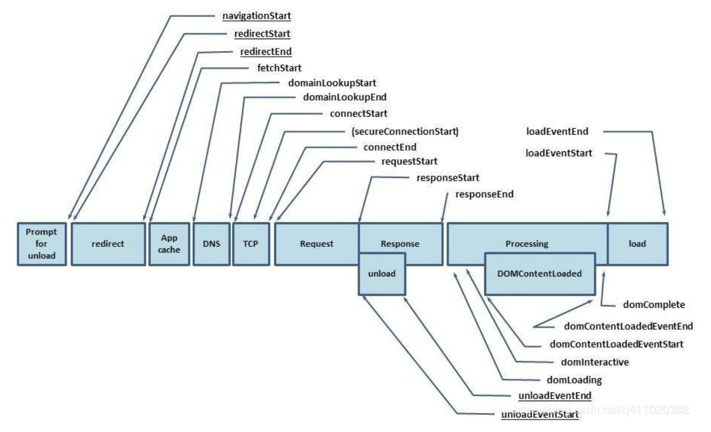

# 前端监控

## 数据采集

首先需要确认监控的数据来源

### 性能数据采集

性能数据采集需要使用 `window.performance` API。

使用  `window.performance.timing` 可以采集到各个阶段的起始及结束时间。



- 各个阶段的定义

```js
timing: {
  // 同一个浏览器上一个页面卸载(unload)结束时的时间戳。如果没有上一个页面，这个值会和fetchStart相同。
  navigationStart: 1543806782096,

  // 上一个页面unload事件抛出时的时间戳。如果没有上一个页面，这个值会返回0。
  unloadEventStart: 1543806782523,

  // 和 unloadEventStart 相对应，unload事件处理完成时的时间戳。如果没有上一个页面,这个值会返回0。
  unloadEventEnd: 1543806782523,

  // 第一个HTTP重定向开始时的时间戳。如果没有重定向，或者重定向中的一个不同源，这个值会返回0。
  redirectStart: 0,

  // 最后一个HTTP重定向完成时（也就是说是HTTP响应的最后一个比特直接被收到的时间）的时间戳。
  // 如果没有重定向，或者重定向中的一个不同源，这个值会返回0. 
  redirectEnd: 0,

  // 浏览器准备好使用HTTP请求来获取(fetch)文档的时间戳。这个时间点会在检查任何应用缓存之前。
  fetchStart: 1543806782096,

  // DNS 域名查询开始的UNIX时间戳。
  //如果使用了持续连接(persistent connection)，或者这个信息存储到了缓存或者本地资源上，这个值将和fetchStart一致。
  domainLookupStart: 1543806782096,

  // DNS 域名查询完成的时间.
  //如果使用了本地缓存（即无 DNS 查询）或持久连接，则与 fetchStart 值相等
  domainLookupEnd: 1543806782096,

  // HTTP（TCP） 域名查询结束的时间戳。
  //如果使用了持续连接(persistent connection)，或者这个信息存储到了缓存或者本地资源上，这个值将和 fetchStart一致。
  connectStart: 1543806782099,

  // HTTP（TCP） 返回浏览器与服务器之间的连接建立时的时间戳。
  // 如果建立的是持久连接，则返回值等同于fetchStart属性的值。连接建立指的是所有握手和认证过程全部结束。
  connectEnd: 1543806782227,

  // HTTPS 返回浏览器与服务器开始安全链接的握手时的时间戳。如果当前网页不要求安全连接，则返回0。
  secureConnectionStart: 1543806782162,

  // 返回浏览器向服务器发出HTTP请求时（或开始读取本地缓存时）的时间戳。
  requestStart: 1543806782241,

  // 返回浏览器从服务器收到（或从本地缓存读取）第一个字节时的时间戳。
  //如果传输层在开始请求之后失败并且连接被重开，该属性将会被数制成新的请求的相对应的发起时间。
  responseStart: 1543806782516,

  // 返回浏览器从服务器收到（或从本地缓存读取，或从本地资源读取）最后一个字节时
  //（如果在此之前HTTP连接已经关闭，则返回关闭时）的时间戳。
  responseEnd: 1543806782537,

  // 当前网页DOM结构开始解析时（即Document.readyState属性变为“loading”、相应的 readystatechange事件触发时）的时间戳。
  domLoading: 1543806782573,

  // 当前网页DOM结构结束解析、开始加载内嵌资源时（即Document.readyState属性变为“interactive”、相应的readystatechange事件触发时）的时间戳。
  domInteractive: 1543806783203,

  // 当解析器发送DOMContentLoaded 事件，即所有需要被执行的脚本已经被解析时的时间戳。
  domContentLoadedEventStart: 1543806783203,

  // 当所有需要立即执行的脚本已经被执行（不论执行顺序）时的时间戳。
  domContentLoadedEventEnd: 1543806783216,

  // 当前文档解析完成，即Document.readyState 变为 'complete'且相对应的readystatechange 被触发时的时间戳
  domComplete: 1543806783796,

  // load事件被发送时的时间戳。如果这个事件还未被发送，它的值将会是0。
  loadEventStart: 1543806783796,

  // 当load事件结束，即加载事件完成时的时间戳。如果这个事件还未被发送，或者尚未完成，它的值将会是0.
  loadEventEnd: 1543806783802
}

```

### 错误数据采集

- 资源加载错误

```js
const monitor = []
addEventListener('error', e => {
  
}, true)
```

- js 执行错误

```js
window.onerror = function(msg, url, row, col, error) {
  
}
```

- promise 错误

```js
addEventListener('unhandledrejection', e => {
    monitor.errors.push({
        type: 'promise',
        msg: (e.reason && e.reason.msg) || e.reason || '',
        // 错误发生的时间
        time: new Date().getTime(),
    })
})
```

- script error

script error不是一种具体的错误，而是浏览器对跨域错误出于安全机制考虑对一种处理方式

- try...catch

```js
try {
  setTimeout(function(){
    throw new Error('project');
  },0);
} catch(e) {
  console.log('error', e.message);
}
```

- AJAX请求异常

> 方法一

window.addEventListener, 监控AJAX失败请求

> 方法二

重写XMLHttpRequest, 监控所有AJAX请求

- UV/PV

PVUV日志采集相对简单，关键点在于采集时机，通常选择在head执行或者onload事件回调，从前端监控的角度我们通常选择 onload 时机；另外，需要考虑SPA页面的支持。

- 其他

除了上述指标日志的采集，通常我们还会上报更多的环境信息，有利于更快速的定位问题。具体字段有 网络环境，设备型号，操作系统版本，客户端版本，前端版本，API接口版本等。

## 日志上报

最简单粗暴的做法可能是直接写一个AJAX请求上报，但这种方式成功率不稳定，极易在页面切换时丢失日志；
并且，对于大流量站点还需要考虑 带宽节流等诉求。完整考虑，一个相对完善的上报逻辑需要包括 数据过滤、采样、合并以及加密压缩等大量细节设计。

处理方法：

- 过滤：按需过滤和截断，如果有多个业务方使用，考虑提供回调函数给调用分放。
- 采样：通过`Math.radom()`方法，对命中采样率对数据上报
- 合并：维护前端请求队列，进行定时上报
- 上报请求：通过AJAX，img等方式容易丢失日志，结合sendbeacon简洁、异步、非阻塞，可以使用sendbeacon向下兼容。
- 数据压缩
- 网络请求协议：加https

## sendBeacon

```js
navigator.sendBeacon(url, data);
```

- url: url 参数表明 data 将要被发送到的网络地址。
- data: 数据

### 描述

这个方法主要用于满足统计和诊断代码的需要，这些代码通常尝试在卸载（`unload`）文档之前向web服务器发送数据。过早的发送数据可能导致错过收集数据的机会。然而，对于开发者来说保证在文档卸载期间发送数据一直是一个困难。

为了解决这个问题， 统计和诊断代码通常要在 `unload` 或者 `beforeunload` (en-US) 事件处理器中发起一个同步 `XMLHttpRequest` 来发送数据。同步的 `XMLHttpRequest` 迫使用户代理延迟卸载文档，并使得下一个导航出现的更晚。

有一些技术被用来保证数据的发送。其中一种是通过在卸载事件处理器中创建一个图片元素并设置它的 src 属性的方法来延迟卸载以保证数据的发送。因为绝大多数用户代理会延迟卸载以保证图片的载入，所以数据可以在卸载事件中发送。另一种技术是通过创建一个几秒钟的 no-op 循环来延迟卸载并向服务器发送数据。

在卸载事件处理器中尝试通过一个同步的 XMLHttpRequest 向服务器发送数据。这导致了页面卸载被延迟。

使用 sendBeacon() 方法会使用户代理在有机会时异步地向服务器发送数据，同时不会延迟页面的卸载或影响下一导航的载入性能。这就解决了提交分析数据时的所有的问题：数据可靠，传输异步并且不会影响下一页面的加载。

```js
window.addEventListener('unload', logData, false);

function logData() {
  navigator.sendBeacon("/log", analyticsData);
}
```

[10分钟彻底搞懂前端页面性能监控](<https://zhuanlan.zhihu.com/p/82981365>)
