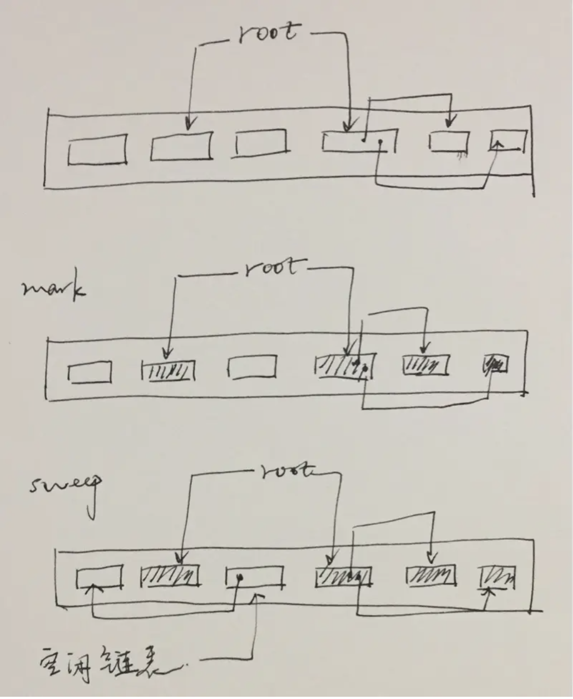
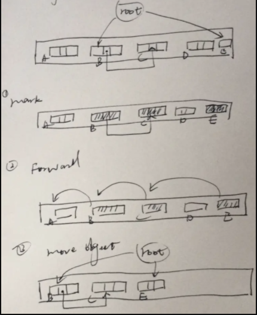
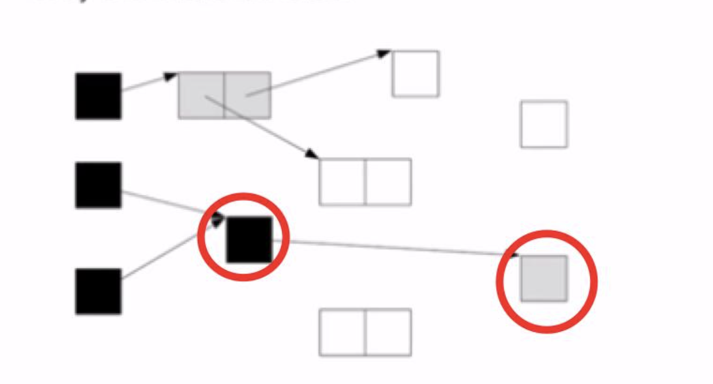
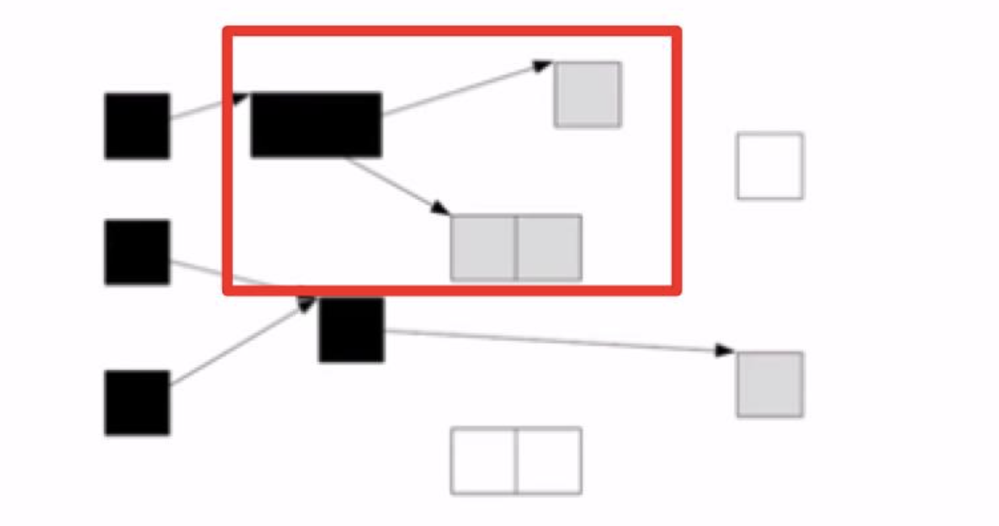

# JavaScript核心


js的几大核心问题

## 解释执行

- 代码编译阶段
  - 编译器
    - 高级语言
    - 汇编指令集
    - 机器码
  - 编译器
    - 词法分析和语法分析生成AST
    - 语义分析生成中间代码
    - 代码优化生成二进制文件
    - 直接执行二进制文件
  - 解释器
    - 词法分析和语法分析生成AST
    - 语义分析生成字节码
    - 解释执行
- V8执行代码阶段
  - 生成抽象语法树(AST)和执行上下文（编译阶段）
    - 使用编译器
    - 分词
    - 解析
  - 生成字节码
    - ast
    - 机器码
  - 执行代码
    - 使用解释器
    - 热点代码的缓存

## 作用域

- 全局作用域
- 函数作用域
  - 执行上下文
  - 词法作用域
- 块级作用域
- 闭包
- 作用域链

## 原型链

## 事件循环

## 垃圾回收

- 栈空间
  - 执行状态指针
- 堆空间
  - 新生代
    - swap
    - 对象晋升
  - 老生代
    - 标记清除法
    - 引用计数法
    - 内存整理

垃圾回收算法有多种，我们从 `吞吐量 throughput`,  `最大暂停时间`, `堆使用效率`, `访问的局部性`来评测算法的好坏。

### 标记-清除算法（ Mark-Sweep GC）

标记清除法分两个阶段：

- 标记阶段：从根集合出发，将所有活动对象及其子对象打上标记
- 清除阶段：遍历堆，将非活动对象（未打上标记）的连接到空闲链表上



优点：

实现简单， 容易和其他算法组合

缺点：

- 碎片化， 会导致无数小分块散落在堆的各处
- 分配速度不理想，每次分配都需要遍历空闲列表找到足够大的分块
- 与写时复制技术不兼容，因为每次都会在活动对象上打上标记

### 标记-压缩（Mark-Compact）

和“标记－清除”相似，不过在标记阶段后它将所有活动对象紧密的排在堆的一侧（压缩），消除了内存碎片，不过压缩是需要花费计算成本的。如下图过程，标记后需要定位各个活动对象的新内存地址，然后再移动对象，总共搜索了3次堆。



有效利用了堆，不会出现内存碎片 也不会像复制算法那样只能利用堆的一部分

压缩过程的开销，需要多次搜索堆

### 引用计数 Reference Counting

引用计数，就是记录每个对象被引用的次数，每次新建对象、赋值引用和删除引用的同时更新计数器，如果计数器值为0则直接回收内存。 很明显，引用计数最大的优势是暂停时间短

- 优点
  - 可即刻回收垃圾
  - 最大暂停时间短
  - 没有必要沿指针查找，不要和标记-清除算法一样沿着根集合开始查找

- 缺点
  - 计数器的增减处理繁重
  - 计数器需要占用很多位
  - 实现繁琐复杂， 每个赋值操作都得替换成引用更新操作
  - 循环引用无法回收

### GC复制算法

将堆分为两个大小相同的空间 From 和 To， 利用 From 空间进行分配，当 From 空间满的时候，GC将其中的活动对象复制到 To 空间，之后将两个空间互换即完成GC。

- 优点
  - 优秀的吞吐量， 只需要关心活动对象
  - 可实现高速分配； 因为分块是连续的，不需要使用空闲链表
  - 不会发生碎片化
  - 与缓存兼容
- 缺点
  - 堆使用率低
  - 需要空间大
  - 递归调用函数， 复制子对象需要递归调用复制函数消耗栈

### 三色标记算法

- 白色： 没有检查
- 灰色： 自身被检查了，成员没被检查完（可以认为访问到了，但是正在被检查，就是遍历里那些在队列中的节点）
- 黑色： 自身和成员都被检查完了

根查找阶段： 对能直接从根引用的对象打上标记，堆放到标记栈里（白色 涂成 灰色）
标记阶段： 从标记栈中取出对象，将其子对象涂成灰色；这个阶段不是一下子处理所有的灰色对象，而只是处理一定个数，然后暂停gc
清除阶段： 将没被标记的白色对象连接到空闲链表，并重置已标记的对象标记位





优点： 缩短最大暂停时间
缺点： 降低了吞吐量

## this指向

- call
- bind
- apply
- 箭头函数

## 事件

事件的三个阶段

- 事件捕获
- 事件触发
- 事件冒泡

### 事件阻断

```js
event.stopPropagation()
```
