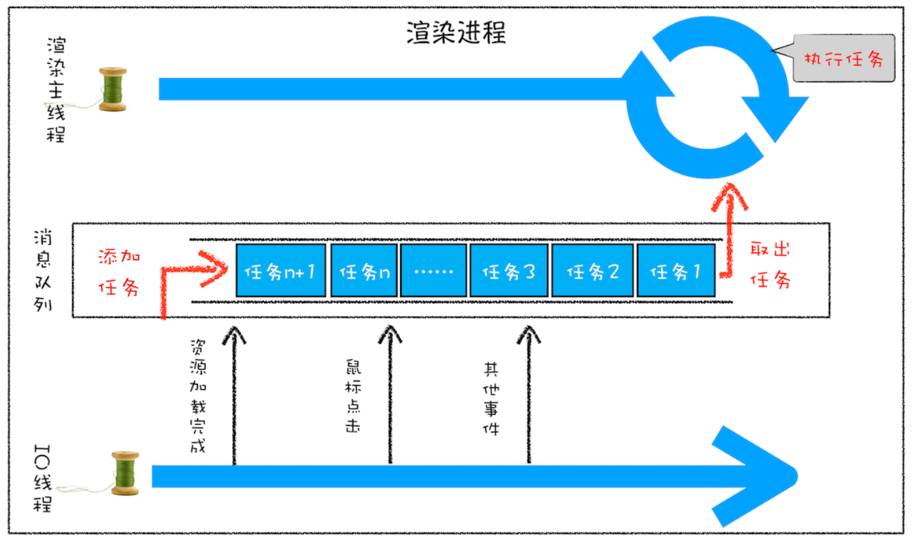
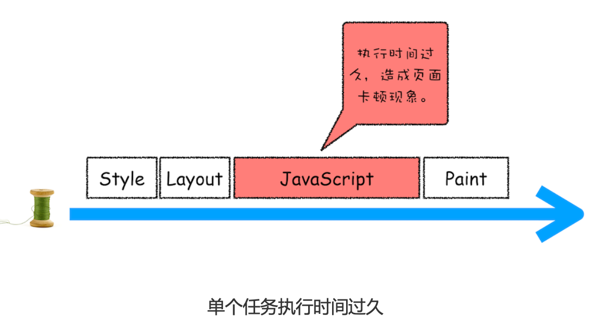

# JavaScript 中的事件循环

`JavaScript` 中的事件循环机制

## 进程与线程

`JS` 是单线程执行的，讲到线程，那么也得说一下进程，本质上来说，两个名词都是 `CPU` 工作时间片的一个描述。

进程描述了 `CPU` 在运行指令及加载和保存上下文所需的时间，放在应用上来说就代表了一个程序。线程是进程中的更小单位，描述了执行一段指令所需的时间。

当你打开一个 Tab 页时，其实就是创建了一个进程，一个进程中可以有多个线程，比如渲染线程、JS 引擎线程、HTTP 请求线程等等，当你发起一个请求时，其实就是创建了一个线程，当请求结束后，该线程可能就会被销毁。

## 为什么有事件循环

因为每一个渲染进程都只有一个主线程，并且主线程非常忙，要处理 Dom,又要计算样式，还要处理布局，同时还需要处理 JavaScript 任务以及各种输入事件。所以会有各种类型的任务在主线程中有条不紊地执行，所以需要一个事件循环系统来统一的调度这些任务。通过消息队列进行消息收集。

### 线程模型



1. 添加一个消息队列;
2. IO 线程中产生的新任务添加进消息队列尾部;
3. 渲染主线程会循环地从消息队列头部中读取任务，执行任务

简单的代码实现

```js
class {
  constructor() {
    this.queue = []
  }
  init() {
    while(true) {
      while(this.queue.length) {
        const task = this.queue.pop()
        if(typeof task == 'function') {
          task()
        }
      }
    }
  }
}
```

### 消息队列中的任务类型

如: 输入事件(鼠标滚动、点击、移动)、微任务、文件读写、WebSocket、JavaScript 定时器等等。

除此之外，消息队列中还包含了很多与页面相关的事件，如 JavaScript 执行、解析 DOM、样式计算、布局计算、CSS 动画等。

以上这些事件都是在主线程中执行的，所以在编写 Web 应用时，你还需要衡量这些事件所 占用的时长，并想办法解决单个任务占用主线程过久的问题。

### 任务优先级问题

事件有分主次先后，通过区分宏任务和微任务来保证执行效率。

我们把消息队列中的任务称为宏任务，每个宏任务中都包含了一个微任务队列，在执行宏任务的过程中，如果 DOM 有变化，那么就会将该变化添加到微任务列表中，这样就不会影响到宏任务的继续执行，因此也就解决了执行效率的问题。

宏任务中的主要功能都直接完成之后，这时候渲染引擎并不着急去执行下一个宏任务， 而是执行当前宏任务中的微任务，因为 DOM 变化的事件都保存在这些微任务队列中，这样也就解决了实时性问题。

### 解决单个任务执行时长过久的问题

因为所有的任务都是在单线程中执行的，所以每次只能执行一个任务，而其他任务就都处于等待状态。



## 浏览器中的 Event Loop


Event Loop 执行顺序:

1. 首先执行同步代码，这属于宏任务
2. 当执行完所有同步代码后，执行栈为空，查询是否有异步代码需要执行
3. 执行所有微任务
4. 当执行完所有微任务后，如有必要会渲染页面
5. 然后开始下一轮 Event Loop，执行宏任务中的异步代码，也就是 setTimeout 中的回调函数

微任务包括: `process.nextTick`，`promise` ，`MutationObserver`，其中 `process.nextTick` 为 `Node` 独有。

宏任务包括 `script`,`setTimeout`, `setInterval`,`setImmediate`,`I/O`,`UI rendering`。

## Node 中的 Event Loop

> node.js 运行流程


Node.js 的运行机制如下:

- V8 引擎解析 JavaScript 脚本。
- 解析后的代码，调用 Node API。
- LibUV 库负责 Node API 的执行。它将不同的任务分配给不同的线程，形成一个 Event Loop（事件循环），以异步的方式将任务的执行结果返回给 V8 引擎。
- V8 引擎再将结果返回给用户。

> 六个阶段


Node 中的 Event Loop 和浏览器中的是完全不相同的东西。
Node 的 Event Loop 分为 6 个阶段，它们会按照顺序反复运行。每当进入一个阶段的时候，都会从对应的回调队列中取出函数去执行。当队列为空或者执行的回调函数数量达到系统的阀值，就会进入下一个阶段。

### timer

`timers` 阶段会执行 `setTimeout` 和 `setInterval` 的回调，并且是由 poll 阶段控制的。
所以在node中的定时器指定的时间也不是准确时间，只能是尽快执行。

### I/O，callback阶段

执行除了 `close` 事件的 `callbacks`、被 `timers` 设定的 `callbacks`, `setImmediate()` 设定的 `callbacks` 这些之外的 `callbacks`，`I/O` 阶段会执行上一轮循环中少数未执行的 `I/O` 回调.

### idl，prepare

仅供 `node` 内部使用.

### poll

这一阶段中，系统会做两件事情

1. 回到 `timer` 阶段执行回调
2. 执行 `I/O` 回调

- 如果 `poll` 队列不为空，会遍历回调队列并同步执行，直到队列为空或者达到系统限制
- 如果 `poll` 队列为空时，会有两件事发生
  - 如果有 `setImmediate` 回调需要执行，`poll` 阶段会停止并且进入到 check 阶段执行回调
  - 如果没有 `setImmediate` 回调需要执行，会等待回调被加入到队列中并立即执行回调，这里同样会有个超时时间设置防止一直等待下去

当然设定了 timer 的话且 poll 队列为空，则会判断是否有 timer 超时，如果有的话会回到 timer 阶段执行回调。

### check

`check` 阶段执行 `setImmediate`

### close callbacks

执行 socket.on('close', ....) 这些 callbacks

### NodeJS 中宏队列主要有4个

由上面的介绍可以看到，回调事件主要位于4个 `macrotask queue` 中：

1. Timers Queue
2. IO Callbacks Queue
3. Check Queue
4. Close Callbacks Queue

不同类型的 `macrotask queue` 会被放入不同的宏任务队列中。在浏览器中

NodeJs 的微任务队列主要有2个：

`Next Tick Queue`：是放置process.nextTick(callback)的回调任务的
`Other Micro Queue`：放置其他microtask，比如Promise等

### 版本差异

```js
setTimeout(()=>{
  console.log('timer1')
  Promise.resolve().then(function() {
    console.log('promise1')
  })
}, 0)
setTimeout(()=>{
  console.log('timer2')
  Promise.resolve().then(function() {
    console.log('promise2')
  })
}, 0)
```

#### timers 阶段的执行时机变化

> node11

如果是 node11 版本一旦执行一个阶段里的一个宏任务(setTimeout,setInterval和setImmediate)就立刻执行微任务队列，这就跟浏览器端运行一致，最后的结果为timer1=>promise1=>timer2=>promise2

> node10

如果是 node10 及其之前版本要看第一个定时器执行完，第二个定时器是否在完成队列中.

- 如果是第二个定时器还未在完成队列中，最后的结果为`timer1=>promise1=>timer2=>promise2`
- 如果是第二个定时器已经在完成队列中，则最后的结果为`timer1=>timer2=>promise1=>promise2`

#### check 阶段的执行时机变化

```js
setImmediate(() => console.log('immediate1'));
setImmediate(() => {
    console.log('immediate2')
    Promise.resolve().then(() => console.log('promise resolve'))
});
setImmediate(() => console.log('immediate3'));
setImmediate(() => console.log('immediate4'));
```

- 如果是 node11 后的版本，会输`immediate1=>immediate2=>promise resolve=>immediate3=>immediate4`
- 如果是 node11 前的版本，会输`出immediate1=>immediate2=>immediate3=>immediate4=>promise resolve`

#### nextTick 队列的执行时机变化

```js
setImmediate(() => console.log('timeout1'));
setImmediate(() => {
    console.log('timeout2')
    process.nextTick(() => console.log('next tick'))
});
setImmediate(() => console.log('timeout3'));
setImmediate(() => console.log('timeout4'));
```

- 如果是 node11 后的版本，会输出timeout1=>timeout2=>next tick=>timeout3=>timeout4
- 如果是 node11 前的版本，会输出timeout1=>timeout2=>timeout3=>timeout4=>next tick

#### 总结

如果是 node11 版本一旦执行一个阶段里的一个宏任务(setTimeout,setInterval和setImmediate)就立刻执行对应的微任务队列。

[掘金参考文章](<https://juejin.cn/post/6844904079353708557#heading-4>)
