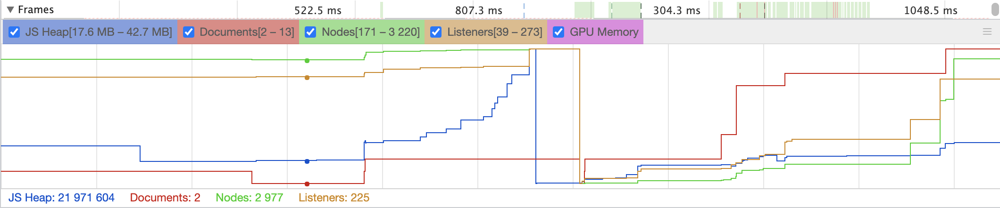
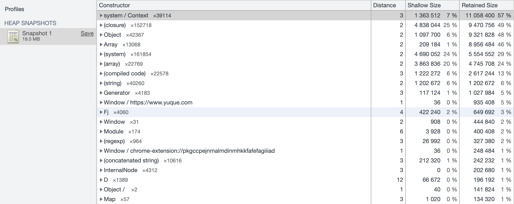

# JavaScript 中的应用内存分析

## 内存模型

JavaScript 的内存模型，其主要由堆、栈、队列三方面组成：

<FigmaContainer url="https://www.figma.com/file/E2utI9rEseFTc7tJ3Bbl9o/blog?type=whiteboard&node-id=6430-3378&t=mB5ZHa6vGkN4Sukx-4"/>

- 队列指的是消息队列，在 EvenLLoop 里面有消息队列
- 栈，存储基本类型，函数的调用上下午，函数执行栈
- 用于存储分配引用对象

## [垃圾回收](./scope-gc.html#垃圾回收)

## 内存泄漏

所谓的内存泄漏，即是指某个对象被无意间添加了某条引用，导致虽然实际上并不需要了，但还是能一直被遍历可达，以致其内存始终无法回收。本部分我们简要讨论下 JavaScript 中常见的内存泄漏情境与处理方法。在新版本的 Chrome 中我们可以使用 Performance Monitor 来动态监测网页性能的变化：

- JS heap size - 应用的内存占用量；
- DOM Nodes - 内存中 DOM 节点数目；
- Documents - 当前页面中使用的样式或者脚本文件数目；
- listeners- 当前页面上注册的 JavaScript 时间监听器数目;
- GPU usage - 当前站点的 GPU 使用量；

### memory

通过memory可以看到整体的内存情况，有以下几种：

- 全局变量
- 定时器与闭包
- DOM 引用与监听器
- iframe
- Web Worker
