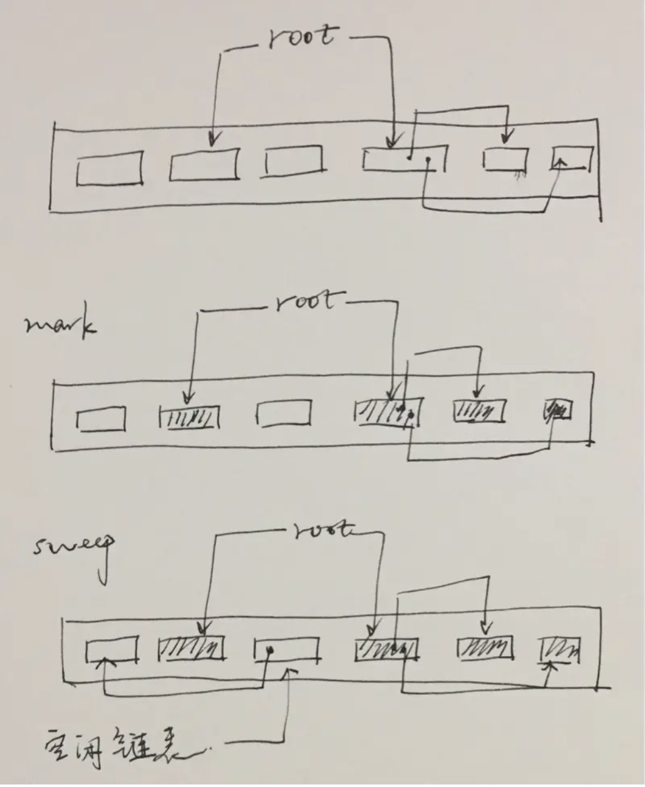
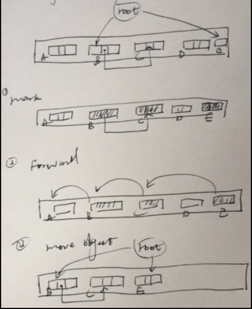
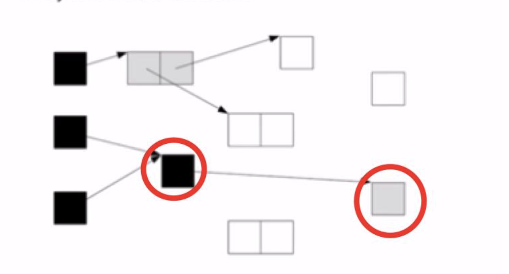
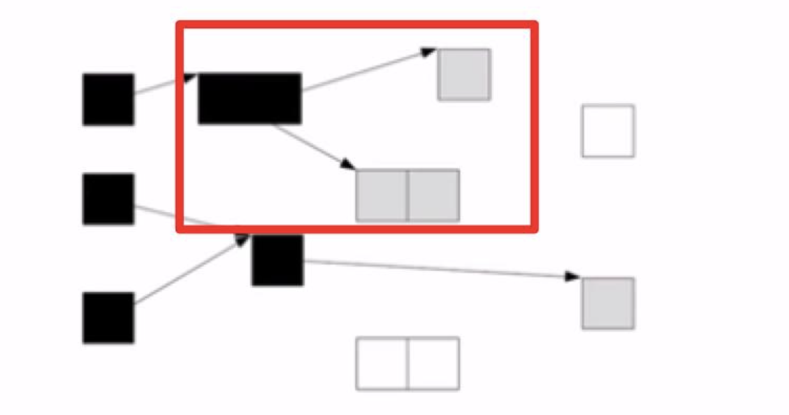
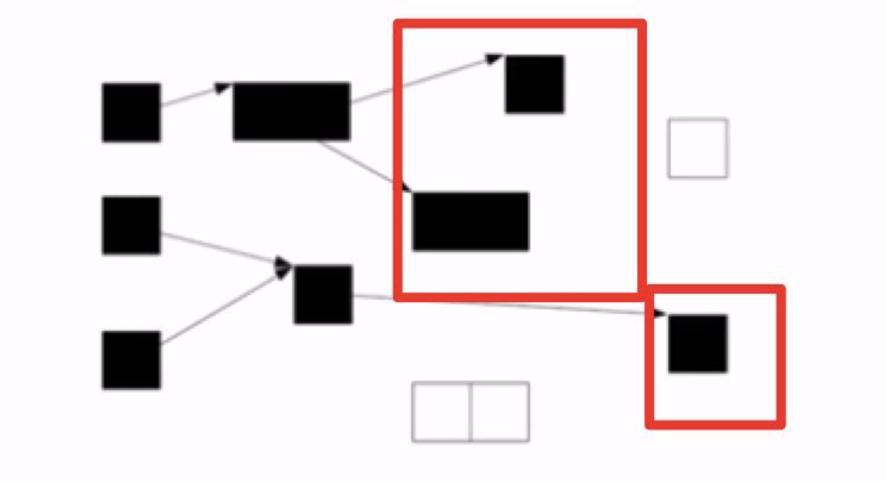

# 作用域与垃圾回收

<script setup>
import FigmaContainer from '/components/FigmaContainer.vue'
</script>

## 作用域

讲到闭包，就会牵扯到作用域和垃圾回收

在 JavaScript 中, 对象和函数同样也是变量。作用域为可访问变量，对象，函数的集合

### 全局作用域

全局作用域贯穿整个 javascript 文档，在所有函数声明或者大括号之外定义的变量，都在全局作用域里。一旦你声明了一个全局变量，那么你在任何地方都可以使用它，包括函数内部。事实上，JavaScript 默认拥有一个全局对象 window，声明一个全局变量，就是为 window 对象的同名属性赋值。

```js
function myFn () {
  person1 = 2
}
var person2 = 1
console.log(window.person2) // 1
console.log(person1) // 2 
myFn() // 执行后person1成为全局变量
console.log(person1) // 2
```

### 局部作用域

在JavaScript中，任何定义在函数体内的变量或者函数都将处于函数作用域中，这些变量也无法被在函数外部使用。(闭包除外)

- 变量在函数内声明，变量属于局部作用域。
- 局部变量只能在函数内部访问。
- 局部变量只作用于函数内，所以不同的函数可以使用相同名称的变量。
- 局部变量在函数开始执行时创建，函数执行完后局部变量会自动销毁。

### 作用域链

- 遍历嵌套作用域链的规则： 引擎从当前的执行作用域开始查找变量，如果找不到， 就向上一级继续查找。当抵达最外层的全局作用域时，无论找到还是没找到，查找过程都会停止。
- 局部作用域可以访问到全局作用域中的变量和方法，而全局作用域不能访问局部作用域的变量和方法。

## 什么是闭包？

闭包是一个拥有许多变量和绑定了这些变量的环境的表达式（通常是一个函数），因而这些变量也是该表达式的一部分。闭包就是能够读取其他函数内部变量的函数。需要追溯到调用栈和垃圾回收。

闭包的例子：

```js
var count = 10; //全局作用域 标记为 flag1
function add(){
  var count = 0; //函数全局作用域 标记为 flag2
  return function(){
    count += 1; //函数的内部作用域
    alert(count);
  }
}
var s = add();
s(); //输出1
s(); //输出2
```

### 闭包的优点和缺点

#### 缺点

- 闭包的缺点就是常驻内存会增大内存使用量，并且使用不当很容易造成内存泄露。

#### 优点

- 可以读取函数内部的变量, 创建私有变量，隐藏实现细节
- 可以让这些局部变量保存在内存中，实现变量数据共享。
- 延长变量声明周期

#### 关于内存泄露

内存泄漏（Memory Leak） 是指程序中己动态分配的堆内存由于某种原因程序未释放或无法释放，造成系统内存的浪费，导致程序运行速度减慢甚至系统崩溃等严重后果。
一些文章内说闭包会造成内存泄漏，要尽量少用。其实这个观点是错误的，闭包并不会造成内存泄漏，而是正常的内存使用如何避免内存泄漏？需要及时解除无用引用。

#### 闭包的实践

- 函数柯里化

```js
// 柯里化前
const getVolume = (l, w, h) => l * w * h
const volume1 = getVolume(100, 200, 100)
const volume2 = getVolume(100, 200, 300)
// 柯里化后
const getVolume = l => w => h => l * w * h
const getVolumeWithDefaultLW = getVolume(100)(200)
const volume3 = getVolumeWithDefaultLW(100)
const volume4 = getVolumeWithDefaultLW(300)

```

- 模块化

用于将内部实现封装，仅对外暴露接口。

```js
var counter = (function() {
  var privateCounter = 0
  function changeBy(val) {
    privateCounter += val
  }
  return {
    increment: function() {
      changeBy(1)
    },
    decrement: function() {
      changeBy(-1)
    },
    value: function() {
      return privateCounter
    }
  }
})()
```

- 设置缓存

```js
var fn=(function(){
  var cache = {}//将结果缓存到该对象中
  return function(){
    var str = JSON.stringify(arguments);
    if (cache[str]) {//判断缓存中是否存在传递过来的参数，存在直接返回结果，无需计算
      return cache[str];
    } else {//进行计算并返回结果
      var sum=0;
      for(var i=0;i<arguments.length;i++){
        sum+=arguments[i];
      }
      return cache[str]=sum;
    }
  }
})()
```

#### 模拟块级作用域

```js
for (var i = 1; i <= 3; i++) {
  setTimeout(function() {
    console.log(i)
  }, i * 1000)
}

for (var i = 1; i <= 3; i++){
  (i => {
    setTimeout(() => {
      console.log(i)
    }, i * 1000)
  })(i)
}
```


## 垃圾回收

<FigmaContainer url="https://www.figma.com/file/E2utI9rEseFTc7tJ3Bbl9o/blog?type=whiteboard&node-id=1664-2980&t=zfM8G0KnIXVdoA3s-4"/>

- 在调用栈中，有一个记录 当前执行状态的指针(称为 ESP)，函数的执行上下文一旦被执行后，JavaScript 引擎会通过向下移动 ESP 来销毁该函数保存在栈中的执行上下文。在调用另外的函数时，这块内容会被直接覆盖掉，用来存放另外一个函数的执行上下文。

- 堆中的垃圾回收：回收堆中的垃圾数据，需要用到 JavaScript 引擎中的垃圾回收器。
- 代际假说：第一个是大部分对象在内存中存在的时间很短，简单来说，就是很多对象一经分配内存，很快就变得不可访问;第二个是不死的对象，会活得更久。

- 栈空间
  - 执行状态指针
- 堆空间
  - 新生代
    - swap
    - 对象晋升
  - 老生代
    - 标记清除法
    - 引用计数法
    - 内存整理

垃圾回收算法有多种，我们从 `吞吐量 throughput`,  `最大暂停时间`, `堆使用效率`, `访问的局部性`来评测算法的好坏。

### 标记-清除算法（ Mark-Sweep GC）

标记清除法分两个阶段：

- 标记阶段：从根集合出发，将所有活动对象及其子对象打上标记
- 清除阶段：遍历堆，将非活动对象（未打上标记）的连接到空闲链表上



优点：

实现简单， 容易和其他算法组合

缺点：

- 碎片化， 会导致无数小分块散落在堆的各处
- 分配速度不理想，每次分配都需要遍历空闲列表找到足够大的分块
- 与写时复制技术不兼容，因为每次都会在活动对象上打上标记

### 标记-压缩（Mark-Compact）

和“标记－清除”相似，不过在标记阶段后它将所有活动对象紧密的排在堆的一侧（压缩），消除了内存碎片，不过压缩是需要花费计算成本的。如下图过程，标记后需要定位各个活动对象的新内存地址，然后再移动对象，总共搜索了3次堆。



有效利用了堆，不会出现内存碎片 也不会像复制算法那样只能利用堆的一部分

压缩过程的开销，需要多次搜索堆

### 引用计数 Reference Counting

引用计数，就是记录每个对象被引用的次数，每次新建对象、赋值引用和删除引用的同时更新计数器，如果计数器值为0则直接回收内存。 很明显，引用计数最大的优势是暂停时间短

- 优点
  - 可即刻回收垃圾
  - 最大暂停时间短
  - 没有必要沿指针查找，不要和标记-清除算法一样沿着根集合开始查找

- 缺点
  - 计数器的增减处理繁重
  - 计数器需要占用很多位
  - 实现繁琐复杂， 每个赋值操作都得替换成引用更新操作
  - 循环引用无法回收

### GC复制算法

将堆分为两个大小相同的空间 From 和 To， 利用 From 空间进行分配，当 From 空间满的时候，GC将其中的活动对象复制到 To 空间，之后将两个空间互换即完成GC。

- 优点
  - 优秀的吞吐量， 只需要关心活动对象
  - 可实现高速分配； 因为分块是连续的，不需要使用空闲链表
  - 不会发生碎片化
  - 与缓存兼容
- 缺点
  - 堆使用率低
  - 需要空间大
  - 递归调用函数， 复制子对象需要递归调用复制函数消耗栈

### 三色标记算法

- 白色： 没有检查
- 灰色： 自身被检查了，成员没被检查完（可以认为访问到了，但是正在被检查，就是遍历里那些在队列中的节点）
- 黑色： 自身和成员都被检查完了

根查找阶段： 对能直接从根引用的对象打上标记，堆放到标记栈里（白色 涂成 灰色）
标记阶段： 从标记栈中取出对象，将其子对象涂成灰色；这个阶段不是一下子处理所有的灰色对象，而只是处理一定个数，然后暂停gc
清除阶段： 将没被标记的白色对象连接到空闲链表，并重置已标记的对象标记位





优点： 缩短最大暂停时间
缺点： 降低了吞吐量


### 内存空间

在 JavaScript 的执行过程中，主要有三种类型内存空间，分别是代码空间、栈空间和堆空间。

#### 栈空间和堆空间

在执行过程中，栈空间用来维护函数的执行上下文，堆空间用来保存引用类型数据。

通常情况下，栈空间都不会设置太大，主要用来存放一些原始类型的小数据。而引用类型的数据占用的空间都比较大，堆空间很大，能存放很多大的数据。

### 新生代和老生代

新生代中存放的是生存时间短的对 象，老生代中存放的生存时间久的对象。
新生区通常只支持 1~8M 的容量，而老生区支持的容量就大很多了。对于这两块区域，V8 分别使用两个不同的垃圾回收器

- 副垃圾回收器，主要负责新生代的垃圾回收。
- 主垃圾回收器，主要负责老生代的垃圾回收。

### 垃圾回收的工作流程

- 第一步：标记空间中活动对象和非活动对象。标记活着的和死的。
- 第二步：回收非活动对象所占据的内存，回收死的。
- 第三步：内存整理，一般来说，频繁回收对象后，内存中就会存在大量不连续空间，这些不连续的内存空间称为内存碎片。

#### 主垃圾回收器

主垃圾回收器主要负责老生区中的垃圾回收。除了新生区中晋升的对象，一些大的对象会直接被分配到老生区。一个是对象占用空间大，另一个是对象存活时间长。

主垃圾回收器是采用标记 - 清除(Mark-Sweep)的算法进行垃圾回收。标记阶段就是从一组根元素开始，递归遍历这组根元素，在这个遍历过程中，能到达的元素称活动对象，没有到达的元素就可以判断为垃圾数据。

在垃圾回收处理过程中，先使用标记清除算法把垃圾清除，再使用标记整理算法把碎片进行整理。

#### 副垃圾回收器

小的对象会分配到新生区，这个区域虽然不大，但是垃圾回收还是比较频繁的。

新生代中用 `Scavenge` 算法,把新生代空间对半划分为两个区域，一半是对象区域，一半是空闲区域.新加入的对象都会存放到对象区域，当对象区域快被写满时，就需要执行一次垃圾清理操作。

在垃圾回收过程中，首先要对对象区域中的垃圾做标记；标记完成之后，就进入垃圾清理阶段，副垃圾回收器会把这些存活的对象复制到空闲区域中，同时它还会把这些对象有序地排列起来，所以这个复制过程，也就相当于完成了内存整理操作，复制后空闲区域就没有内存碎片了。

完成复制后，对象区域与空闲区域进行角色翻转，也就是原来的对象区域变成空闲区域，原来的空闲区域变成了对象区域。

因为需要开辟两块空间，所以一般新生区都会设置的比较小。因为空间不大，所以很容易被存活的对象装满整个区域。JavaScript 引擎采用了对象晋升策略，也就是经过两次垃圾回收依然还存活的对象，会被移动到老生区中。

### 暂停时间

由于 JavaScript 是运行在主线程之上的，一旦执行垃圾回收算法，都需要将正在执行的 JavaScript 脚本暂停下来。待垃圾回收完毕后再恢复脚本执行。我们把这种行为叫做全停顿(Stop-The-World)。

为了降低老生代的垃圾回收而造成的卡顿，V8 将标记过程分为一个个的子标记过程，同时让垃圾回收标记和 JavaScript 应用逻辑交替进行。这个算法称为增量标记。使用增量标记算法，可以把一个完整的垃圾回收任务拆分为很多小的任务，这些小的任务执行时间比较短，可以穿插在其他的 JavaScript 任务中间执行。
