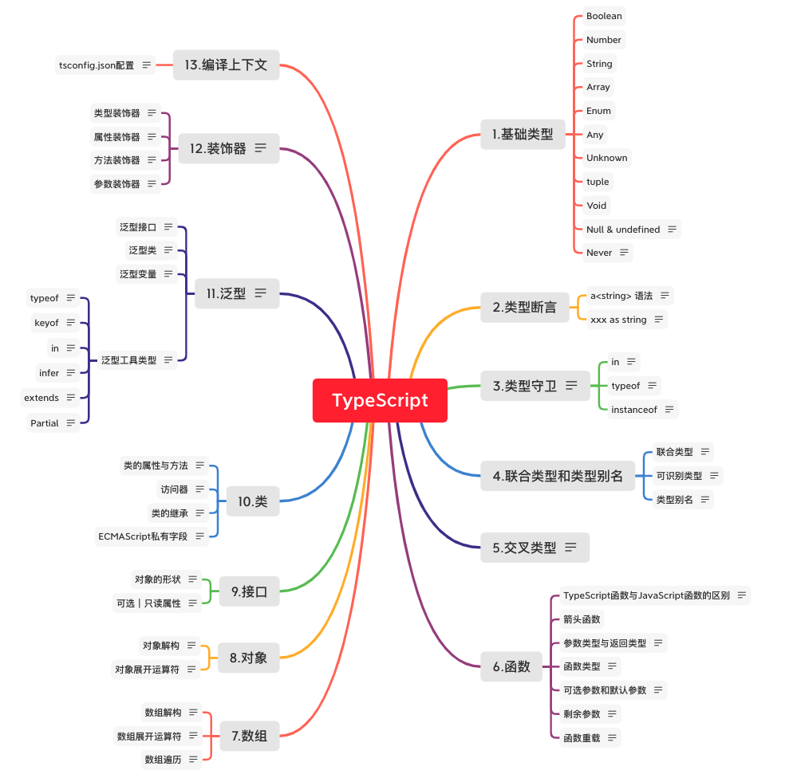

# TypeScript



## 基础类型

- Boolean
- Number
- String
- Array
- Enum
- Any：*与any同为顶级类型*
- Unknown
- tuple：*元组类型，必须提供到其中到每一个参数*
- Void
- Null & undefined

:::tip
是所有类型的子类型， 可以把 `null` 和 `undefined` 赋值给 `number` 类型的变量，如果你指定了--`strictNullChecks` 标记，`null` 和 `undefined` 只能赋值给 `void` 和它们各自的类型
:::

- Never

:::tip
never 类型表示的是那些永不存在的值的类型。 例如，never 类型是那些总是会抛出异常或根本就不会有返回值的函数表达式或箭头函数表达式的返回值类型。利用never特性来实现全面性检查。

```js
type Foo = string | number;

function controlFlowAnalysisWithNever(foo: Foo) {
 if (typeof foo === "string") {
  // 这里 foo 被收窄为 string 类型
 } else if (typeof foo === "number") {
  // 这里 foo 被收窄为 number 类型
 } else {
  // foo 在这里是 never
  const check: never = foo;
 }
}
```

:::

## 类型断言

- `a<string>` 语法

```js
let someValue: any = "this is a string";
let strLength: number = (<string>someValue).length;
```

- `xxx as string` 语法

```js
let someValue: any = "this is a string";
let strLength: number = (someValue as string).length;
```

## 类型守卫

类型保护是可执行运行时检查的一种表达式，用于确保该类型在一定的范围内。

- in

```js
interface Admin {
 name: string
 options: string[]
}

interface Employee {
 name: string
 startDate: Date
}

type UnknownEmployee = Employee | Admin;

function printEmployeeInfo(emp: UnknownEmployee) {
 console.log("Name: " + emp.name)
 if ("options" in emp) {
  console.log('emp' is 'Admin')
 }
 if ("startDate" in emp) {
  console.log('emp' is 'Employee')
 }
}
```

- typeof

```js
typeof v === typeName
typeof v !== typeName

typeName 只支持 number string boolean symbol
```

- instanceof

```js
interface I {
 getPaddingString(): string;
}

class A implements I {
  constructor(private numSpaces: number) {}
  getPaddingString() {
   return Array(this.numSpaces + 1).join(" ");
  }
}

class B implements I {
  constructor(private value: string) {}
  getPaddingString() {
    return this.value;
  }
}

let C: A = new A(6);
if (C instanceof A) {
  // C的类型收窄为 'A'
}

A类，B类实现接口I。C通过A类构造，C instanceof A 为true
```

- 自定义类型保护

```js
function isNumber(x: any): x is number {
  return typeof x === 'number'
}
function isString(x: any): x is string {
  return typeof x === 'string'
}
```

## 联合类型和类型别名

### 联合类型

```js
function a(name: string | undefined) {

}
```

### 可辨识联合

```js

1. 可辨识
enum CarTransmission {
 Automatic = 200,
 Manual = 300
}

interface Motorcycle {
 vType: "motorcycle"; // discriminant
 make: number; // year
}

interface Car {
 vType: "car"; // discriminant
 transmission: CarTransmission
}

interface Truck {
 vType: "truck"; // discriminant
 capacity: number; // in tons
}

2. 联合类型

type Vehicle = Motorcycle | Car | Truck;

```

### 类型别名

```js
type Message = string | string[];
let greet = (message: Message) => {
  // ...
};
```

## 交叉类型

将多个类型合并为一个类型。 这可以把现有的多种类型叠加到一起成为一种类型，它包含了所需的所有类型的特性。

```ts
interface IPerson {
 id: string;
 age: number;
}

interface IWorker {
 companyId: string;
}

type IStaff = IPerson & IWorker;

const staff: IStaff = {
 id: 'E1006',
 age: 33,
 companyId: 'EFT'
};
```
