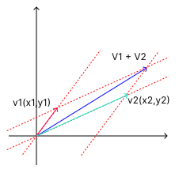

# 线性代数

## 基本概念

### 代数

**代数** 是构造一系列对象和一系列操作这些对象的规则。

### 向量

**向量** 也叫欧几里得向量(Euclidean Vector)，其实就是能够互相相加、被标量乘的特殊对象。而标量也叫“无向量”，它只有数值大小，没有方向。

**几何向量** 是有向线段，在二维空间(也就是平面)中，两个几何向量能够相加，比如，向量 $x$ 加上向量 $y$ 等于向量 $z$，$x$ + $y$ = $z$ ，$x$ 向量也能被一个标量乘。再比如，标量 $λ$ 乘向量 $x$ 结果也是向量，$λx$, $λ∈R$。几何向量通过大小和方向来简化向量的表达。

**多项式其实也是向量**。两个多项式能够相加，它也能够被标量乘，结果也是多项式。

**矩阵的一行或一列也是向量**。就比如下面这样形式的向量。

$$
x ∈ R^3 : x=
\begin{bmatrix}
1 \\
2 \\
3 \\
\end{bmatrix}
$$

## 矩阵

## 线性方程组

## 线性无关

## 基和秩

## 线性映射

## 仿射空间

## 解析几何
