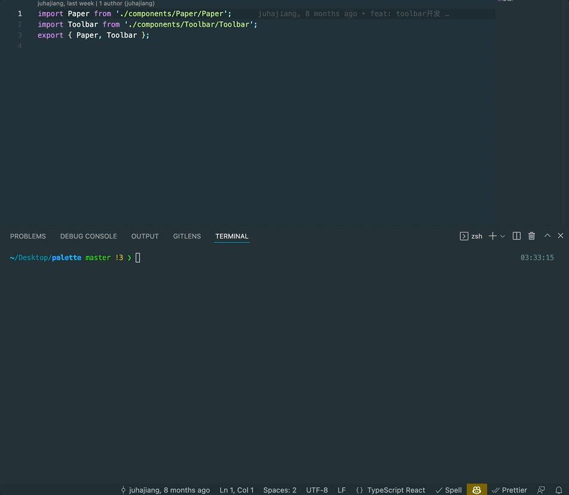
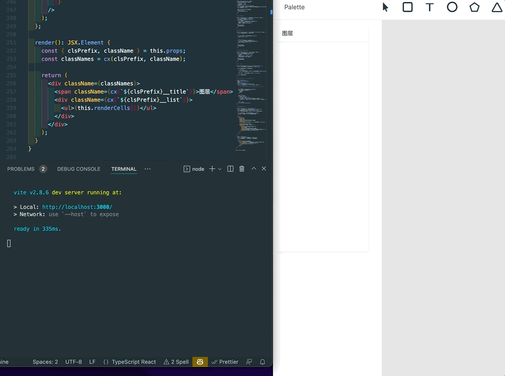

# webpack 项目迁移 vite 实践

最近接触了一个 `webpack` 项目的开发, 在 `TDesign` 中的 `vite` 开发环境还是非常丝滑的。项目的构建工具使用的是 `sand-build`，一个 `webpack` 和 `roll-up` 的集大成者。但是确实在项目上手之初遇到了很烦恼的热更新编译问题。真的太慢了🐢。


上图应该可以感受到这种开发时候热更新的绝望了。一次热更新的时间在 `25` 秒左右。宝贵的时间当然不能用来等热更新了。开发效率极低，甚至都不想写了。

## 分析

在这个情况下，肯定要着手解决问题了。首先分析一下为什么这么慢。

### 启动阶段


中间还有两张30秒的图就不放了，下面这张是gif动图，在 `webpack` 的编译花了很久。


实测启动过程 2 分钟，启动过程大致如下：

- 创建 `monorepo` 包的软链接（2s）左右
- 打包 `packages` 下面的每一个子包（100s）左右，其中 `ui` 库包体积最大，时间最长。
- `webpack dev server` 启动（15s）左右

### 热更新阶段

- `rollup` 增量打包（5s）左右，视改动文件所属包大小速度不一。如果改动 `UI` 库则这一步的时间非常长。
- `webpack` 热更新（25s），整个`dev server`的依赖链路太长。

## 解决方案

开始着手解决，规划了 `vite` 和 `webpack` 主流的两种方案。

### webpack升级

由于 `sand-build` 底层依赖为 `webpack4`，如果将依赖升级到 `webpack5`，将获得一定程度的性能提升。

优点：

- 不需要对现有工程做大幅度的改动，只需要升级底层依赖即可
- 不需要考虑相关依赖包的文件类型问题

缺点：

- webpack 大版本升级后配置项改动幅度可能很大。
- 按照这个方式改动对整条链接影响只能优化 `webpack` 热更新阶段的时间，且效果不明显。
- 需要改动底层

### 终极解决方案vite

`vite` 真香, 大概是每个用过的开发者第一想法，当前最佳的开发体验 `vite` 可以提供，且生态日渐强大。在 `vite` 面前，`webpack` 可能让人感觉是上世纪的产物。

优点：

- 秒启动，极致的开发体验，丝滑

缺点：

- 解决许多未知问题
- 依赖包不兼容
- 工程大幅改动

### 一步到位

本着长期主义，一步到位的原则，选择走 `vite` 的路线。

## webWorker 文件处理

`vite` 处理 `worker` 的格式是 `.xxx.ts?worker`

`rollup-plugin-web-worker-loader` 处理 `worker` 的格式是 `web-worker:.xxx.ts`

这就导致了我们会在开发环境和生产环境会有不同的表现。

### rollup-plugin-web-worker-loader

第一种方案是 `rollup` 兼容 `vite`

`rollup-plugin-web-worker-loader` 在源码中提供了 `pattern` 参数，但是在配置为 `vite` 所需要的 `/(.+)\?worker/` 格式后，转换链路无法追溯。尝试了很久以后，决定转向编写 `vite` 插件进行处理。

### vite 插件处理

`vite` 插件的 `hook` 比较常用的是 `load`, `resolveId` 和 `transformer`。在 `transformer` 中返回给 `vite` 你想要他处理的内容。

参照 [源码](https://github.com/vitejs/vite/blob/main/packages/vite/src/node/plugins/worker.ts), 对 `web-worker:.xxx.ts`类型文件进行 `web-worker` 相关的处理。

```js
import path from 'path';
import { Plugin } from 'vite';

export function webWorkerPathTransformPlugin(): Plugin {
  const pattern = /web-worker:(.+)/;
  return {
    name: 'vite:web-work-path-transform',
    transformer(_, id) {
      if (id.test(pattern)) {
        // 处理逻辑
        return {
          code: `export default function WorkerWrapper() {
            xxxx
          )}, ${JSON.stringify(workerOptions, null, 2)})
          }`,
          map: { mappings: '' }
        }
      }
    },
  };
}
```

以上这种处理方式其实就是源码处理内容的一个参数替换版本。但是却非常麻烦，很多处理函数 `vite` 都没有暴露出来。于是换一种思路，在读取文件的时候，将路径 `id` 换成 `vite` 认识的文件资源就可以了。

```js
import path from 'path';
import { Plugin } from 'vite';

export function webWorkerPathTransformPlugin(): Plugin {
  const pattern = /web-worker:(.+)/;
  return {
    name: 'vite:web-work-path-transform',
    resolveId(id, inputFile) {
      const match = id.match(pattern);
      if (match && match.length && inputFile) {
        return (
          path.join(path.dirname(inputFile), match[match.length - 1]) +
          '?worker'
        );
      }
    },
  };
}
```

## 尤雨溪也遇到的 BUG

在 `react-virtualized` 这个包中， `es/WindowScroller/utils/onScroll.js` 的最后一行出现了下面这段代码。会从 `WindowScroller.js` 导入这个不存在的 `bpfrpt_proptype_WindowScroller` 的变量。在   `es module` 分析依赖的过程中，会直接报错。

```js
import { bpfrpt_proptype_WindowScroller } from "../WindowScroller.js";
```

https://unpkg.com/browse/react-virtualized@9.22.3/dist/es/WindowScroller/utils/onScroll.js

有趣的和尤雨溪遇到了同一个问题，在这个 [issue](https://github.com/bvaughn/react-virtualized/issues/1632) 里面社区也给到了很多解决方式。

最常见的解决方案可能是将包提取出来，删掉代码，但是我们的工程是 `react-tiny-virtual-list` 依赖了 `react-virtualized` ，属于影子依赖。无法通过这种方式解决。

### 补丁包路径替换

可以在 `package.json` 中增加 `resolutions` 来描述加载远端 `patch` 库的资源。

```json
{
  "resolutions": {
    "react-virtualized": "git+https://git@github.com/remorses/react-virtualized-fixed-import.git#9.22.3""
  }
}
```

需要注意的是，这种方法会强依赖于第三方库，所以还是选择 `fork` 一份代码出来到自己仓库里面。

但是最终还是放弃了这个方案，因为这种方式只有 `yarn` 才能使用，不是通用的解决方案。

### 简单粗暴

既然优雅的方式不能完美解决，那就简单粗暴吧。装包的时候把这段代码删掉就行了。从根本上解决。

```json
{
  "patch:react-virtualized": "npx replace-in-files-cli --string='import { bpfrpt_proptype_WindowScroller } from \"../WindowScroller.js\";' --replacement='' node_modules/**/onScroll.js"
}
```

## 依赖包类型问题

部分依赖包是 `commonjs` 规范,在 `vite` 的字典里确实找不到和他相似的问题。解决这个问题：

1. 根据报错路径找到相关依赖包，然后替换掉。
2. 我们发现在一些对 `antd` 对依赖会导致相关问题。在同事的帮助下也很快顺利的解决了。
3. 替换很久不更新的包，替换为现代包。

## 两套模式

同事提出，我们现在作为包开发时 `vite` 的热更确实很舒服，但是加载的资源却并不是正式发布的资源。可能会存在一些偏差。于是需要模拟一套标准发布模式下的开发环境。

### 处理方案

所以需要构建两种开发环境：

1. `vite` 会作为 `devServer`，依赖的资源是 `rollup` 构建后的环境下的资源 `es` 资源，热更新 `rollup` 会先打包 `packages` 资源,然后热更新。保证开发调试的代码为发布时的代码。在这套环境中使用 `wait-on` 来解决资源未构建时，`devServer` 需等待后再启动。
2. `vite` 会作为 `devServer`，直接加载源码。极速热更。

```js
// vite.config.js 配置
import { defineConfig } from 'vite';
import react from '@vitejs/plugin-react';
import path from 'path';
import { webWorkerPathTransformPlugin } from './plugin/webwork';
const packages = [
  'palette-constants',
  'palette-utils',
  'palette-slate',
  'palette-sketch',
  'palette-ink',
  'palette-pen',
  'palette-paper',
  'palette-renderer',
  'palette-filter',
  'palette-ui',
]
const getAlias = () => {
  if (process.env.NODE_ENV !== 'turbo')
    return {
      '@tencent': path.resolve(__dirname, '../packages'),
    };
  const map = Object.create(null);
  packages.forEach((pkg: string) => {
    map[`@tencent/${pkg}`] = path.resolve(__dirname, `../packages/${pkg}/src`);
  });
  return map;
};

export default defineConfig({
  plugins: [react(), webWorkerPathTransformPlugin()],
  resolve: {
    alias: getAlias(),
  },
});
```

```json
{
  "start": "run-p dev:*", // 热更新优化模式
  "start:turbo": "cd examples && cross-env NODE_ENV=turbo npm run dev", // 极速模式
  "dev:pkg": "npx sand-build start -t lib -w -l -e development",
  "dev:example": "wait-on --config ./build/wait-on-config.js && cd examples && npm run dev", //等待es资源打包完毕，使用了 wait-on 这个包
}
```

```js
// wait-on-config.js
const packages = [
  'palette-constants',
  'palette-utils',
  'palette-slate',
  'palette-sketch',
  'palette-ink',
  'palette-pen',
  'palette-paper',
  'palette-renderer',
  'palette-filter',
  'palette-ui',
]

module.exports = {
  resources: packages.map((item) => {
    return `./packages/${item}/es/index.js`;
  }),
};

```

## 最终效果

### 启动

秒级启动



### 热更新

极速热更新



🚀 🚀 🚀，`coding` 速度起飞，属于下一代构建工具的降维打击了。
