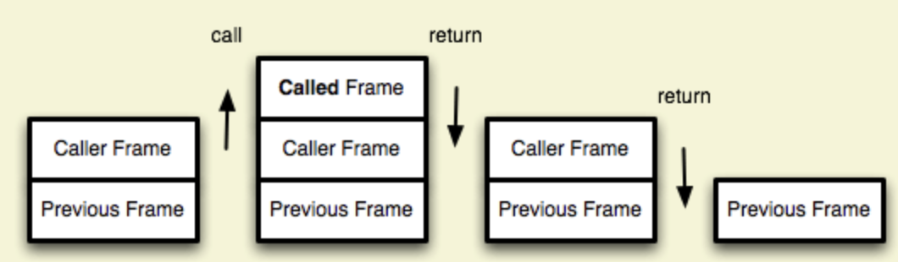

# 杂七杂八

## 尾递归调用

函数调用会在内存形成一个"调用记录"，又称"调用帧"（call frame），保存调用位置和内部变量等信息。



在递归中，如果尾调用自身，就称为尾递归。递归非常消耗内存，因为需要同时保存成千上百个调用记录，很容易发生"栈溢出"错误（stack overflow）。对于尾递归来说，由于只存在一个调用记录，所以永远不会发生"栈溢出"错误。

```js
function factorial(n) {
  if (n === 1) return 1;
  return n * factorial(n - 1);
}
```

上面代码是一个阶乘函数，计算n的阶乘，最多需要保存n个调用记录，复杂度 O(n) 。
如果改写成尾递归，只保留一个调用记录，复杂度 O(1) 。

```js
function factorial(n, total) {
  if (n === 1) return total;
  return factorial(n - 1, n * total);
}
```

## 运算符技巧

### 交换两个数

```js
// 常规
int tmp = x;
x = y;
y = tmp;

// 位运算
x = x ^ y   // （1）
y = x ^ y   // （2）
x = x ^ y   // （3）
```

### 判断奇偶数

```js
// 普通判断
if(n % 2 == 1) {
 // n 是个奇数。
}
// 位运算
if(n & 1 == 1){
  // n 是个奇数。
}
```

### ^= 异或

二进制对比，在两次对比以后会是原来的值

4 ^= 5

```js
100 //4
101 //5
001 //异或后得到
```

#### 示例：[只出现一次的数字](https://leetcode-cn.com/problems/single-number/)

``` javascript
let ans = 0
 for (const num of nums) {  
  ans ^= num;
 }
 return ans
```

### 移位>>和>>>

`>>>` 是无符号的
`>>` 是有符号的

#### 示例

通过寻找二分的中间点

```js
const mid = (start + end) >> 1
```

## 数组中的位置交换

i，j两个位置的交换

```js
function swap(i, j, arr) {
  if(i == j) {
    return
  }
  arr[i] = arr[i] + arr[j]
  arr[j] = arr[i] - arr[j]
  arr[i] = arr[i] - arr[j]
}
```

## 整数操作相关

### [整数反转](https://leetcode-cn.com/problems/reverse-integer/)

🌟

```js
var reverse = function(x) {
  let ord = Math.abs(x);//去符号
  let now = 0;
  while(ord > 0){
    now = now * 10 + ord % 10;
    ord = Math.floor(ord / 10);
  }
  if(x < 0){
    return now <= Math.pow(2,31) ? -now : 0;
  }else{
    return now < Math.pow(2,31) ? now : 0;
  }
};
```

### [字符串相加](https://leetcode-cn.com/problems/add-strings/)

🌟

```js
var addStrings = function(num1, num2) {
  const ans = []
  let i = num1.length -1, j = num2.length - 1, add = 0
  while(i >= 0 || j >= 0 || add != 0) {
    const x = i >= 0 ? parseInt(num1.charAt(i)) : 0;
    const y = j >= 0 ? parseInt(num2.charAt(j)) : 0;
    const result = x + y + add;
    ans.push(result % 10);
    add = Math.floor(result / 10)
    i--
    j--
  }
  return ans.reverse().join('')
}
```

### [字符串相乘](https://leetcode-cn.com/problems/multiply-strings/)

🌟🌟

```js
const multiply = (num1, num2) => {
  if(num1 == '0' || num2 == '0') return 0
  let len1 = num1.length; 
  let len2 = num2.length;
  let arr = new Array(len1 + len2).fill(0)
  let i = len1, j = len2
  while(i) {
    i--
    while(j) {
      j--
      let sum = num1[i]*num2[j] + arr[i+j+1]
      arr[i+j] += 0 | sum / 10
      arr[i+j+1] = sum % 10
    }
    j=len2;
  }
  while(arr[0] == 0) {
    arr.shift()
  }
  return arr.join('')
}
```

### [进制转换](https://leetcode-cn.com/problems/multiply-strings/)

🌟

```js
// 10进制转n进制
function ten2x(num, n){
  var res = [];
  while(num > 0){
    res.push(num % n);
    x = Math.floor(num / n);
  }
  return res.reverse().join('');
}
```
