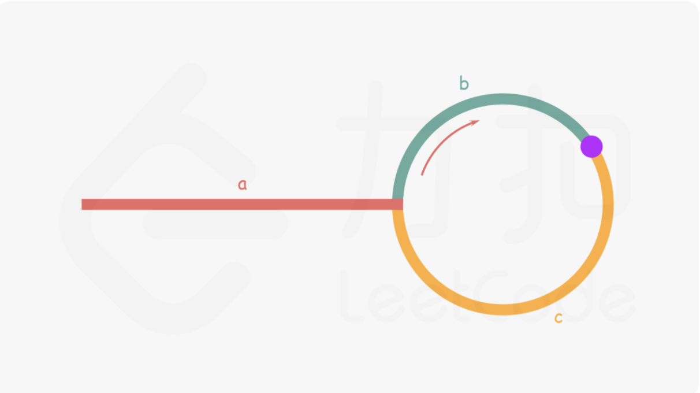

# 链表

基础数据结构

## 链表遍历框架

```ts
class ListNode {
  constructor(value) {
    this.value = value
    this.next = null
  }
}

// 循环
const traverse = (head: ListNode) => {
  let cur = head
  while (cur != null) {
    cur = cur.next
  }
}

// 递归
const recursive = (head: ListNode) => {
  recursive(head.next)
}
```

## [反转链表](<https://leetcode-cn.com/problems/reverse-linked-list/>)

### 递归实现

```js
const reversLinkedList = (head) => {
  if (head == null || head.next == null) {
    return head
  }
  const newHead = reversLinkedList(head.next)
  head.next.next = head
  head.next = null
  return newHead
}
```

### 迭代实现

```js
const reversLinkedList = (head) => {
  let prev = null
  let cur = head
  while(cur) {
    const next = cur.next
    cur.next = prev
    prev = cur
    cur = next
  }
  return cur
}
```

## [合并两个有序链表](https://leetcode-cn.com/problems/he-bing-liang-ge-pai-xu-de-lian-biao-lcof/)

### 递归

```js
var mergeTwoLists = (l1, l2) => {
  if (l1 == null) {
    return l2
  } else if (l2 == null) {
    return l1
  } else if (l1.val < l2.val) {
    l1.next = mergeList(l1.next, l2)
    return l1
  } else {
    l2.next = mergeList(l1, l2.next)
    return l2
  }
}
```

### 迭代

```js
var mergeTwoLists = (l1, l2) => {
  const preHead = new ListNode(-1);
  let prev = preHead;
  while(l1 && l2) {
    if (l1.val <= l2.val) {
      prev.next = l1
      l1 = l1.next
    } else {
      prev.next = l2
      l2 = l2.next
    }
    prev = prev.next
  }
  prev.next = l1 === null ? l2 : l1
  return preHead.next
}
```

## [回文链表](https://leetcode-cn.com/problems/palindrome-linked-list/)

```js
var isPalindrome = (head) => {
  if(head == null || head.next == null) return true
  let fast = head
  let slow = head
  let prev;
  while(fast && fast.next) {
    pre = slow
    slow = slow.next
    fast = fast.next.next
  }
  prev.next = null //断开
  let prev2 = null;
  while(slow) {
    const next = slow.next;
    slow.next = prev2;
    prev2 = slow;
    slow = next;
  }
  while(head && prev2) {
    if(head.val !== prev.val) return false
    head = head.next
    prev2 = prev2.next
  }!
  return true
}
```

## [环形链表](https://leetcode-cn.com/problems/linked-list-cycle/)

- 标记法

```js
const hasCycle = function(head) {
  while(head) {
    if(head.flag) return true
    head.flag = true
    head = head.next
  }
  return false
}
```

- 快慢指针法

```js
const hasCycle = function(head) {
  if(!head || !head.next) return false
  let fast = head.next.next, slow = head.next
  while(fast !== slow) {
    if(!fast || !fast.next) return false
    fast = fast.next.next
    slow = slow.next
  }
  return true
}
```

## [环形链表2](https://leetcode-cn.com/problems/linked-list-cycle-ii/submissions/)



以相遇点为基准

- 快指针走过的距离：a + (b+c) * n + b
- 慢指针走过的距离是：a + b

a + (b + c) * n + b = 2 （a + b）
a = c + (n - 1)(b + c)

所以a = c

```js
var detectCycle = function(head) {
  if (head === null) {
    return null;
  }
  let slow = head, fast = head;
  while (fast !== null) {
    slow = slow.next;
    if (fast.next !== null) {
      fast = fast.next.next;
    } else {
      return null;
    }
    if(slow == fast) {
      let pre = head
      while(pre !== slow) {
        slow = slow.next
        pre = pre.next
      }
      return pre
    }
  }
  return null;
};
```

## [相交链表](https://leetcode-cn.com/problems/intersection-of-two-linked-lists/)

```js
var getIntersectionNode = function(headA, headB) {
  if(!headA || !headB) return null
  let pA = headA
  let pB = headB
  while(PA !== pB) {
    pA = pA === null ? headB : pA.next;
    PB = PB === null ? headA : PB.next
  }
  return pA
}
```

## [构造链表](https://leetcode-cn.com/problems/design-linked-list/)

```js
class myLinkedList{
  constructor() {
    this.data = {}
  }
  get(index) {
    if (index < 0) return -1
    let cur = this.data
    for (let i = 0; i < index; i++) {
      if(!cur.next) return -1
      cur = cur.next
    }
    return cur.val == undefined || cur.val == null ? -1 : cur.val
  }
  addHead(val) {
    if (this.data && !(this.data.val === undefined || this.data.val == null)) {
      this.data = {
        val,
        next: this.data
      }
    } else {
      this.data = {
        val,
        next: null
      }
    }
  },
  addAtTail(val) {
    let cur = this.data
    while (cur.next) {
      crr = cur.next
    }
    cur.next = { val, next: null }
  },
  addAtIndex() {
    if (index <= 0) return this.addAtHead(val)
    let cur = this.data
    for (let i = 0; i < index - 1; i++) {
      if (!cur || !cur.next) return null
      cur = cur.next
    }
    if(!cur.val && cur.val !== 0) return null
    cur.next = { val, next: cur.next }
  },
  deleteAtIndex() {
    if (index < 0) return null
    if (index === 0) return this.data = this.data.next
    let cur = this.data
    for (let i = 0; i < index - 1; i++) {
      if(!cur.next || !cur.next.next) return null
      cur= cur.next 
    }
    if (!cur.next) return null
    if (!cur.next.next) return cur.next = null
    cur.next = cur.next.next
  }
}
```

### [合并K个排序链表](https://leetcode-cn.com/problems/merge-k-sorted-lists/description/)

```javascript
var mergeKLists = function(lists) {
    if(!lists || lists.length == 0) return null;
    let arr = [];
    let res = new ListNode(0);
    lists.forEach(list => {
        let cur = list;
        while(cur){
            arr.push(cur.val);
            cur = cur.next;
        }
    })
    let cur = res;
    // 快排
    arr.sort((a,b) => a-b).forEach(val => {
        let node = new ListNode(val);
        cur.next = node;
        cur = cur.next;
    })
    return res.next;
};
```
