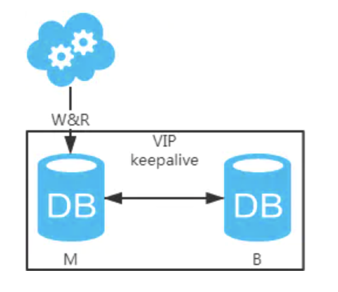
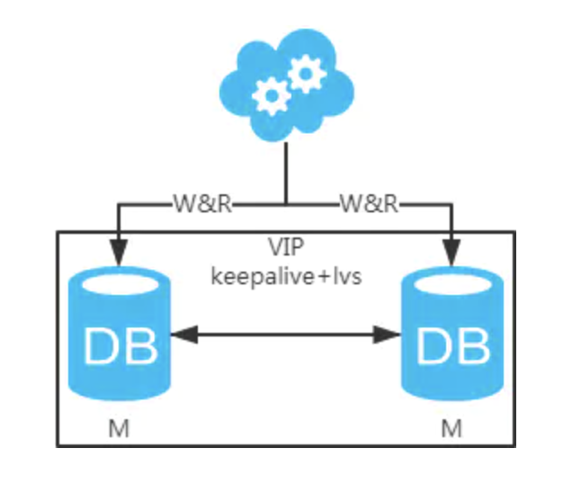
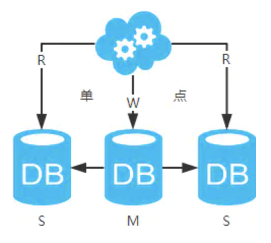
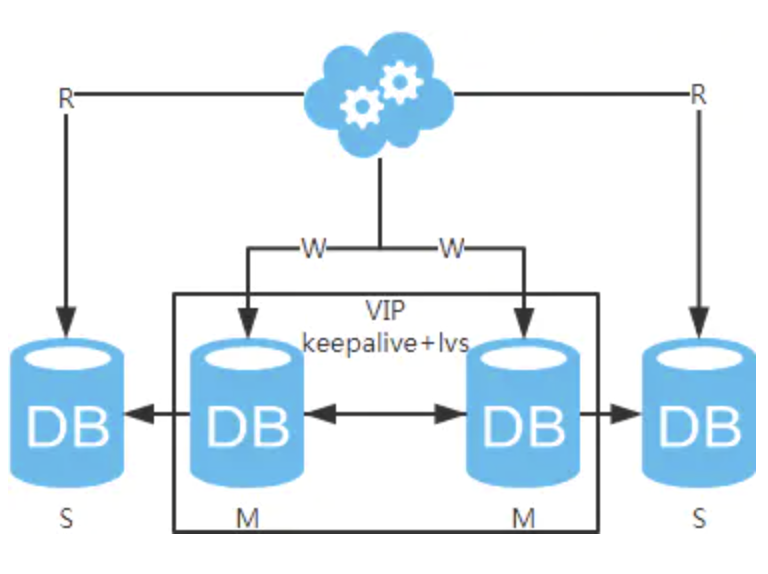
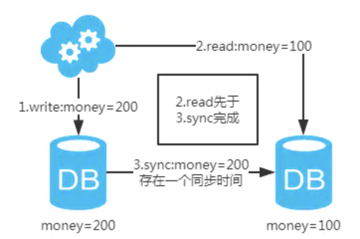

# mysql

## mysql的安装与基本配置

```bash
// 检查是否已经安装过mysql，执行命令
rpm -qa | grep mysql

// 查询所有Mysql对应的文件夹
whereis mysql
find / -name mysql

//检查mysql用户组和用户是否存在，如果没有，则创建
cat /etc/group | grep mysql
cat /etc/passwd |grep mysql
groupadd mysql

//下载并安装MySQL官方的 Yum Repository
wget -i -c http://dev.mysql.com/get/mysql57-community-release-el7-10.noarch.rpm

//yum安装
yum -y install mysql57-community-release-el7-10.noarch.rpm

//开始安装MySQL服务器
yum -y install mysql-community-server

// 启动mysql
systemctl start  mysqld.service
// 查看mysql状态
systemctl status mysqld.service
```

### 用户设置

```bash
// 找到密码
grep "password" /var/log/mysqld.log
// 登陆
mysql -uroot -p
//设置密码等级
set global validate_password_policy=0;
set global validate_password_length=1;
//替换临时密码
ALTER USER USER() IDENTIFIED BY 'pengyue'
//新建用户
CREATE USER '用户名'@'连接主机(%为全部)' IDENTIFIED BY '密码';
//设置权限
GRANT ALL ON *.* TO '用户名'@'连接主机(%为全部)';
GRANT SELECT, INSERT ON test.user TO '用户名'@'连接主机(%为全部)';
```

### 常见问题

### 无法连接（2003）

```bash
firewall-cmd --state  查看防火墙状态

firewall-cmd --list-ports 查看放行端口

firewall-cmd --zone=public --add-port=3306/tcp --permanent 放行某端口

systemctl restart firewalld.service    重启防火墙服务

systemctl stop firewalld.service 关闭防火墙服务
```

### 数据库备份

```bash
mysqldump -uroot -p'xxxx' DBName > directory/filename.sql
```

## 数据源处理

- 热数据:3个月内的订单数据，查询实时性较高;
- 冷数据A:3个月 ~ 12个月前的订单数据，查询频率不高;
- 冷数据B:1年前的订单数据，几乎不会查询，只有偶尔的查询需求;

因为根据实际场景需求，用户基本不会去查看1年前的数据，如果将这部分数据还存储在db中，那么成本会非常高，而且也不便于维护。另外如果真遇到有个别用户需要查看1年前的订单信息，可以让用户走离线数据查看。

## 分库分表

### 分库

#### 垂直分库

随着业务系统的扩大，系统越来越复杂，越来越难以维护，开发效率变得越来越低，并且对资源的消耗也变得越来越大，通过硬件提高系统性能的成本会变得更高。可以进行分库，将所有业务都放在一个库中已经变得越来越难以维护，因此可以将不同业务放在不同的库中。

> 不分库

总库: a表，b表，c表

> 分库

a库：a表，b库：b表，c库：c表

#### 水平分库

水平分库是把同一个表的数据按一定规则拆到不同的数据库中，每个库可以放在不同的服务器上。

当数据量过大的时候，且无法做垂直分库的时候，将同一个库的数据分散到不同的库里面。例如：1-10000放A库，10000-20000放B库。

垂直分库是把不同表拆到不同数据库中，它是对数据行的拆分，不影响表结构。

它带来的提升是：

- 解决了单库大数据，高并发的性能瓶颈。
- 提高了系统的稳定性及可用性。

### 分表

#### 垂直分表

将一个表按照字段分成多表，每个表存储其中一部分字段

垂直分表就是将一张表拆分为多两张表，如商品表：商品访问频次低的话，单独存放到一张表中。商品访问频次高的字段单独存放到一张表中。

> 带来的提升

- 为了避免IO争抢并减少锁表的几率，查看详情的用户与商品信息浏览互不影响
- 充分发挥热门数据的操作效率，商品信息的操作的高效率不会被商品描述的低效率所拖累。

为什么大字段IO效率低：第一是由于数据量本身大，需要更长的读取时间；第二是跨页，页是数据库存储单位，很多查找及定位操作都是以页为单位，单页内的数据行越多数据库整体性能越好，而大字段占用空间大，单页内存储行数少，因此IO效率较低。第三，数据库以行为单位将数据加载到内存中，这样表中字段长度较短且访问频率较高，内存能加载更多的数据，命中率更高，减少了磁盘IO，从而提升了数据库性能。（内存分页）

拆分准则：

1. 把不常用的字段单独放在一张表;
2. 把text，blob等大字段拆分出来放在附表中;
3. 经常组合查询的列放在一张表中;

#### 水平分表

将一张表分为多张表，假设一张表里面放1000条数据，

使用主键作为唯一标识,`primaryKey % 1000`，主键取模可以确定在哪一张表里面。

数据库分表能够解决单表数据量很大的时候数据查询的效率问题，但是无法给数据库的并发操作带来效率上的提高，因为分表的实质还是在一个数据库上进行的操作，很容易受数据库IO性能的限制。将数据进行分库操作可以很好地解决单台数据库的性能问题。分库策略与分表策略的实现很相似，最简单的都是可以通过取模的方式进行路由。

## 数据库架构

数据库架构原则：

- 高可用
- 高性能
- 一致性
- 拓展性

### 主备架构



只有主库提供读写服务，备库冗余作故障转移用

- 高可用：主库挂了会自动切换到备库。
- 高性能分析：读写都操作主库，很容易产生瓶颈，大部分互联网应用读多写少，读会先成为瓶颈，进而影响写性能。另外，备库只是单纯的备份，资源利用率50%。
- 一致性：读写都操作主库，不存在数据一致性问题
- 扩展性：无法通过加从库来扩展读性能，进而提高整体性能
- 可落地性：两点影响落地使用。第一，性能一般，这点可以通过建立高效的索引和引入缓存来增加读性能，进而提高性能。第二，扩展性差，这点可以通过分库分表来扩展。

### 双主架构



两个主库同时提供服务，负载均衡

- 高可用：一个主库挂了，不影响另一台主库提供服务，这个过程对业务层是透明的，无需修改代码或配置。
- 高性能分析：读写性能相比于方案一都得到提升，提升一倍。
- 一致性分析：存在数据一致性问题。
- 扩展性分析：可以扩展成三主循环。
- 可落地分析：第一，数据一致性问题，一致性解决方案可解决问题。第二，主键冲突问题，ID统一地由分布式ID生成服务来生成可解决问题。

### 主从架构



一主多从，读写分离

- 高可用：主库单点，从库高可用。一旦主库挂了，写服务也就无法提供。
- 高性能设计：大部分互联网应用读多写少，读会先成为瓶颈，
- 一致性分析：存在数据一致性问题
- 扩展性分析：可以通过加从库来扩展读性能，进而提高整体性能。
- 可落地分析：第一，数据一致性问题，一致性解决方案可解决问题。第二，主库单点问题，笔者暂时没想到很好的解决方案。

### 双主双从架构



- 高可用分析：高可用。
- 高性能分析：高性能。
- 一致性分析： 存在数据一致性问题。
- 扩展性分析：可以通过加从库来扩展读性能，进而提高整体性能

## 一致性解决方案

### 主从数据一致性问题

数据不一致性产生的原因：

数据同步（从库从主库拉取binlog日志，再执行一遍）是需要时间的，这个同步时间内主库和从库的数据会存在不一致的情况。如果同步过程中有读请求，那么读到的就是从库中的老数据。


#### 如何解决

- 强制读主，采用主备架构方案，读写都走主库。用缓存来扩展数据库读性能 。
- 选择读主，写操作时根据库+表+业务特征生成一个key放到Cache里并设置超时时间（大于等于主从数据同步时间）。读请求时，同样的方式生成key先去查Cache，再判断是否命中。若命中，则读主库，否则读从库。
- 半同步复制，等主从同步完成，写请求才返回。代价是写请求时延增长，吞吐量降低。
