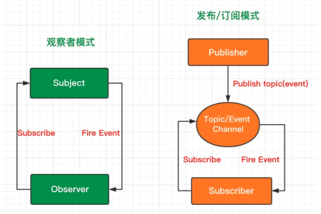
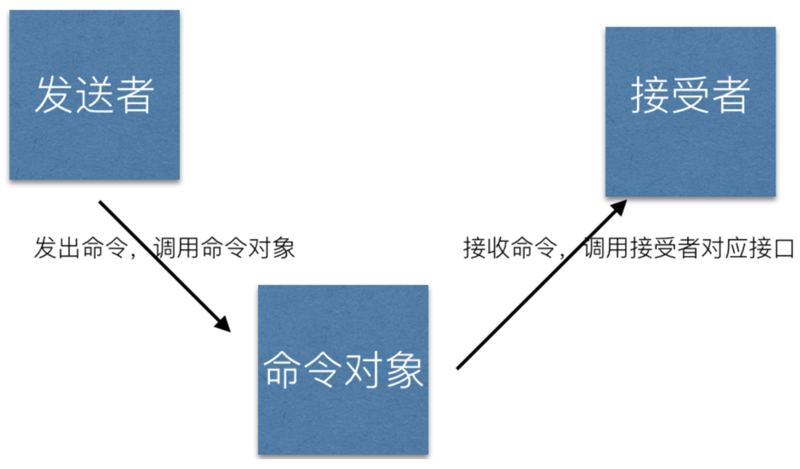

# 设计模式

设计模式的代码简述

## 单例模式

单例在编程实战中存在大量的应用，比如说弹窗。

```javascript
{
  const Singleton = function(name) {
    this.name = name
    this.instance = null
  }
  Singleton.prototype.getName = function() {
    console.log(this.name)
  }
  Singleton.getInstance = function() {
    if (!this.singleton) {
      this.instance = new Singleton(name)
    }
    return this.instance
  }
  var a = Singleton.getInstance('sing1')
  var b = Singleton.getInstance('sing2')
}
```

## 策略模式

一个计算工资的例子

```javascript
var performanceS = function(){};
performanceS.prototype.calculate = function(salary) {
  return salary * 4
}
var performanceA = function(){};
performanceA.prototype.calculate = function(salary) {
  return salary * 3
}
var performanceB = function(){}
performanceB.prototype.calculate = function(salary) {
  return salary * 2
}

var Bonus = function() {
  this.salary = null
  this.strategy = null
}
Bonus.prototype.setSalary = function(salary) {
  this.salary = salary
}
Bonus.prototype.setStrategy = function( strategy ){
  this.strategy = strategy; // 设置员工绩效等级对应的策略对象
};
Bonus.prototype.getBonus = function(){
  return this.strategy.calculate( this.salary );
};
```

适用于JavaScript的策略模式

```javascript
var strategies = {
  "S": function(salary) {
    return salary * 4;
  },
  "A": function(salary) {
    return salary * 3
  },
  "B": function(salary) {
    return salary * 2
  }
}
var calculateBonus = function( level, salary ){ 
  return strategies[level](salary);
};
console.log(calculateBonus("S", 2000)) // 8000
console.log(calculateBonus("A", 1000)) // 3000
```

## 代理模式

- 虚拟代理

```javascript
var myImage = (function(){
  var imgNode = document.createElement('img')
  document.body.appendChild(imgNode)
  return {
    setSrc: function(src) {
      imgNode.src = src
    }
  }
})()

var proxyImage = (function() {
  var img = new Image
  img.onload = function() {
    myImage.setSrc(this.src)
  }
  return {
    setSrc: function(src) {
      myImage.setSrc('加载中图片');
      img.src = src;
    }
  }
})()
proxyImage.setSrc('实际的图片');
```

- 缓存代理

```js
const proxyMulti = function() {
  const cache = {}
  return function() {
    const args = Array.prototype.join.call( arguments, ',' );
    if (args in cache) {
      return cache[args]
    }
    return cache[args] = multi.apply( this, arguments );
  }
}
function multi() {
  var a = 1
  for(var i = 0; l = arguments.length; i++) {
    a = a * arguments[i]
  }
  return a
}
```

## 迭代器模式

可以理解为迭代器模式就是对同一问题的不同参数的反复迭代过程。

### 内部迭代

实现一个 each 函数，each 函数接受 2 个参数，第一个为被循环的数组，第 二个为循环中的每一步后将被触发的回调函数。

```js
var each = function( ary, callback ){
  for ( var i = 0, l = ary.length; i < l; i++ ){
    callback.call( ary[i], i, ary[ i ] );
  }
}
each( [ 1, 2, 3 ], function( i, n ){ 
  alert ( [ i, n ] );
}); 
```

### 外部迭代器

判断 2 个数组里元素的值是否完全相等

```js
var Iterator = function(obj) {
  var current = 0;
  var next = function() {
    current += 1
  }
  var isDone = function() {
    return current >= obj.length
  }
  var getCurrentItem = function() {
    return obj[current]
  }
  return {
    next,
    isDone,
    getCurrentItem
  }
}

var compare = function(iterator1, iterator2) {
  while(!iterator1.isDone() && !iterator2.isDone()) {
    if(iterator1.getCurrentItem() !== iterator2.getCurrentItem()) {
      throw new Error ( 'iterator1 和 iterator2 不相等' );
    }
    iterator1.next();
    iterator2.next();
  }
  alert ( 'iterator1 和 iterator2 相等' );
}
```

## 发布-订阅模式

基于一个主题/事件通道，希望接收通知的对象（称为subscriber）通过自定义事件订阅主题，被激活事件的对象（称为publisher）通过发布主题事件的方式被通知。

```js
class Pubsub {
  constructor() {
    this.handlers = {}
  }

  addEventListener(type, handler) {
    if(!(type in this.handlers)) {
      this.handlers[type] = []
    }
    this.handlers[type].push(handler)
  }

  dispatchEvent(type, ...params) {
    if(!(type in this.handlers)) {
      return new Error("未注册该事件")
    }
    this.handlers[type].forEach(handler => {
      handler(...params)
    })
  }

  removeEventListers(type, handler) {
    if(!(type in this.handlers)) {
      return new Error("无效事件")
    }
    if(!handler) {
      delete this.handlers[type]
    } else {
      const idx = this.handlers[type].findIndex(ele => ele === handler)
      if(idx === undefined) {
        return new Error("无该绑定事件")
      }
      this.handlers[type].splice(index, 1)
      if(this.handlers[type].length === 0) {
        delete this.handlers[type]
      }
    }
  }
}
```

## 观察者模式

一个对象（称为subject）维持一系列依赖于它的对象（称为observer），将有关状态的任何变更自动通知给它们（观察者）。

```js
/**
 * 观察者模式组件
 * @author  wilton
 */
define(function(require, exports, module) {

 function ObserverList () {
  this.observerLists = [];
 }

 // 添加观察者对象
 ObserverList.prototype.add = function(obj){

  // 保证observer的唯一性
  if (this.observerLists.indexOf(obj) != -1) return this.observerLists;
  return this.observerLists.push(obj);
 },

 // 清空观察者对象
 ObserverList.prototype.empty = function(){
  this.observerLists = [];
 },

 // 计算当前的观察者数量
 ObserverList.prototype.count = function(){
  return this.observerLists.length;
 },

 // 取出对应编号的观察者对象
 ObserverList.prototype.get = function(index){
  if (index > -1 && index < this.observerLists.length) {
   return this.observerLists[index];
  }
 },

 // 指定位置上插入观察者对象
 ObserverList.prototype.insert = function(obj,index){
  var pointer = -1;

  if (index === 0) {
   this.observerLists.unshift(obj);
   pointer = index;
  } else if (index === this.observerLists.length) {
   this.observerLists.push(obj);
   pointer = index;
  } else {
   this.observerLists.splice(index, 0, obj);
   pointer = index;
  }

  return pointer;
 },

 // 查找观察者对象所在的位置编号
 ObserverList.prototype.indexOf = function(obj, startIndex){
  var i = startIndex || 0, pointer = -1;

  while (i < this.observerLists.length) {
   if (this.observerLists[i] === obj) {
    pointer = i;
    break;
   }
   i++;
  }

  return pointer;
 },

 // 移除指定编号的观察者
 ObserverList.prototype.removeIndexAt = function(index){
  var temp = null;
  if (index === 0) {
   temp = this.observerLists.shift();
  } else if (index === this.observerLists.length) {
   temp = this.observerLists.pop();
  } else {
   temp = this.observerLists.splice(index, 1)[0];
  }

  return temp;
 }

 // 定义目标类
 function Subject(){
  this.observers = new ObserverList();
 }

 // 添加观察者
 Subject.prototype.addObserver = function(observer){
  this.observers.add(observer);
 }

 // 移除观察者
 Subject.prototype.removeObserver = function(observer){
  this.observers.removeIndexAt(this.observers.indexOf(observer, 0));
 }

 // 通知观察者
 Subject.prototype.notify = function(params){
  var observersCount = this.observers.count();

  for(var i = 0; i < observersCount; i++){
   this.observers.get(i).update(params);
  }
 }

 function Observer(){

  // 定义观察者内容更新事件
  this.update = function(){}
 }

 module.exports = {
  Observer: Observer,
  Subject: Subject,

  // 对象扩展
  extend: function(obj, extension){
   for (var key in obj) {
    extension[key] = obj[key];
   }
  }
 }; 
});

```



## 命令模式

```js
var command1 = {
  execute: function(){
    console.log(1);
  }
};
var command2 = {
  execute: function(){
    console.log(2);
  }
}
var command3 = {
  execute: function(){
    console.log(3);
  }
}
var command = function() {
  return {
    commandList: [],
    add: function(command) {
      this.commandList.push(command)
    },
    execute: function(command) {
      for(var i = 0,commands = this.commandsList.length; i < commands; i+=1) {
        this.commandsList[i].execute();
      }
    }
  }
}
```



<!-- ## 组合模式

## 模版模式

## 享元模式

## 责任链模式

## 中介者模式

## 装饰者模式

## 状态模式

## 适配器模式 -->
