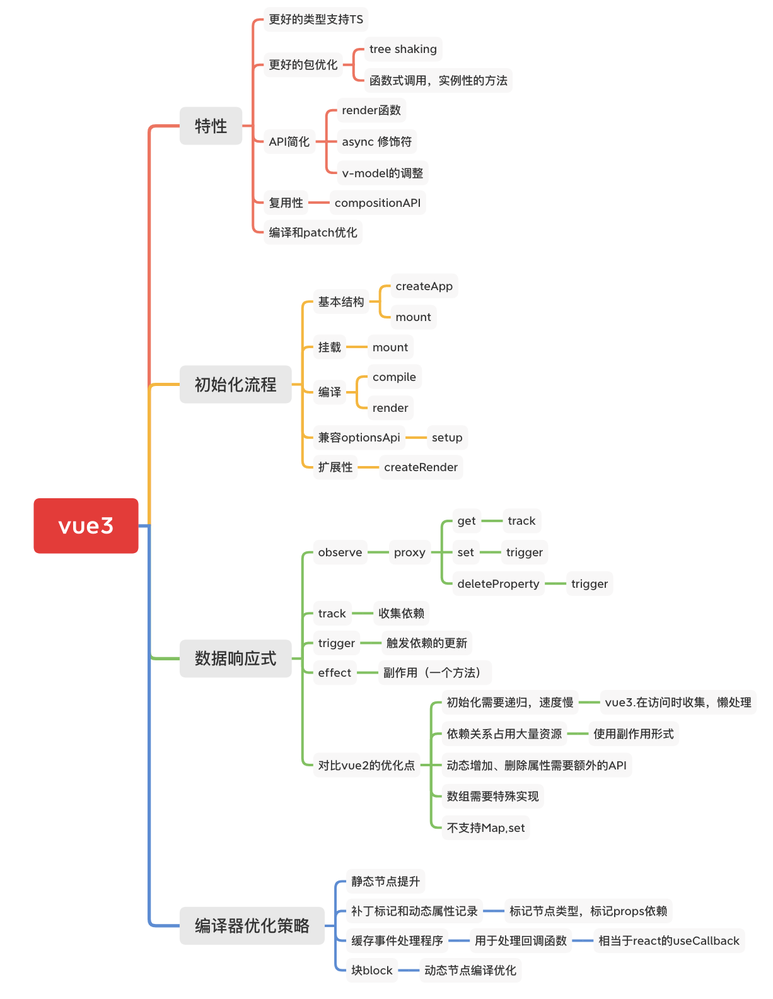
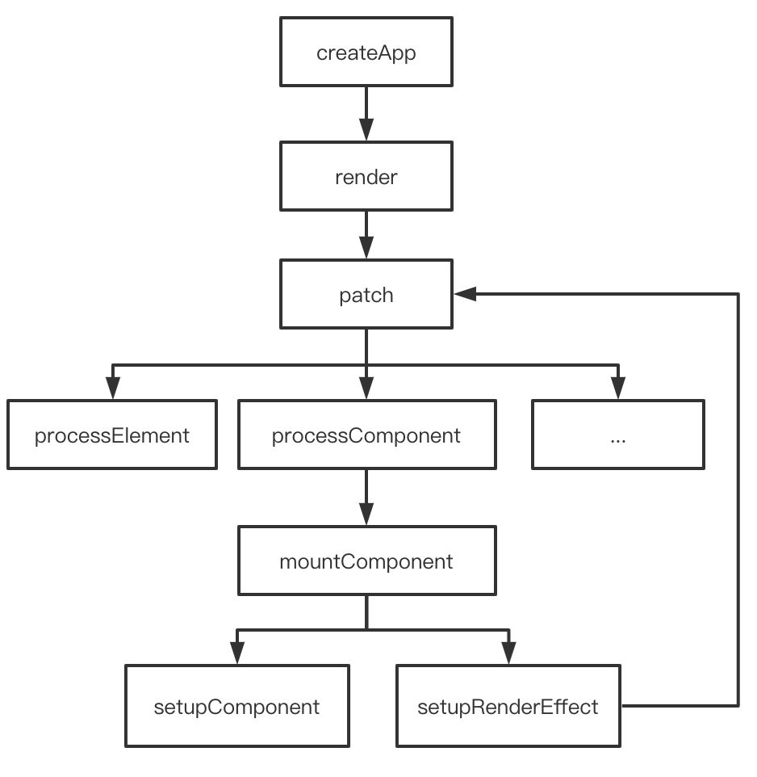
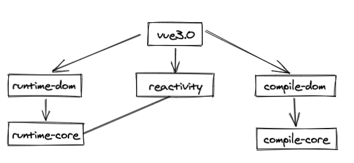
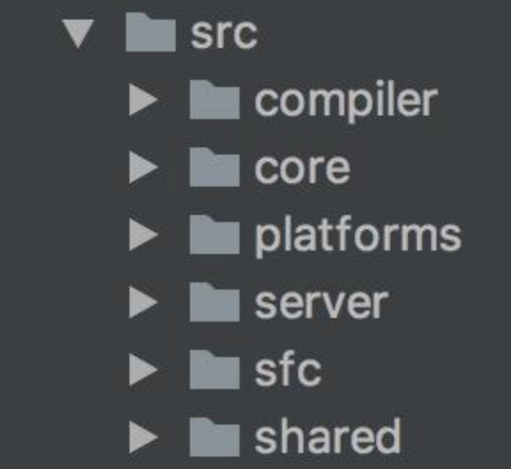
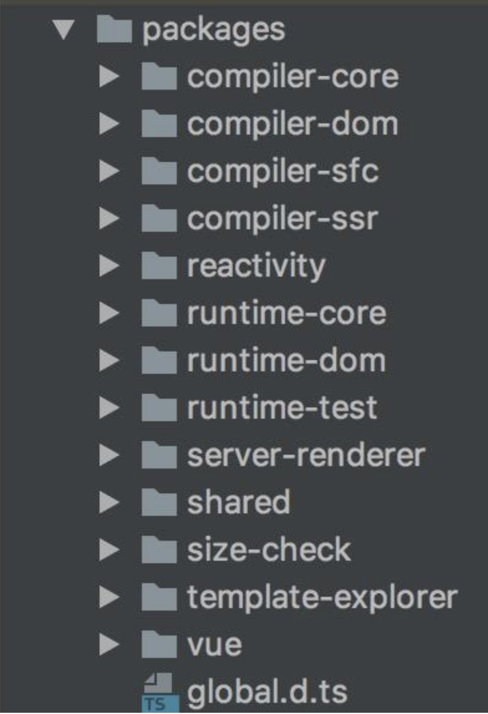
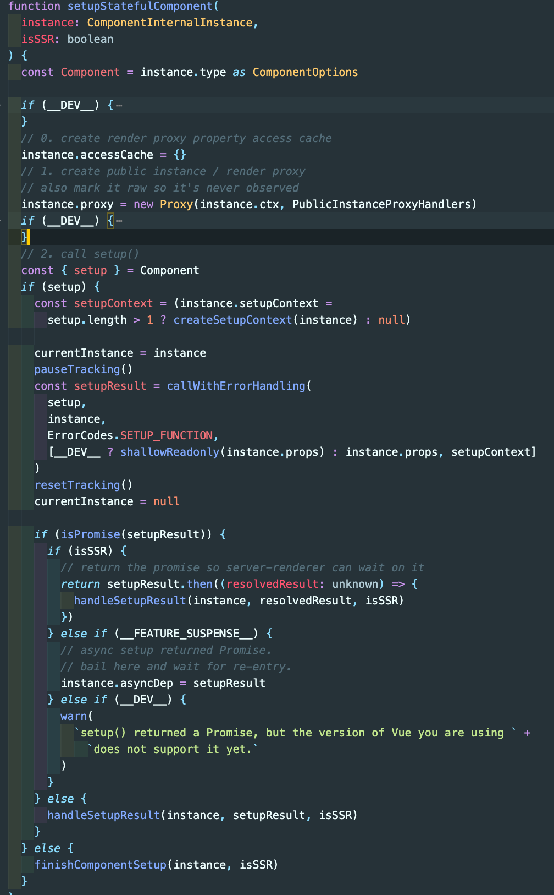

# Vue3.0



## vue3.0初始化流程



简单的实现

```js
// vue3的初始化流程
const Vue = {
  createApp(options) {
    // 创建render, 此处可根据不同平台去创建不同的render
    const render = Vue.createRender({
      querySelector(select) {
        return document.querySelector(select)
      },
      insert(children, parent, anchor) {
        parent.insertBefore(children, anchor || null)
      }
    })
    return render.createApp(options)
  },
  createRender({ querySelector, insert }) {
    return {
      createApp(options) {
        return {
          // 挂载函数
          mount(selector) {
            const parent = querySelector(selector)
            if(!options.render) {
              options.render = this.compile(parent.innerHTML)
            }
            if(options.setup) {
              this.setupState = options.setup()
            } else {
              this.data = options.data()
            }

            // 确认render中数据从哪获取
            this.proxy = new Proxy(this, {
              get(target, key) {
                if (key in target.setupState) {
                  return target.setupState[key]
                } else {
                  return target.data[key]
                }
              },
              Set(target, key, val) {
                if (key in target.setupState) {
                  target.setupState[key] = val
                } else {
                  target.data[key] = val
                }
              }
            })

            const el = options.render.call(this.proxy)
            parent.innerHTML = ''
            // parent.appendChild(el)
            insert(el, parent)
          },
          // 编译函数，省略
          compile(template) {
            return function render() {
              const node = document.createElement("h3")
              node.textContent = this.title
              return node
            }
          }
        }
      }
    }
  }
}
```

### 步骤

- 挂载mount
  - 获取parent
- 编译
  - compile
  - render
- 兼容compositionApi
  - setup
- 渲染,插入节点

## 数据响应式

```js
const isObject = val => val !== null && typeof val === 'object'

function reactive(obj) {
  if (!isObject(obj)) {
    return obj
  }
  // Proxy相当于在对象外层加拦截
  const observed = new Proxy(obj, {
    get(target, key, receiver) {
      // Reflect用于执行对象默认操作，更规范、更友好
      // Proxy和Object的方法Reflect都有对应
      const res = Reflect.get(target, key, receiver)
      console.log(`获取${key}:${res}`)
      // 依赖收集
      track(target, key)
      return isObject(res) ? reactive(res) : res
    },
    set(target, key, value, receiver) {
      const res = Reflect.set(target, key, value, receiver)
      console.log(`设置${key}:${value}`)
      trigger(target, key)
      return res
    },
    deleteProperty(target, key) {
      const res = Reflect.deleteProperty(target, key)
      console.log(`删除${key}:${res}`)
      trigger(target, key)
      return res
    }
  })
  return observed
}

const effectStack = []

function effect(fn) {
  const rxEffect = function() {
    // 1.捕获异常
    try {
      // 2.入栈
      effectStack.push(rxEffect)
      // 3.触发依赖收集
      return fn()
    } finally {
      // 4.出栈
      effectStack.pop()
    }
  }

  rxEffect()

  return rxEffect
}

// 依赖收集，建立target，key和上面的effect函数之间映射关系
// 需要一个数据结构存储该关系
// {target: {key: [cb1, cb2, ...]}}
let targetMap = new WeakMap()
function track(target, key) {
  // 获取effect存入的函数
  const effect = effectStack[effectStack.length - 1]

  if (effect) {
    // 获取target对应Map
    let depsMap = targetMap.get(target)
    if (!depsMap) {
      depsMap = new Map()
      targetMap.set(target, depsMap)
    }
    // 获取depsMap中key和其值，也就是Set
    let deps = depsMap.get(key)
    if (!deps) {
      // 首次deps不存在，创建之
      deps = new Set()
      depsMap.set(key, deps)
    }

    // 将传入effect，添加到Set里面
    deps.add(effect)
    console.log(deps)
  }
}

function trigger(target, key) {
  // 获取映射关系
  const depsMap = targetMap.get(target)
  if (depsMap) {
    // 获取函数集合
    const deps = depsMap.get(key)
    deps.forEach(effect => {
      effect()
    })
  }
}

const state = reactive({
  foo: 'foo',
  bar: { a: 1 }
})

effect(() => {
  console.log('effect:', state.foo)
})

state.foo = 'fooooooo'
```

## vue3.0的优化

vue3.0带来的优化

### 代码组织

- vue3.0代码结构



更好的代码管理方式：monorepo

Vue 2.x 的源码托管在 src 目录，然后依据功能拆分出了 compiler（模板编译的相关代码）、core（与平台无关的通用运行时代码）、platforms（平台专有代码）、server（服务端渲染的相关代码）、sfc（.vue 单文件解析相关代码）、shared（共享工具代码）



Vue 3.0 ，整个源码是通过 monorepo 的方式维护的，根据功能将不同的模块拆分到 packages



monorepo 把这些模块拆分到不同的 package 中，每个 package 有各自的 API、类型定义和测试。这样使得模块拆分更细化，职责划分更明确，模块之间的依赖关系也更加明确。
另外一些 package（比如 reactivity 响应式库）是可以独立于 Vue.js 使用的，这样用户如果只想使用 Vue.js 3.0 的响应式能力，可以单独依赖这个响应式库而不用去依赖整个 Vue.js，减小了引用包的体积大小。

### 虚拟dom重写

做了一些静态标记，针对不同类型对节点进行不同策略的处理，静态节点在diff过程中会直接跳过。

### 性能提升

1. 更好的初始性能
2. tree-shaking支持，更小的文件大小
3. composition Api新语法
4. fragment,teleport,suspense新组件
5. 更好的typescript支持
6. 自定义渲染器

tree-shaking原理：依赖 ES2015 模块语法的静态结构（即 import 和 export），通过编译阶段的静态分析，找到没有引入的模块并打上标记。未被引入的 square 模块会被标记，然后压缩阶段会利用例如 uglify-js、terser 等压缩工具真正地删除这些没有用到的代码。
利用 tree-shaking技术，如果在项目中没有引入Transition、KeepAlive 等组件, 那么它们对应的代码就不会打包，这样也就间接达到了减少项目引入的 Vue.js 包体积的目的。

### 数据劫持优化

- vue1x与vue2x是利用Object.defineProperty这个 API 去劫持数据的 getter 和 setter：

```js
Object.defineProperty(data, 'a',{
  get() {
    // track
  },
  set() {
    // trigger
  }
})
```

这个 API 有一些缺陷，它必须预先知道要拦截的 key 是什么，它并不能检测对象属性的添加和删除。之前提供了 `$set` 和 `$delete` 实例方法，但是增加了一定对负担。

嵌套层级比较深的对象,需要递归遍历整个对象，执行 Object.defineProperty 把每一层对象数据都变成响应式的。

```js
export default {
  data: {
    a: {
      b: {
        c: {
          d: 1
        }
      }
    }
  }
}
```

- Vue.js 3.0 使用了 Proxy API 做数据劫持

```js
const observed = new Proxy(data, {
  get() {
    // track
  },
  set() {
    // trigger
  }
})
```

Proxy劫持的是整个对象，自然对于对象的属性的增加和删除都能检测到，Proxy API也不能监听到内部深层次的对象变化，因此 Vue.js 3.0 的处理方式是在 getter 中去递归响应式，这样的好处是真正访问到的内部对象才会变成响应式。

> Proxy的优势

- 可直接监听数组类型的数据变化
- 监听的目标为对象本身，不需要像Object.defineProperty一样遍历每个属性，有一定的性能提升
- 可拦截apply、ownKeys、has等13种对象方法，而Object.defineProperty不行
- 直接实现对象属性的新增/删除

### 编译优化

主要优化发生在patch阶段，也就是diff阶段。

- vue2.0的diff算法与模版的节点数量正相关，会造成大量的性能浪费。
- vue3.0的diff算法与模版的动态节点数正相关，避免了资源的浪费，其实现原理是通过Block tree，打补丁时将跳过这些属性不会改变的节点。

### 重构 Virtual DOM

- 模板编译时的优化，将一些静态节点编译成常量
- slot优化，将slot编译为lazy函数，将slot的渲染的决定权交给子组件
- 模板中内联事件的提取并重用（原本每次渲染都重新生成内联函数）

### 语法 API 优化：Composition API

- 增强了逻辑复用
- 增强了代码结构与可读性

### 取消组件的根节点

由老的

```js
<template>
  <div></div>
</template>
```

变成为

```js
<template>
  <div></div>
  <div></div>
</template>
```

在做组件递归的时候可以减少`div`的生成

## 新特性

### setup

全局import

vue2中的data,methods,computed都是挂载在this上面，两个明显的缺点

1. 不利于类型推导
2. 没用到computed功能，代码也会被打包

vue3的手动import更利于Tree-shaking

### ref

reactive负责复杂数据结构，ref可以把基本的数据结构包装成响应式

```vue
<template>
  <div>
    <h1>{{state.count}} * 2 = {{double}}</h1>
    <h2>{{num}}</h2>
    <button @click="add"></button>
  </div>
</template>

<script>
import { reactive, computed, ref, method, onMounted } from 'vue'
export default {
  setup () {
    const state = reactive({
      count: 1
    })
    const num = ref(2)

    function add() {
      state.count++
      num += 20
    }

    const double = computed(() => state.count * 2)

    onMounted(( => {
      console.log('method')
    }))

    return {
      state,
      num,
      double,
      add
    }
  }
}
</script>
```

## Composition API原理

vue3.0的 `compositionApi` 和 `options` 是共存的。

### composition和options如何做到和谐共存？

- 关键代码

如果设置了setup就会先处理它，else逻辑在后面做。如果设置了setup则先调用它，随后再处理别的options。



### setup中的this指向

setup中的this就是它执行时的上下文，如果是esm方式打包，会是undefined；如果是单文件的方式运行，会是window；但是不管怎样都没有什么意义
