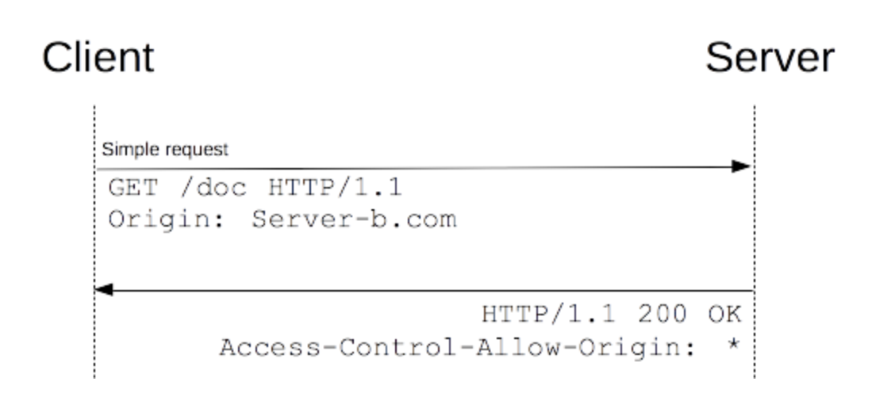
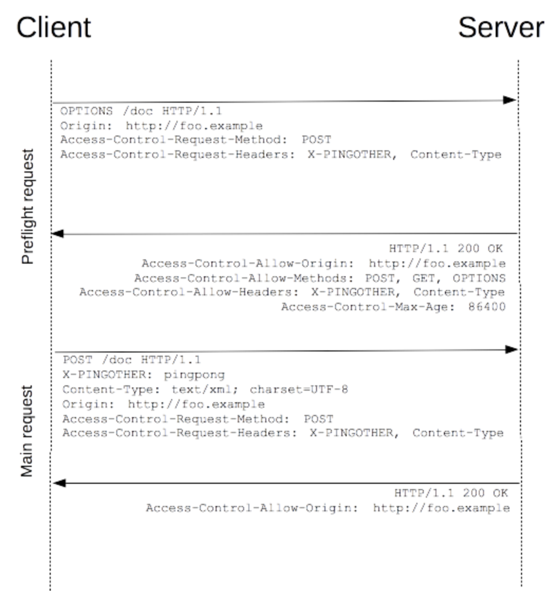

# 跨域

## why

Q: 为什么会出现跨域问题？

A: 同源策略限制了从同一个源加载的文档或脚本如何与来自另一个源的资源进行交互。这是一个用于隔离潜在恶意文件的重要安全机制。同源指：协议、域名、端口号必须一致。

同源策略控制了不同源之间的交互，例如在使用XMLHttpRequest 或标签时则会受到同源策略的约束。这些交互通常分为三类：

- 通常浏览器允许进行跨域写操作（Cross-origin writes），如链接（links），重定向以及表单提交。特定少数的HTTP请求需要添加 preflight。
- 通常浏览器允许跨域资源嵌入（Cross-origin embedding），如 img、script 标签;
- 通常浏览器不允许跨域读操作（Cross-origin reads）。

允许跨域资源嵌入的示例，一些不受同源策略影响的标签示例：

- `<script src="..."></script>`标签嵌入跨域脚本。语法错误信息只能在同源脚本中捕捉到。
- `<link rel="stylesheet" href="...">`标签嵌入CSS。CSS的跨域需要一个设置正确的Content-Type消息头.
- `` 嵌入图片。支持的图片格式包括PNG,JPEG,GIF,BMP,SVG
- `<video>` 和 `<audio>` 嵌入多媒体资源。
- `@font-face`引入的字体。一些浏览器允许跨域字体（ cross-origin fonts），一些需要同源字体（same-origin fonts）。
- `<frame>和<iframe>`载入的任何资源。站点可以使用X-Frame-Options消息头来阻止这种形式的跨域交互。

## cors跨域

跨域资源共享

### 预检请求(OPTIONS)

浏览器限制跨域请求一般有两种方式：

1. 浏览器限制发起跨域请求
2. 跨域请求可以正常发起，但是返回的结果被浏览器拦截了

一般浏览器都是第二种方式限制跨域请求，那就是说请求已到达服务器，并有可能对数据库里的数据进行了操作，但是返回的结果被浏览器拦截了，那么我们就获取不到返回结果，这是一次失败的请求，但是可能对数据库里的数据产生了影响。

对这种可能对服务器数据产生副作用的HTTP请求方法，浏览器必须先使用OPTIONS方法发起一个预检请求，从而获知服务器是否允许该跨域请求：如果允许，就发送带数据的真实请求；如果不允许，则阻止发送带数据的真实请求。

#### 简单请求

使用下列方法之一且没有人为设置对 CORS 安全的首部字段集合之外的其他首部字段：

- GET
- HEAD
- POST

- 仅当POST方法的Content-Type值等于下列之一才算作简单请求
  - text/plain
  - multipart/form-data
  - application/x-www-form-urlencoded



#### 非简单请求

使用了下面任一 HTTP 方法：

- PUT
- DELETE
- CONNECT
- OPTIONS
- TRACE
- PATCH

人为设置了对 CORS 安全的首部字段集合之外的其他首部字段

- Accept
- Accept-Language
- Content-Language
- Content-Type (but note the additional requirements below)
- DPR
- Downlink
- Save-Data
- Viewport-Width
- Width

Content-Type 的值不属于下列之一

- application/x-www-form-urlencoded
- multipart/form-data
- text/plain

发送真正请求前会先发送预检请求，如图所示：



1.第一条OPTIONS为预检请求，中同时携带了下面两个首部字段：

```js
Access-Control-Request-Method: POST
Access-Control-Request-Headers: X-PINGOTHER
```

- 预检请求的Request中的Access-Control-Request-Method: POST，是告诉服务器，之后的实际请求将使用POST方式。
- Access-Control-Request-Headers 是告诉服务器，实际请求将携带两个自定义请求首部字段：X-PINGOTHER 与 Content-Type。服务器据此决定，该实际请求是否被允许

### 附带身份凭证的请求

一般而言，对于跨域 XMLHttpRequest 或 Fetch 请求，浏览器不会发送身份凭证信息。

```js
var xhr = new XMLHttpRequest();
var url = 'http://bar.other/resources/credentialed-content/';

xhr.open('GET', url, true);
xhr.withCredentials = true;
xhr.onreadystatechange = () => {};
xhr.send();
```

将 XMLHttpRequest 的 withCredentials 标志设置为 true，从而向服务器发送 Cookies。因为这是一个简单 GET 请求，所以浏览器不会对其发起“预检请求”。但是，如果服务器端的响应中未携带 Access-Control-Allow-Credentials: true ，浏览器将不会把响应内容返回给请求的发送者。

#### 附带身份凭证的请求与通配符

对于附带身份凭证的请求，服务器不得设置 Access-Control-Allow-Origin 的值为“*”。

因为请求的首部中携带了 Cookie 信息。如果 Access-Control-Allow-Origin 的值为“*”，请求将会失败。而将 Access-Control-Allow-Origin 的值设置为 <http://foo.example>，则请求将成功执行。

### HTTP 响应首部字段

#### Access-Control-Allow-Origin

origin 参数的值指定了允许访问该资源的外域 URI.对于不需要携带身份凭证的请求，服务器可以指定该字段的值为通配符，表示允许来自所有域的请求。

```js
Access-Control-Allow-Origin: <origin> | *
```

#### Access-Control-Expose-Headers

在跨域访问时，XMLHttpRequest对象的getResponseHeader()方法只能拿到一些最基本的响应头，Cache-Control、Content-Language、Content-Type、Expires、Last-Modified、Pragma，如果要访问其他头，则需要服务器设置本响应头。
Access-Control-Expose-Headers 头让服务器把允许浏览器访问的头放入白名单，例如：

```js
Access-Control-Expose-Headers: X-My-Custom-Header, X-Another-Custom-Header
```

#### Access-Control-Max-Age

头指定了请求的结果能够被缓存多久

```js
Access-Control-Max-Age: <delta-seconds>

```

#### Access-Control-Allow-Credentials

指定了当浏览器的credentials设置为true时是否允许浏览器读取response的内容。

#### Access-Control-Allow-Methods

用于预检请求的响应,指明了实际请求所允许使用的 HTTP 方法。

#### Access-Control-Allow-Headers

用于预检请求的响应。其指明了实际请求中允许携带的首部字段。

#### Origin

表明预检请求或实际请求的源站。

#### Access-Control-Request-Method

用于预检请求。其作用是，将实际请求所使用的 HTTP 方法告诉服务器。

#### Access-Control-Request-Headers

用于预检请求。其作用是，将实际请求所携带的首部字段告诉服务器。

## Node中间件代理

从服务器向服务器请求，无需遵循同源策略。
node中间件，需要做以下几个步骤：

- 接受客户端请求 。
- 将请求转发给服务器。
- 拿到服务器响应数据。
- 将响应转发给客户端。

我们可以使用`http-proxy-middleware`中间件来做这样的代理

```js
const express = require('express');
const proxy = require('http-proxy-middleware');
const app = express();
app.use(
  `xxx`,
  proxy({
    target: 'targetUrl',
    changeOrigin: true,
    pathRewrite: {
      [`${config.baseUrl}cheapflightapi`]: '/'
    }
  })
)
```

上面方式适用于以node作为web服务器的场景，比如SSR应用，这样会非常方便的去做各种服务的转发。

## Nginx反向代理

使用Nginx服务器的反向代理功能来实现跨域请求，非常简单且，只需要修改nginx的配置即可解决跨域问题，支持所有浏览器，支持session，不需要修改任何代码，并且不会影响服务器性能。

```shell
// proxy服务器
server {
  listen 80;
  server_name  www.domain1.com;
  location / {
    proxy_pass   http://www.domain2.com;  #反向代理域
    proxy_cookie_domain www.domain2.com www.domain1.com; #修改cookie里域名
    index  index.html index.htm;

    add_header Access-Control-Allow-Origin http://www.domain1.com;  #当前端只跨域不带cookie时，可为*
    add_header Access-Control-Allow-Credentials true;
  }
}
```

## JSONP

利用script标签不受跨域限制而形成的一种方案。

```js
function jsonpRequest({url, params}){
  return new Promise((resolve, reject)=>{
    let script = document.createElement('script')
    const cb = 'jsonRequestCb' + Math.random()
    window[cb] = function(data) {
      resolve(data);
    }
    params = {...params, cb}
    let arr = [];
    for(let key in parmas) {
      arr.push(`${key}=${params[key]}`)
    }
    script.src = `${url}?${arr.join('&')}`

    script.onload = () => {
      script.remove()
    }
    script.onerror = () => {
      reject()
    }
    document.body.appendChild(script)
  })
}

jsonpRequest({
    url: 'http://localhost:3000/say',
    params: { wd: 'haoxl' },
}).then(data=>{
    console.log(data)
})

```

【JSONP的优缺点】
优点：兼容性好（兼容低版本IE）
缺点：
1.JSONP只支持GET请求；
2.XMLHttpRequest相对于JSONP有着更好的错误处理机制
3.拿不到状态码是什么和header

### JSONP和AJAX对比

JSONP和AJAX相同，都是客户端向服务器端发送请求，从服务器端获取数据的方式。但AJAX属于同源策略，JSONP属于非同源策略（跨域请求）

## postMessage

window.postMessage(message,targetOrigin) 方法是html5新引进的特性，可以使用它来向其它的window对象发送消息，无论这个window对象是属于同源或不同源.

实际中使用场景不多，个人认为他属于跨页面通信的一种。我只在一次向iframe发送消息的时候用到过。另外小程序的内嵌H5向原生发送消息的方法与此类似。
