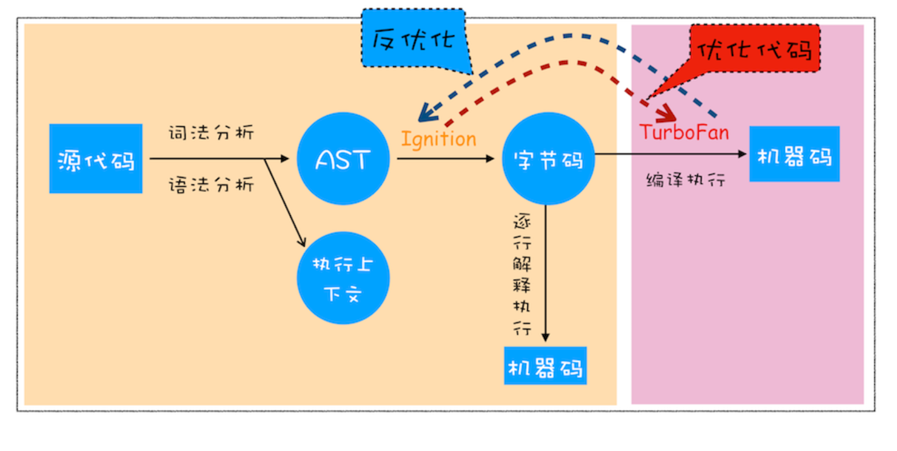
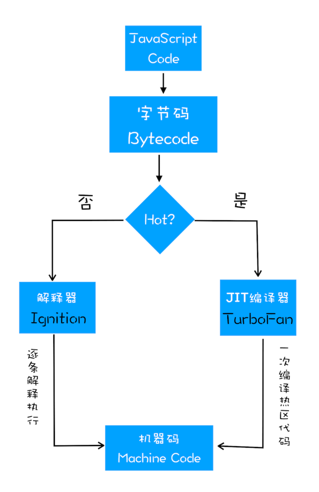

# js的执行机制

## js的执行

### 变量提升

- 在执行过程中，若使用了未声明的变量，那么 JavaScript 执行会报错。
- 在一个变量定义之前使用它，不会出错，但是该变量的值会为 undefined，而不是定义
时的值。
- 在一个函数定义之前使用它，不会出错，且函数能正确执行。

#### 变量声明

所谓的变量提升，指在 `JavaScript` 代码执行过程中，`javaScript`引擎把变量的声明部分和函数的声明部分提升到代码开头行为。变量提升后，会给变量设置一个默认值，这个值就是 `undefined`

```js
var myName = 'pengYue'
// 上面的变量可以拆解为两部分
var myName
myName = "pengYue"
```

#### 函数声明

```js
// 具名函数
function foo() {
 console.log('foo)
}
// 函数变量，先声明变量bar，再把匿名函数赋值给bar
var bar = function(){
 console.log('bar')
}
```

#### javaScript 代码执行过程

变量和函数声明在代码里面的位置不会改变，而是在编译阶段被JavaScript引擎放入内存。

- 编译阶段

在输入一段代码，经过编译后，会生成两部分内容：执行上下文(Execution context)和可执行代码，执行上下文是JavaScript执行一段代码时的运行环境。
在执行上下文中，存在一个变量环境的对象。该对象中保存了变量提升的内容。

- 执行阶段

javaScript 引擎开始执行可执行代码，按照顺序一行一行的执行。变量会到变量环境中寻找。

::: tip
从最简单的理解来看，编译阶段，构建变量，放入变量执行环境中。执行阶段，一行一行执行，从变量环境中找到变量。
:::

## JavaScript的执行栈

在执行过程中，会编译全局代码并创建全局执行上下文，在整个页面的生存周期中，全局执行上下文只有一份。

当调用一个函数的时候，函数体内的代码会被编译，并创建函数执行上下文，一般情况 下，函数执行结束之后，创建的函数执行上下文会被销毁。

当使用 eval 函数的时候，eval 的代码也会被编译，并创建执行上下文。

### 调用栈

调用栈就是用来管理函数调用关系的一种数据结构。在执行上下文创建好后， JavaScript 引擎会将执行上下文压入栈中，通常把这种用来管理执行上下文的栈称为执行上下文栈，又称调用栈。

#### 函数调用

函数调用就是运行一个函数，在执行函数之前，会创建全局执行上下文。同时，函数本身也存在执行上下文。所以函数执行过程中会存在多个执行上下文。javaScript通过栈来管理执行上下文。

#### 栈溢出

当入栈的执行上下文超过一定数目，JavaScript引擎就会报错，我们把这种错误叫做栈溢出。

调用栈有两个指标，最大栈容量和最大调用深度，满足其中任意一个就会栈溢出。

## 块级作用域

作用域是指在程序中定义变量的区域，该区域决定了变量的生命周期。作用域就是变量与函数的可访问范围，作用域控制着变量和函数的可见性和生命周期。

- 全局作用域：其中的对象在代码中的任何地方都能访问，其生命周期伴随着页面的生命周期。
- 函数作用域：在函数内部定义的变量或函数，并且定义的函数只能在函数内部被访问。函数执行结束，就会被销毁。
- 块级作用域：使用一对大括号包裹的一段代码，比如函数、判断语句、循环语句， 甚至单独的一个{}都可以被看作是一个块级作用域。

### 变量提升带来的问题

- 变量容易在不被察觉的情况下被覆盖掉
- 一些本来应该销毁的代码不会被销毁

### 块级作用域的实现

使用 let 关键字声明的变量是可以被改变 的，而使用 const 声明的变量其值是不可以被改变的。

函数内部通过var声明的变量，在编译阶段全部被存入变量环境中。通过let和const声明的变量会放到词法环境中。在词法环境内部，维护了一个小型栈结构，栈底是函数最外层的变量，进入一个作用域块后，就会把该作用域块内部的变量压到栈顶。当作用域执行完成之后，该作用域的信息 就会从栈顶弹出，这就是词法环境的结构。在使用变量时，需要在词法环境和变 量环境中查找变量 a 的值。沿着词法环境的栈顶向下查询，如果在词法环境中的某个块中查找到了，就直接返回给 JavaScript 引擎，如果没有查找到，那么继 续在变量环境中查找。

### 作用域链

在每个执行上下文中，都包含一个外部引用。用来指向外部的执行上下文，外部应用称为outer。

在函数的执行过程中，按照作用域链查找变量。在分析作用域链的时候，需要结合词法环境和变量环境。

## JavaScript 中的 this

执行上下文中包含了变量环境、词法环境、外部环境。this 是和执行上下文绑定的，也就是说每个执行上下文中都有一个 this。

与执行上下文对应,this有三种.

- 全局执行上下文
- 函数执行上下文
- eval 执行上下文

全局执行上下文中的 this 是指向 window 对象。

函数执行上下文，指向他的执行上下文，也就是谁执行它，this就指向谁。

### 设置函数执行上下文中的 this 值

1: 通过函数的call方法设置它的执行上下文，同样的还有，bind, apply。

call,bind,apply的区别

- bind只是绑定执行上下文，并不执行函数，call,与apply立即执行
- call，bind传入多个参数，apply传入两个参数。第一个参数都为this的指向对象。

2: 通过对象调用方法设置

在全局环境中调用一个函数，函数内部的 this 指向的是全局变量 window。
使用对象来调用其内部的一个方法，该方法的 this 是指向 对象本身的。

3: 通过构造函数中设置

执行 new CreateObj() 创建了对象时，JavaScript 引擎做了如下四件事:

- 首先创建了一个空对象 tempObj
- 接着调用 CreateObj.call 方法，并将 tempObj 作为 call 方法的参数，这样当 CreateObj 的执行上下文创建时，它的 this 就指向了 tempObj 对象;
- 然后执行 CreateObj 函数，此时的 CreateObj 函数执行上下文中的 this 指向了 tempObj 对象;
- 最后返回 tempObj 对象。

### 在使用 this 时

- 当函数作为对象的方法调用时，函数中的 this 就是该对象;
- 当函数被正常调用时，在严格模式下，this 值是 undefined，非严格模式下 this 指向的是全局对象 window;
- 嵌套函数中的 this 不会继承外层函数的 this 值。

## v8

javascript 是动态类型的语言，在运行过程中需要检查数据类型。支持在运行过程中的隐式类型转换。他是一种弱类型的、动态的语言。

- 弱类型：意味着不需要告诉 JavaScript 引擎这个或那个变量是什么数据类型， JavaScript 引擎在运行代码的时候自己会计算出来。

- 动态：意味着可以使用同一个变量保存不同类型的数据。

### javascript的8种基本类型

|类型 | 时间复杂度 |
|----|-----|
|Boolean|只有true和false|
|Null|只有一个null|
|Undefined|没有赋值的变量有个默认值undefined。变量提升默认值也为undefined|
|Number|数字类型,有范围|
|BigInt|数字类型,无范围|
|String|用于表示文本数据|
|Symbol|符号唯一而且不可修改，通常用来作为Object的key|
|Object|在JavaScript中，对象可以被看作是一组属性的集合|

### 内存空间

在JavaScript的执行过程中，主要有三种类型内存空间，分别是代码空间、栈空间和堆空间。

#### 栈空间和堆空间

在执行过程中，栈空间用来维护函数的执行上下文，堆空间用来保存引用类型数据。

通常情况下，栈空间都不会设置太大，主要用来存放一些原始类型的小数据。而引用类型的数据占用的空间都比较大，堆空间很大，能存放很多大的数据。

### 垃圾回收

- 在调用栈中，有一个记录 当前执行状态的指针(称为 ESP)，函数的执行上下文一旦被执行后，JavaScript 引擎会通过向下移动 ESP 来销毁该函数保存在栈中的执行上下文。在调用另外的函数时，这块内容会被直接覆盖掉，用来存放另外一个函 数的执行上下文。

- 堆中的垃圾回收：回收堆中的垃圾数据，需要用到JavaScript引擎中的垃圾回收器。
- 代际假说：第一个是大部分对象在内存中存在的时间很短，简单来说，就是很多对象一经分配内存，很快就变得不可访问;第二个是不死的对象，会活得更久。

#### 新生代和老生代

新生代中存放的是生存时间短的对象，老生代中存放的生存时间久的对象。
新生区通常只支持 1~8M 的容量，而老生区支持的容量就大很多了。对于这两块区域，V8 分别使用两个不同的垃圾回收器

- 副垃圾回收器，主要负责新生代的垃圾回收。
- 主垃圾回收器，主要负责老生代的垃圾回收。

#### 垃圾回收的工作流程

- 第一步：标记空间中活动对象和非活动对象。标记活着的和死的。
- 第二步：回收非活动对象所占据的内存。回收死的。
- 第三步：内存整理，一般来说，频繁回收对象后，内存中就会存在大量不连续空间，这些不连续的内存空间称为内存碎片。

#### 主垃圾回收器

主垃圾回收器主要负责老生区中的垃圾回收。除了新生区中晋升的对象，一些大的对象会直接被分配到老生区。一个是对象占用空间大，另一个是对象存活时间长。

主垃圾回收器是采用标记 - 清除(Mark-Sweep)的算法进行垃圾回收。标记阶段就是从一组根元素开始，递归遍历这组根元素，在这个遍历过程中，能到达的元素称活动对象，没有到达的元素就可以判断为垃圾数据。

在垃圾回收处理过程中，先使用标记清除算法把垃圾清除，再使用标记整理算法把碎片进行整理。

#### 副垃圾回收器

小的对象会分配到新生区，这个区域虽然不大，但是垃圾回收还是比较频繁的。

新生代中用 `Scavenge` 算法,把新生代空间对半划分为两 个区域，一半是对象区域，一半是空闲区域.新加入的对象都会存放到对象区域，当对象区域快被写满时，就需要执行一次垃圾清理操作。

在垃圾回收过程中，首先要对对象区域中的垃圾做标记;标记完成之后，就进入垃圾清理阶段，副垃圾回收器会把这些存活的对象复制到空闲区域中，同时它还会把这些对象有序地排列起来，所以这个复制过程，也就相当于完成了内存整理操作，复制后空闲区域就没有内存碎片了。

完成复制后，对象区域与空闲区域进行角色翻转，也就是原来的对象区域变成空闲区域，原来的空闲区域变成了对象区域。

因为需要开辟两块空间，所以一般新生区都会设置的比较小。因为空间不大，所以很容易被存活的对象装满整个区域。JavaScript引擎采用了对象晋升策略，也就是经过两次垃圾回收依然还存活的对象，会被移动到老生区中。

### 全停顿

由于 JavaScript 是运行在主线程之上的，一旦执行垃圾回收算法，都需要将正在执行的 JavaScript 脚本暂停下来。待垃圾回收完毕后再恢复脚本执行。我们把这种行为叫做全停顿(Stop-The-World)。

为了降低老生代的垃圾回收而造成的卡顿，V8 将标记过程分为一个个的子标记过程，同时让垃圾回收标记和 JavaScript 应用逻辑交替进行。这个算法称为增量标记。使用增量标记算法，可以把一个完整的垃圾回收任务拆分为很多小的任务，这些小的任务执 行时间比较短，可以穿插在其他的 JavaScript 任务中间执行。

### V8如何执行代码

编译器(Compiler)、解释器(Interpreter)、抽象语法树(AST)、字节码 (Bytecode)、即时编译器(JIT)

#### 编译器和解释器

- 编译型语言在程序执行之前，需要经过编译器的编译过程，并且编译之后会直接保留机器能 读懂的二进制文件，这样每次运行程序时，都可以直接运行该二进制文件，而不需要再次重新编译。比如 C/C++、GO 等都是编译型语言。
- 而由解释型语言编写的程序，在每次运行时都需要通过解释器对程序进行动态解释和执行。比如 Python、JavaScript 等都属于解释型语言。

- 编译器流程：源代码 -词法分析，语法分析-> AST -词义分析> 中间代码 -代码优化> 二进制文件 -直接执行> 执行
- 解释器流程：源代码 -词法分析，语法分析-> AST -词义分析> 字节码 -解释执行> 执行

#### V8执行代码流程

- 生成抽象语法树和执行上下文，将源代码转化成抽象语法树，并生成执行上下文，
  - 分词(tokenize):将一行行的源码拆解成一个个 `token` 指的是语法上不可能再分的、最小的单个字符或字符串。
  - 解析(parse): 将生成的 token 数据，根据语法规则转为 AST
- 生成字节码：解释器 Ignition 根据 AST生成字节码，并解释执行字节码。一开始 V8 并没有字节码，而是直接将 AST 转换为机器码，但是V8 需要消耗大量的内存来存放转换后的机器码。字节码就是介于 AST 和机器码之间的一种代码。但是与特定类型的机器码无关，字节码需 要通过解释器将其转换为机器码后才能执行。
- 执行代码： 在执行字节码的过程中，如果发现有热点代码(HotSpot)，比如一段代码被重复执行多次，这种就称为热点代码，那么后台的编译器 TurboFan 就会把该段热点的字节码编译为高效的机器码，然后当再次执行这段被优化的代码时，只需要执行编译后的机器码就可以了，这样就大大提升了代码的执行效率。



### JavaScript 的性能优化

主要关注以下三点内容

- 提升单次脚本的执行速度，避免 JavaScript 的长任务霸占主线程，这样可以使得页面 快速响应交互;
- 避免大的内联脚本，因为在解析 HTML 的过程中，解析和编译也会占用主线程;
- 减少 JavaScript 文件的容量，因为更小的文件会提升下载速度，并且占用更低的内存。



### 