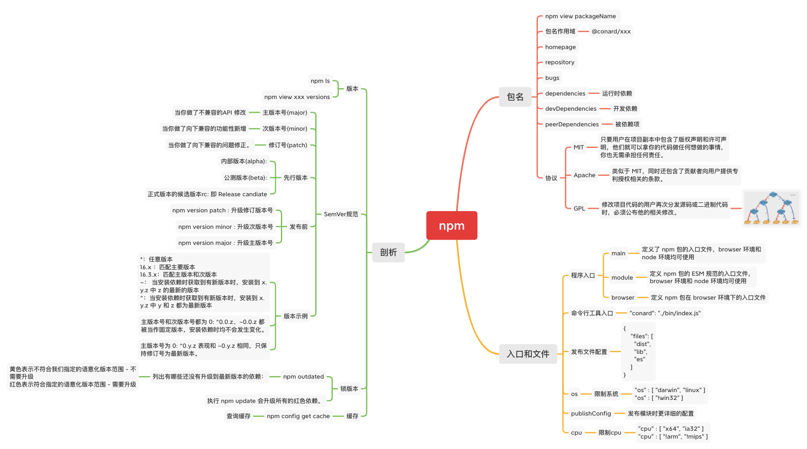
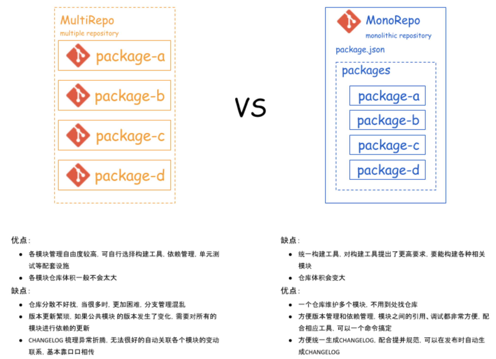

# 包管理

## 脑图



## yarn

### 和npm区别

- `yarn` 在下载和安装依赖包采用的是多线程的方式，而 `npm` 是单线程的方式执行，速度上就拉开了差距。
- `yarn`  会在用户本地缓存已下载过的依赖包，优先会从缓存中读取依赖包，只有本地缓存不存在的情况才会采取远端请求的方式；反观 `npm` 则是全量请求，速度上再次拉开差距。
- `yarn` 把所有的依赖躺平至同级，有效的减少了相同依赖包重复下载的情况，加快了下载速度而且也减少了 `node_modules` 的体积；`npm`则是严格的根据依赖树下载并放置到对应位置，导致相同的包多次下载`node_modules`体积大的问题

### yarn工作流程

`yarn` 在安装依赖包时会分为主要 5 个步骤：

- checking：检查配置项（.yarnrc、命令行参数、package.json 信息等）、兼容性（cpu、nodejs 版本、操作系统等）是否符合约定
- resolveStep：解析依赖包信息，并且会解析出整个依赖树上所有包的具体版本信息
- fetchStep：下载全部依赖包，如果依赖包已经在缓存中存在则跳过下载，反之则下载对应依赖包到缓存文件夹内，当这一步都完成后代表着所有依赖包都已经存在缓存中了
- linkStep：将缓存的依赖包扁平化的复制副本到项目的依赖目录下
- buildStep：对于一些二进制包，需要进行编译，在这一步进行

## lerna

Lerna 是一个管理多个 npm 模块的工具，是 Babel 自己用来维护自己的 Monorepo 并开源出的一个项目。优化维护多包的工作流，解决多个包互相依赖，且发布需要手动维护多个包的问题。

### monorepo管理

Monorepo 是管理项目代码的一个方式，指在一个项目仓库 (repo) 中管理多个模块/包 (package)，不同于常见的每个模块建一个 repo。常见

目录结构如下:

```js
├── packages
|   ├── pkg1
|   |   ├── package.json
|   ├── pkg2
|   |   ├── package.json
├── package.json
```

monorepo 最主要的好处是统一的工作流和Code Sharing。使用统一的流程管理，统一测试、统一发版。只要搭建一套脚手架，就能管理（构建、测试、发布）多个 package。



[lerna官网](https://github.com/lerna/lerna)

[基于lerna和yarn workspace的monorepo工作流](https://zhuanlan.zhihu.com/p/71385053)

## 版本规范

- beta:内部测试版本
- alpha:开放测试
- rc:预选发布版本，主要着重于除错

x.y.z

x：主版本号，当做了不兼容当API修改
y：次版本号：当你做了向下兼容的功能性新增
z：修订号：当你做了向下兼容的问题修正

### 修改版本

如何修改版本

`npm version [<newVersion> | major | minor | patch | premajor | preminor | prepatch | prerelease [custom version] ]`
