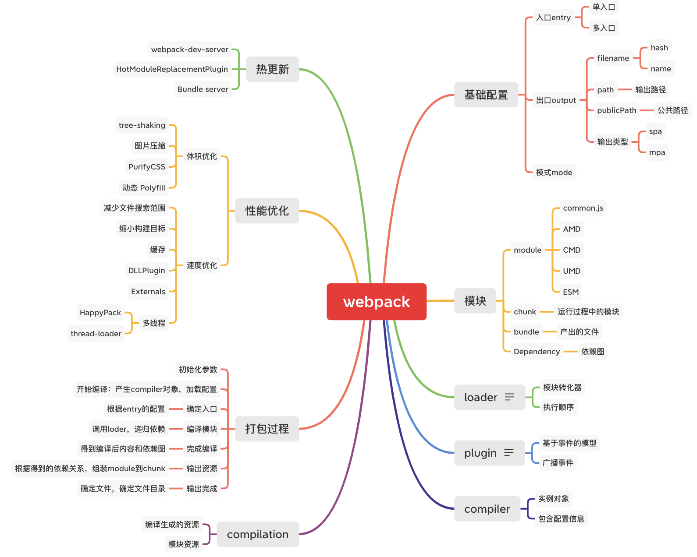

# webpack



## webpack的文件监听以及热更新

文件监听原理，轮询判断文件的最后编辑时间是否发生变化

某个文件发生了变化，并不会立即告诉监听者，而是先缓存起来，等aggregateTimeout

### 热更新

- webpack-dev-server + HotModuleReplacementPlugin插件: 热跟新不输出文件，直接放在内存中。

- webpack-dev-middleware:将webpack输出等文件传输给服务器：较为灵活。

### 热更新原理

[从零实现webpack热更新HMR](https://juejin.cn/post/6844904020528594957)

## 文件指纹

通常用于文件的版本管理

- Hash:和整个项目的构建目录有关，只要项目文件有修改，整个项目构建的hash值就会变。
- chunkHash: 和webpack打包的chunk有关，不同的entry会生成不同的chunkHash值。
- contentHash: 根据文件内容来定义hash,文件内容不变，则contentHash不变

- css指纹设置：通过miniCssExtractPlugin来做

## 代码压缩

代码压缩处理

### js压缩

js内置了`uglifyjs-webpack-plugin`进行压缩

### css压缩

使用`optimize-css-assets-webpack-plugin`
同时使用`cssnano`

```js
plugins:[
  new OptimizeCssAssetsPlugin({
    assetNameRegExp: /\.css$/g,
    cssProcessor: require('cssnano')
  })
]
```

### 压缩

使用 `html-webpack-plugin`

## 资源内连

通过资源内连优化性能

### 代码层面

- 页面框架的初始化脚本
- 上报相关的打点
- css内连避免页面的闪动

### 请求层面

减少http请求

- 小图片或者字体内嵌

### 如何内连

raw-loader内连html，js

css内连：

- 借助：style-loader,设置选项options
- 借助：html-inline-css-webpack-plugin

## 多页面应用打包（MPA）

多页面通用打包方案

动态获取entry和设置html-webpack-plugin数量

利用glob.sync

```javascript
entry: glob.sync(path.join(__dirname,'./src/*/index.js'))
```

## 事件流

- webpack 通过 Tapable 来组织这条复杂的生产线。
- webpack 的事件流机制保证了插件的有序性，使得整个系统扩展性很好。
- webpack 的事件流机制应用了观察者模式，和 Node.js 中的 EventEmitter 非常相似。

## webpack启动

- 查找入口 node_modules/webpack/bin/webpack.js
- 启动后，webpack 最终找到 webpack-cli，并且 执行 CLI。
- webpack-cli 做的事情

引入 yargs，对命令行进行定制，分析命令行参数，对各个参数进行转换，组成编译配置项，引用webpack，根据配置项进行编译和构建

webpack-cli对配置文件和命令行参数进行转换最终生成配置选项参数 options最终会根据配置参数实例化 webpack 对象，然后执行构建流程。

webpack的编译都按照下面的钩子调用顺序执行：

entry-option(初始化option) -> run(开始编译) -> make(从entry开始递归的 分析依赖，对每个 依赖模块进行build) -> before-resolve(对模块位置进行解析) -> build-module(开始构建某个模块) -> normal-module-loader(将loader加载完成的 module进行编译，生成 AST树) -> program(遍历AST，当遇到 require等一些调用表 达式时，收集依赖) -> seal(所有依赖build完 成，开始优化) -> emit(输出到dist目录)

## compiler和compilation

- Compiler:

Compiler 也是我们所说的 Tapable 实例，他就是webpack的整体环境。通过这种实现机制，我们可以理解为，它混合(mix)了 Tapable类，来使实例也具备注册和调用插件功能。
插件机制事实上就是通过注册在Complier上，在运行时Compier会根据各种事件钩子，从而触发插件的注册函数。

- Compilation:

Compilation 实例继承于 compiler。例如，compiler.compilation 是对所有 require 图(graph)中对象的字面上的编译。这个对象可以访问所有的模块和它们的依赖（大部分是循环依赖）。在编译阶段，模块被加载，封闭，优化，分块，哈希和重建等等。这将是任何编译操作中，重要的生命周期。

官方文档看起来比较难理解，compilation 对象代表了一次单一的版本构建和生成资源。当运行 webpack 开发环境中间件时，每当检测到一个文件变化，一次新的编译将被创建，从而生成一组新的编译资源。一个编译对象表现了当前的模块资源、编译生成资源、变化的文件、以及被跟踪依赖的状态信息。编译对象也提供了很多关键点回调供插件做自定义处理时选择使用。

两者之间的区别：

compiler 对象代表的是不变的webpack环境，是针对webpack的
compilation 对象针对的是随时可变的项目文件，只要文件有改动，compilation就会被重新创建。

## Tapable

其核心对象继承自Tapable，Tapable 是一个类似于 Node.js 的 EventEmitter 的库, 主要是控制钩子函数的发布 与订阅,控制着 webpack 的插件系统。Tapable库暴露了很多 Hook(钩子)类，为插件提供挂载的钩子。

```js
const {
  SyncHook, //同步钩子
  SyncBailHook, //同步熔断钩子
  SyncWaterfallHook, //同步流水钩子
  SyncLoopHook, //同步循环钩子
  AsyncParallelHook, //异步并发钩子
  AsyncParallelBailHook, //异步并发熔断钩子
  AsyncSeriesHook, //异步串行钩子
  AsyncSeriesBailHook,  //异步串行熔断钩子
  AsyncSeriesWaterfallHook //异步串行流水钩子
} = require("tapable");
```

hook 基本用法示例

```js
const hook1 = new SyncHook(["arg1", "arg2", "arg3"]);
hook1.tap('hook1', (arg1, arg2, arg3) => console.log(arg1, arg2, arg3)) //1,2,3
```

tabable提供了同步&异步钩子的方法，并且他们都有绑定事件和执行事件对应的方法。

## webpackHooks

### 流程相关

- (before-)run
- (before-/after-)compile ·make
- (after-)emit
- done

### 监听相关

- watch-run
- watch-close

## Compilation hooks

### 模块相关

- build-module
- failed-module
- succeed-module

### 资源生成相关

- module-asset
- chunk-asset

### 优化和 seal相关

- (after-)seal
- optimize
- optimize-modules(-basic/advanced)
- after-optimize-modules
- after-optimize-chunks
- after-optimize-tree
- optimize-chunk-modules (-basic/advanced)
- after-optimize-chunk-modules
- optimize-module/chunk-order
- before-module/chunk-ids
- (after-)optimize-module/ chunk-ids
- before/after-hash

## Chunk 生成算法

1. webpack 先将 entry 中对应的 module 都生成一个新的 chunk
2. 遍历 module 的依赖列表，将依赖的 module 也加入到 chunk 中
3. 如果一个依赖 module 是动态引入的模块，那么就会根据这个 module 创建一个 新的 chunk，继续遍历依赖
4. 重复上面的过程，直至得到所有的 chunks

## loader

loader 只是一个导出为函数的 JavaScript 模块。和glup类似。

### 执行顺序

多个 Loader 串行执行，顺序从后到前。

Compose(webpack采取的是这种)

```js
compose = (f, g) => (...args) => f(g(...args));
```

### loader 的参数获取

通过 loader-utils 的 getOptions 方法获取

```js
const loaderUtils = require("loader-utils");
module.exports = function(content) {
  const { name } = loaderUtils.getOptions(this);
};
```

### 调试

使用 `loader-runner` 调试 loader

## pulgin

pulgin,只能在 webpack 里面运行，通过导出apply函数，提供给webpack进行调用。

```js
module.exports = class DemoPlugin { 
  constructor(options) {
    this.options = options;
  }
  apply() {
    console.log("apply", this.options);
  }
};

```

## webpack构建流程

### webpack准备阶段

webpack启动入口，webpack-cli/bin/cli.js，初始化参数

#### 创建Compiler

创建了 compiler 对象，加载配置，compiler 可以理解为 webpack 编译的调度中心，是一个编译器实例，在 compiler 对象记录了完整的 webpack 环境信息，在 webpack 的每个进程中，compiler 只会生成一次。

#### 初始化默认插件和Options配置

WebpackOptionsApply 类中会根据配置注册对应的插件。

#### run

初始化 compiler 后，根据 options 的 watch 判断是否启动了 watch，如果启动 watch 了就调用 compiler.watch 来监控构建文件，否则启动 compiler.run 来构建文件，compiler.run 就是我们此次编译的入口方法，代表着要开始编译了。

### 构建编译阶段

调用 compiler.run 方法来启动构建

#### Compilation

创建此次编译的 Compilation 对象

Compilation 对象是后续构建流程中最核心最重要的对象，它包含了一次构建过程中所有的数据。也就是说一次构建过程对应一个 Compilation 实例。在创建 Compilation 实例时会触发钩子 compilaiion 和 thisCompilation。

```js
在Compilation对象中：

modules 记录了所有解析后的模块
chunks 记录了所有chunk
assets记录了所有要生成的文件
```

#### make

当 Compilation 实例创建完成之后，webpack 的准备阶段已经完成，下一步将开始 modules 的生成阶段。

### 生成modules

compilation.addEntry 方法会触发第一批 module 的解析，即我们在 entry 中配置的入口文件 index.js。

一个依赖对象（Dependency）经过对应的工厂对象（Factory）创建之后，就能够生成对应的模块实例（Module）。

> Dependency，可以理解为还未被解析成模块实例的依赖对象。比如配置中的入口模块，或者一个模块依赖的其他模块，都会先生成一个 Dependency 对象。每个 Dependency 都会有对应的工厂对象，比如我们这次debuger的代码，入口文件 index.js 首先生成 SingleEntryDependency， 对应的工厂对象是 NormalModuleFactory。(前文说到SingleEntryPlugin插件时有放代码，有疑惑的同学可以往前翻翻看)

### 生成chunks

按照modules生成chunks

### 生成bundle

按照chunks生成bundle
