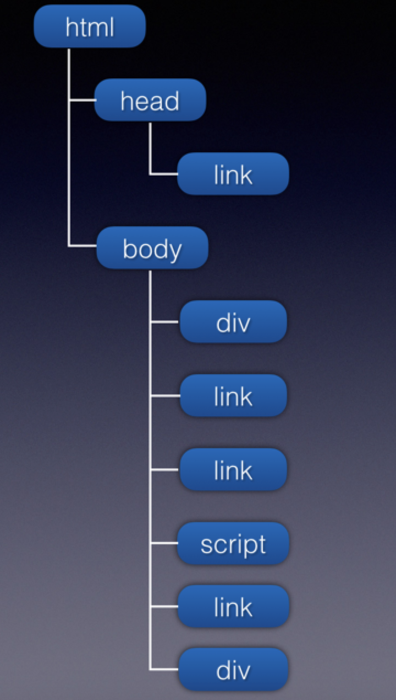

# Load 与 DOMContentLoaded

- load: load 应该仅用于检测一个完全加载的页面 当一个资源及其依赖资源已完成加载时，将触发load事件。
- DOMContentLoaded: 当初始的 HTML 文档被完全加载和解析完成之后，DOMContentLoaded 事件被触发，而无需等待样式表、图像和子框架的完成加载。

## HTML解析

解析的意思是将一个元素通过一定的方式转换成另一种形式。 比如 html 的解析。首先要明确，html 下载到浏览器的表现形式就是 包含字符串的文件。浏览器将 html 文件里面的字符串读取到内存中，按照 html 规则，对字符串进行取词编译，将字符串转化成另一种易于表达的数据结构。我们看下一段代码：

```js
<!DOCTYPE html>
<html lang="en">
<head>
  <meta charset="UTF-8">
  <meta name="viewport" content="width=device-width, initial-scale=1.0">
  <meta http-equiv="X-UA-Compatible" content="ie=edge">
  <title>只有css</title>
  <link rel="stylesheet" href="./index.css" />
</head>
<body>
  <div id="div1"></div>
  <link rel="stylesheet" href="./c1.css" />
  <link rel="stylesheet" href="./c3.css" />
  <script src="http://test.com:9000/mine/load/case2/j1.js
  "></script>
  <link rel="stylesheet" href="./c4.css" />
  <div id="div2"></div>
</body>
</html>
```

浏览器会对这个 html 文件进行编译，转化成类似下面的结构.



浏览器会对转化后的数据结构自上而下进行分析：首先开启下载线程，对所有的资源进行优先级排序下载（注意，这里仅仅是下载）。同时主线程会对文档进行解析：

- 遇到 script 标签时，首先阻塞后续内容的解析，同时检查该script是否已经下载下来，如果已下载，便执行代码。
- 遇到 link 标签时，不会阻塞后续内容的解析（比如 DOM 构建），检查 link 资源是否已下载，如果已下载，则构建 cssom。
- 遇到 DOM 标签时，执行 DOM 构建，将该 DOM 元素添加到文档树中。

- DOM 构建

DOM 构建的意思是，将文档中的所有 DOM 元素构建成一个树型结构。

- CSS 构建

将文档中的所有 css 资源合并。

- render 树
将 DOM 树和 CSS 合并成一棵渲染树，render 树在合适的时机会被渲染到页面中。（比如遇到 script 时, 该 script 还没有下载到本地时）。

## HTML文档的加载与页面的首次渲染

输入一个页面地址，发生了下面的事情：

- 浏览器首先下载该地址所对应的 html 页面
- 浏览器解析 html 页面的 DOM 结构
- 开启下载线程对文档中的所有资源按优先级排序下载。
- 主线程继续解析文档，到达 head 节点 ，head 里的外部资源无非是外链样式表和外链 js。
- 解析到 body
  - 只有 DOM 元素：DOM 树构建完，页面执行首次渲染。
  - 有 DOM 元素、外链 js：当解析到外链 js 的时候，该 js 尚未下载到本地，则 js 之前的 DOM 会被渲染到页面上，同时 js 会阻止后面 DOM 的构建，即后面的 DOM 节点并不会添加到文档的 DOM 树中。所以，js 执行完之前，我们在页面上看不到该 js 后面的 DOM 元素。
  - 有 DOM 元素、外链 css：外链 css 不会影响 css 后面的 DOM 构建，但是会阻碍渲染。简单点说，外链 css 加载完之前，页面还是白屏。
  - 有 DOM 元素、外链 js、外链 css：外链 js 和外链 css 的顺序会影响页面渲染，这点尤为重要。当 body 中 js 之前的外链 css 未加载完之前，页面是不会被渲染的。当body中 js 之前的 外链 css 加载完之后，js 之前的 DOM 树和 css 合并渲染树，页面渲染出该 js 之前的 DOM 结构。
- 文档解析完毕，页面重新渲染。当页面引用的所有 js 同步代码执行完毕，触发 DOMContentLoaded 事件。
- html 文档中的图片资源，js 代码中有异步加载的 css、js 、图片资源都加载完毕之后，load 事件触发。

## head 中资源的加载

- head 中 js 资源加载都会停止后面 DOM 的构建，但是不影响后面资源的下载。
- css资源不会阻碍后面 DOM 的构建，但是会阻碍页面的首次渲染。

## body 中资源的加载

- body 中 js 资源加载都会停止后面 DOM 的构建，但是不影响后面资源的下载。
- css 资源不会阻碍后面 DOM 的构建，但是会阻碍页面的首次渲染。

## DomContentLoaded 事件的触发

DOMContentLoaded 事件在 html文档加载完毕，并且 html 所引用的内联 js、以及外链 js 的同步代码都执行完毕后触发。

## load 事件的触发

当页面 DOM 结构中的 js、css、图片，以及 js 异步加载的 js、css 、图片都加载完成之后，才会触发 load 事件。

- 页面中引用的js 代码如果有异步加载的 js、css、图片，是会影响 load 事件触发的。
- video、audio、flash 不会影响 load 事件触发。

[参考1](https://juejin.cn/post/6844903623583891469)
[参考2](https://juejin.cn/post/6844903504025223176)
