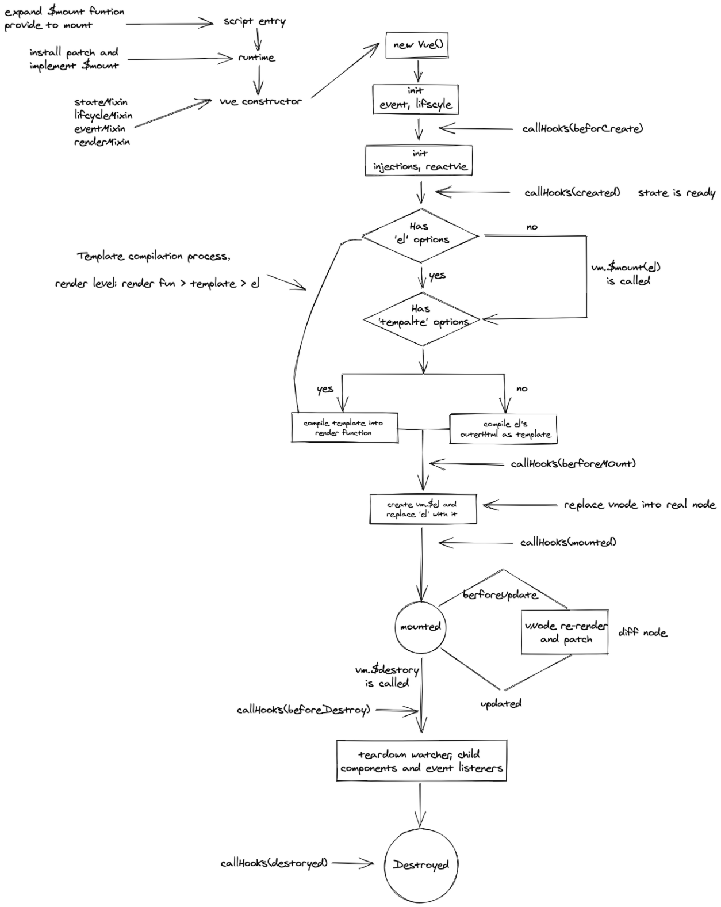
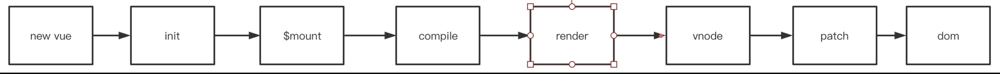
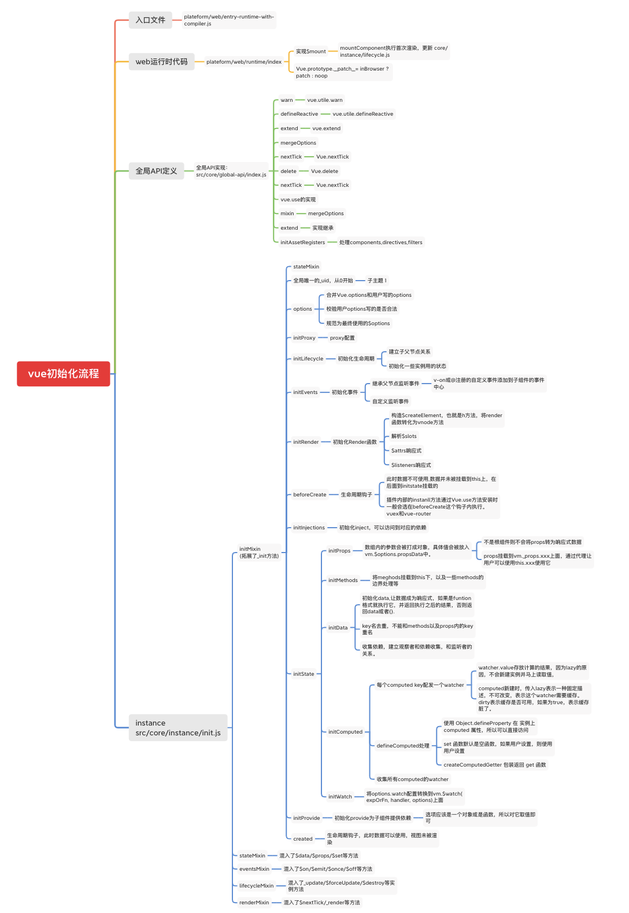
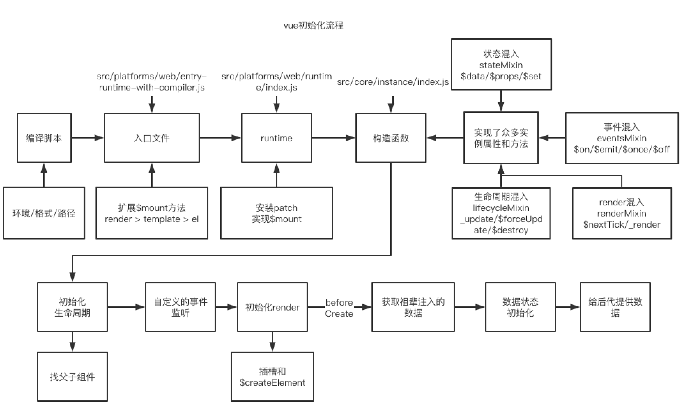
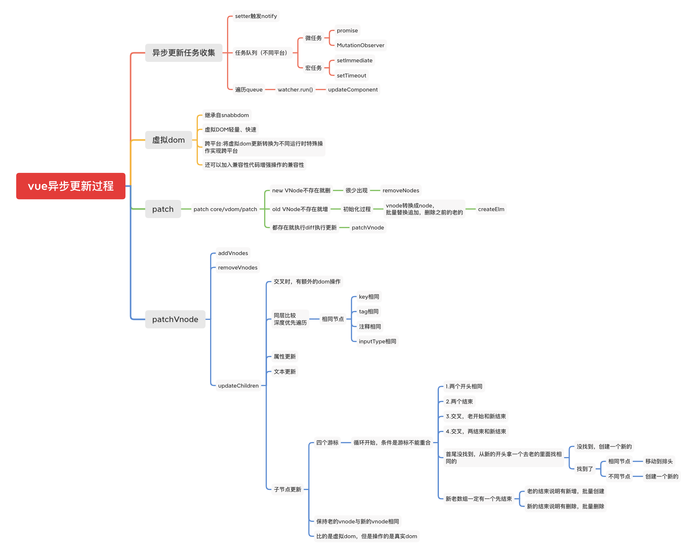
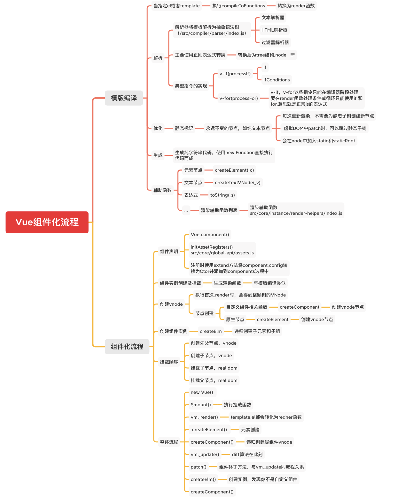
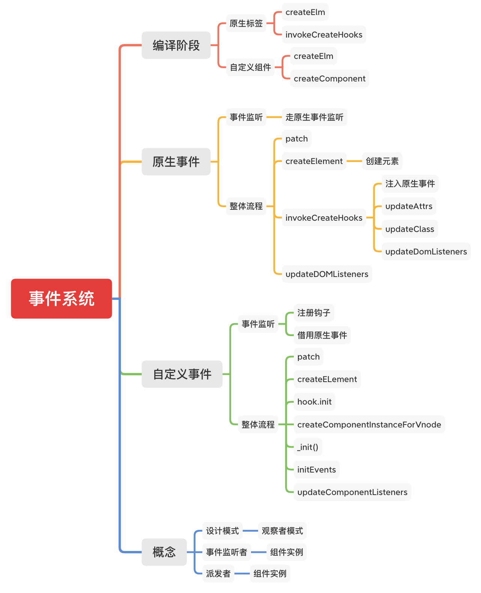
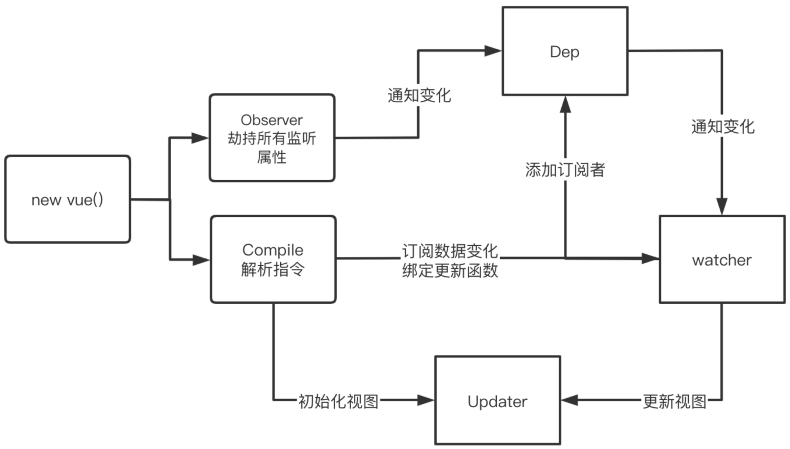
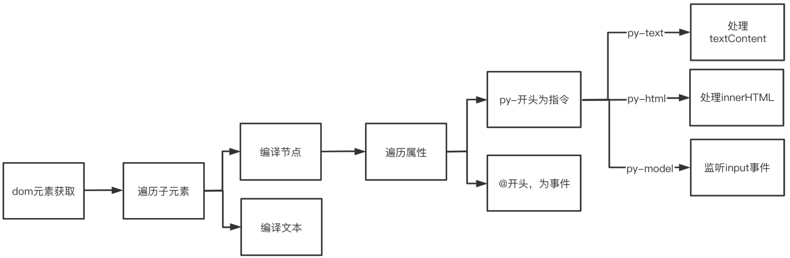
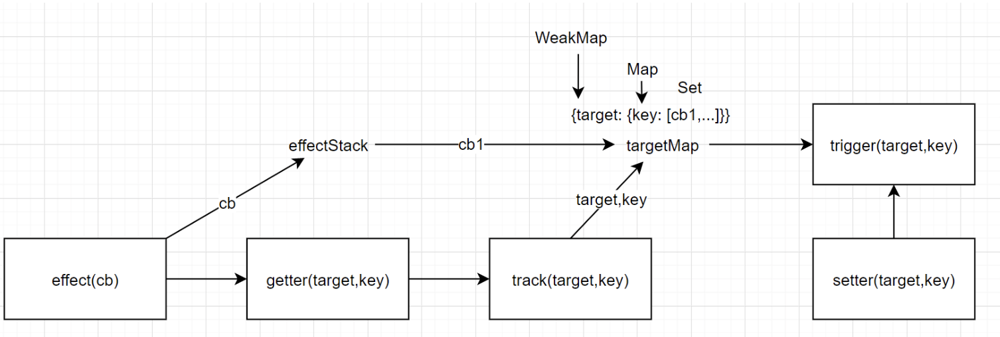

# Vue核心

## 生命周期图

- vue 生命周期



- beforeCreate：执行时组件还未创建，通常用于插件开发中执行一些未初始化任务
- created：组件初始化完毕，各种数据可以使用，常用于异步数据获取
- beforeMounted：未执行渲染，更新，dom未创建
- mounted：初始化结束，dom创建，可用于获取访问数据和dom元素
- beforeUpdate：更新前，可用于获取更新前各种状态
- updated：更新后，所有状态都是最新
- beforeDestory：销毁前，用于定时器或订阅的取消
- destoryed：组件已经销毁

- 运行流程



## 实例化与入口

流程图




源码入口文件，做了初始化工作，`/instance/index`为vue实例, `initGlobalAPI`中为初始化流程。

```js
// src/core/index.js
import Vue from './instance/index'
import { initGlobalAPI } from './global-api/index'
import { isServerRendering } from 'core/util/env'
import { FunctionalRenderContext } from 'core/vdom/create-functional-component'

initGlobalAPI(Vue)

Object.defineProperty(Vue.prototype, '$isServer', {
  get: isServerRendering
})
Object.defineProperty(Vue.prototype, '$ssrContext', {
  get () {
    return this.$vnode && this.$vnode.ssrContext
  }
})
Object.defineProperty(Vue, 'FunctionalRenderContext', {
  value: FunctionalRenderContext
})
Vue.version = '__VERSION__'

export default Vue
```

实例文件中定义了一个 Vue Class，然后调用了一系列的 init、mixin这样的方法来初始化功能，这里导出的就是一个vue的功能类。

```js
// core/instance/index
import { initMixin } from './init'
import { stateMixin } from './state'
import { renderMixin } from './render'
import { eventsMixin } from './events'
import { lifecycleMixin } from './lifecycle'
import { warn } from '../util/index'

function Vue (options) {
  if (process.env.NODE_ENV !== 'production' &&
    !(this instanceof Vue)
  ) {
    warn('Vue is a constructor and should be called with the `new` keyword')
  }
  this._init(options)
}

initMixin(Vue)
stateMixin(Vue)
eventsMixin(Vue)
lifecycleMixin(Vue)
renderMixin(Vue)

export default Vue
```

再来看全局API

```js
export function initGlobalAPI (Vue: GlobalAPI) {
  // config
  const configDef = {}
  configDef.get = () => config
  if (process.env.NODE_ENV !== 'production') {
    configDef.set = () => {
      warn(
        'Do not replace the Vue.config object, set individual fields instead.'
      )
    }
  }
  Object.defineProperty(Vue, 'config', configDef)

  // 这些工具方法不视作全局API的一部分，除非你已经意识到某些风险，否则不要去依赖他们
  Vue.util = {
    warn,
    extend,
    mergeOptions,
    defineReactive
  }
  // 这里定义全局属性
  Vue.set = set
  Vue.delete = del
  Vue.nextTick = nextTick

  Vue.options = Object.create(null)
  ASSET_TYPES.forEach(type => {
    Vue.options[type + 's'] = Object.create(null)
  })
  Vue.options._base = Vue
  extend(Vue.options.components, builtInComponents)

  // 定义全局方法
  initUse(Vue)
  initMixin(Vue)
  initExtend(Vue)
  initAssetRegisters(Vue)
}
```

GlobalAPI 列表

- 【Vue.config】 各种全局配置项
- 【Vue.util】 各种工具函数，还有一些兼容性的标志位
- 【Vue.set/delete】
- 【Vue.nextTick】
- 【Vue.options】
- 【Vue.use】通过initUse方法定义
- 【Vue.mixin】 通过initMixin方法定义
- 【Vue.extend】通过initExtend方法定义

## 初始化与流程

在引入vue的时候有一系列的混入功能，我们先来研究一下 `initMixin` 中发生了什么。

```js
// core/instance/init.js
export function initMixin (Vue: Class<Component>) {
  Vue.prototype._init = function (options?: Object) {
    const vm: Component = this
    vm._uid = uid++

    let startTag, endTag
    if (process.env.NODE_ENV !== 'production' && config.performance && mark) {
      startTag = `vue-perf-start:${vm._uid}`
      endTag = `vue-perf-end:${vm._uid}`
      mark(startTag)
    }

    // 如果是Vue的实例，则不需要被observe
    vm._isVue = true
    // 内部组件的话直接处理
    if (options && options._isComponent) {
      initInternalComponent(vm, options)
    } else {
      // 根组件走mergeOptions
      vm.$options = mergeOptions(
        resolveConstructorOptions(vm.constructor),
        options || {},
        vm
      )
    }

   // 第二步： 初始化组件的代理
    if (process.env.NODE_ENV !== 'production') {
      initProxy(vm)
    } else {
      vm._renderProxy = vm
    }
    
    vm._self = vm
    
    // 第三步： 初始化生命周期
    initLifecycle(vm)

    // 第四步：初始化事件监听
    initEvents(vm)

    // 初始化渲染函数
    initRender(vm)

    // beforeCreate生命周期
    callHook(vm, 'beforeCreate')
    initInjections(vm) // resolve injections before data/props

    // 初始化state
    initState(vm)
    initProvide(vm) // resolve provide after data/props

    // created生命周期
    callHook(vm, 'created')

    // 组件挂载
    if (vm.$options.el) {
      vm.$mount(vm.$options.el)
    }
  }
}
```

mergeOptions的实现,根示例与非根示例走不同的逻辑

```js
export function mergeOptions (
  parent: Object,
  child: Object,
  vm?: Component
): Object {
  //...

  // 统一props格式
  normalizeProps(child)
  // 统一directives的格式
  normalizeDirectives(child)

  // 针对不同的键值，采用不同的merge策略
  const options = {}
  let key
  for (key in parent) {
    mergeField(key)
  }
  for (key in child) {
    if (!hasOwn(parent, key)) {
      mergeField(key)
    }
  }
  function mergeField (key) {
    const strat = strats[key] || defaultStrat
    options[key] = strat(parent[key], child[key], vm, key)
  }
  return options
}
```

options.data经过merge之后，实际上是一个function,在真正调用function才会进行真正的merge,其它的merge都会根据自身特点而又不同的操作.

### renderProxy

`renderProxy` 是后期为render做准备的，一般而言，vm._renderProxy是等于vm的，在非生产环境中，Vue动用了Proxy，也是vue3的核心理念之一。

### initLifecycle

合并完参数之后继续往下走流程，initLifecycle。

```js
export function initLifecycle (vm: Component) {
  const options = vm.$options

  // 这里判断是否存在父示例，如果存在，则通过 while 循环，建立所有组建的父子关系
  let parent = options.parent
  if (parent && !options.abstract) {
    while (parent.$options.abstract && parent.$parent) {
      parent = parent.$parent
    }
    parent.$children.push(vm)
  }

  /**
   * 为组件实例挂载相应属性，并初始化
   */

  vm.$parent = parent
  vm.$root = parent ? parent.$root : vm

  vm.$children = []
  vm.$refs = {}

  vm._watcher = null
  vm._inactive = null
  vm._directInactive = false
  vm._isMounted = false
  vm._isDestroyed = false
  vm._isBeingDestroyed = false
}
```

这边分两步，一步是建立组件的父子关系，另一部分是初始化组件示例。

### initEvents

我们常用的事件`$on, $once,  $off, $emit,` 都在此进行挂载

```js
export function initEvents (vm: Component) {
  vm._events = Object.create(null)
  vm._hasHookEvent = false
  // init parent attached events
  const listeners = vm.$options._parentListeners
  if (listeners) {
    updateComponentListeners(vm, listeners)
  }
}
```

### initRender

initRender挂载了_render私有方法，它用来把实例渲染成一个vNode。初始化一些渲染属性，比如 `$slots` 和 `$createElement` 等。

渲染过程

```js
<div id="app">
  {{ message }}
</div>
```

通过render函数

```js
render: function (createElement) {
  return createElement('div', {
     attrs: {
        id: 'app'
      },
  }, this.message)
}
```

### initInjections 和 initProvide

initInjections 和 initProvide的执行顺序：

```js
initInjections(vm) // resolve injections before data/props
initState(vm)
initProvide(vm) // resolve provide after data/props
```

### initState

这里的主要工作主要是定义的数据进行defineReactive. 主要是 `props` 和 `data`

## 异步更新



## 组件化流程



## 事件系统



## vue2.0 数据响应式

数据响应式过程


- MyVue：框架构造函数
- Observer：执⾏数据响应化（分辨数据是对象还是数组）
- Compile：编译模板，初始化视图，收集依赖（更新函数、watcher创建）
- Watcher：执⾏更新函数（更新dom）
- Dep：依赖，管理多个Watcher，批量更新

### 流程描述

#### 数据劫持

1. 将data做响应式处理,走reactive
2. 递归的对对象做处理
3. 创建依赖对象，每一个key一个依赖对象

#### 代理data

1. 代理data，将data的值映射到vm上

#### 编译过程

1. 指令编译，遍历子元素等
2. 遇到响应式对象，确认update函数，创建wathcer，并将watcher添加到相应key到依赖队列中

#### 响应式处理

1. 修改响应式数据后，触发依赖对象的notify，遍历执行watcher中的更新函数，达到更新效果

### 响应式核心代码

```js
function defineReactive(obj, key, val) {
  // 如果val是对象，需要递归处理之
  observe(val)

  Object.defineProperty(obj, key, {
    get() {
      return val
    },
    set(newVal) {
      if(val !== newVal) {
        // 如果newVal是对象，也要做响应式处理
        observe(newVal)
        val = newVal
      }
    }
  })
}

// 遍历指定数据对象每个key，拦截他们
function observe(obj) {
  if (typeof obj !== 'object' || obj === null) {
    return obj
  }

  Object.keys(obj).forEach(key => {
    defineReactive(obj, key, obj[key])
  })
}
```

```js
// 第一步初始化
class PYVue {
  constructor(options) {
    this.$options = options
    this.$data = options.data
    this.$methods = options.methods

    // 让数据成为响应式的数据，观察者
    observe(this.$data)

    //为$data做代理
    proxy(this, '$data')

    // 编译
    new Compile('#app', this)
  }
}
```

### 数据响应式原理

```js

// 响应式
function defineReactive(obj, key, val) {
  // val是对象还需要递归处理
  observe(val)

  const dep = new Dep()
  
  Object.defineProperty(obj, key, {
    get() {
      // 依赖收集
      Dep.target && dep.addDep(Dep.target)
      return val
    },
    set(newVal) {
      // 如果newVal是对象，也要做响应式处理
      if(val && val != newVal) {
        observe(newVal)
        val = newVal
        dep.notify()
      }
    }
  })
}

function observe(obj) {
  if (typeof obj !== 'object' || obj !== null) {
    return obj
  }
  if (Array.isArray(obj)) {
    obj.__proto__ = arrProto
    const keys = Object.keys(obj)
    for (let i = 0; i < keys.length; i++) {
      observe(obj[i])
    }
  } else {
    new Observe(obj)
  }
}

function proxy(vm, key) {
  Object.keys(obj).forEach(k => {
    Object.defineProperty(vm, k, {
       get() {
        return vm[key][k]
      },
      set(v) {
        vm[key][k] = v
      }
    })
  })
}

class Observe {
  constructor(val) {
    this.val = val
    walk(this)
  }

  // 收集
  walk(obj) {
    Object.keys(obj).forEach(key => {
      defineReactive(obj, key, obj[key])
    })
  }
}
```

### 依赖收集过程


```js
// 监听者
class Watcher {
  constructor(vm ,key, updaterFn) {
    this.vm = vm
    this.key = key
    this.updaterFn = updaterFn

    Dep.target = this
    this.vm[this.key]
    Dep.target = null
  }

  update() {
    this.updaterFn.call(this.vm, this.vm[this.key])
  }
}

// 收集者
class Dep {
  constructor() {
    this.deps = []
  }

  addDep(watcher) {
    this.deps.push(watcher)
  }

  notify() {
    this.deps.forEach(watcher => {
      watcher.update()
    })
  }
}
```

### 模版编译过程



```js
class Compile {
  constructor(el, vm) {
    this.$el = document.querySelector(el)
    this.$vm = vm

    if (this.$el) {
      this.compile(this.$el)
    }
  }

  compile(el) {
    el.childNodes.forEach(node => {
      if (node.nodeType == 1) {
        this.compileElement(node)
      } else if (this.isInter(node)) {
        this.compileText(node)
      }

      if(node.childNodes && node.childNodes.length > 0) {
        this.compile(node)
      }
    })
  }

  isInter(node) {
    return node.nodeType === 3 &&  /\{\{(.*)\}\}/.test(node.textContent)
  }

  compileText(node) {
    this.update(node, RegExp.$1, 'text')
  }

  compileElement(node) {
    const nodeAttrs = node.attributes
    Array.from(nodeAttrs).forEach(attr => {
      const attrName = attr.name
      const exp = attr.value
      if (this.isDirective(attrName)) {
        const dir = attrName.substring(3)
        // 指令实际操作方法
        this[dir] && this[dir](node, exp)
        // 判断是否是事件,
      } else if(this.isEvent(attrName)) {
        const eventName = attrName.split('@')[1]
        node.addEventListener(eventName, () => {
          this.$vm.$methods[exp].bind(this.$vm)(e)
        })
      }
    })
  }

  isEvent(attr) {
    return attr.indexOf('@') === 0
  }

  isDirective(name) {
    return name.indexOf('py-') === 0
  }
  
  // 双向绑定
  model(node, exp) {
    this.update(node, exp, 'model')
    node.addEventListener('input', (e) => {
      this.$vm.$data[exp] = e.target.value
    })
  }

  // 处理事件派发
  modelUpdater(node, val) {
    node.value = val
  }
  
  // k-text对应操作函数
  text(node, exp) {
    this.update(node, exp, 'text')
  }

  textUpdater(node, val) {
    node.textContent = val
  }

  html(node, exp) {
    this.update(node, exp, 'html')
  }

  htmlUpdater(node, val) {
    node.innerHTML = val
  }

  // 更新
  update(node, exp, type) {
    const fn = this[dir + 'Updater']
    fn && fn(node, this.$vm[exp])

    new Watcher(this.$vm, exp, val => {
      fn && fn(node, val)
    })
  }
}
```

## vue3.0数据响应式



### 大致的流程

#### proxy

1. 代理对象，set，get，deleteProperty

#### 副作用

1. 副作用函数执行，执行过程中，先将副作用函数推入一个栈中
2. 执行过程中，如果遇到响应式对象，会触发proxy中的get，get触发track
3. tack过程中，会建立，响应式数据的key与副作用函数的关系，通过WeakMap,Map,Set三级关系
4. weakMap管理的是总的依赖收集对应到traget,Map对应的是target中的key,set对应的是当前key对应的副作用列表，此时就建立了，target.key到effect的连接
5. 副作用函数第一次执行完毕，函数从副作用函数栈中弹出，结束收集过程

#### 副作用触发过程

- 修改响应式数据，触发proxy中的set，set触发trigger，
- trigger获取对象target的depsMap，然后拿到依赖depsMap中key的副作用数组，全部执行一遍

### 核心代码

```js
const isObject = val => val !== null && typeof val === 'object'

function reactive(obj) {
  if (!isObject(obj)) {
    return obj
  }
  // Proxy相当于在对象外层加拦截
  const observed = new Proxy(obj, {
    get(target, key, receiver) {
      // Reflect用于执行对象默认操作，更规范、更友好
      // Proxy和Object的方法Reflect都有对应
      const res = Reflect.get(target, key, receiver)
      console.log(`获取${key}:${res}`)
      // 依赖收集
      track(target, key)
      return isObject(res) ? reactive(res) : res
    },
    set(target, key, value, receiver) {
      const res = Reflect.set(target, key, value, receiver)
      console.log(`设置${key}:${value}`)
      trigger(target, key)
      return res
    },
    deleteProperty(target, key) {
      const res = Reflect.deleteProperty(target, key)
      console.log(`删除${key}:${res}`)
      trigger(target, key)
      return res
    }
  })
  return observed
}

const effectStack = []

function effect(fn) {
  const rxEffect = function() {
    // 1.捕获异常
    try {
      // 2.入栈
      effectStack.push(rxEffect)
      // 3.触发依赖收集
      return fn()
    } finally {
      // 4.出栈
      effectStack.pop()
    }
  }

  rxEffect()

  return rxEffect
}

// 依赖收集，建立target，key和上面的effect函数之间映射关系
// 需要一个数据结构存储该关系
// {target: {key: [cb1, cb2, ...]}}
let targetMap = new WeakMap()
function track(target, key) {
  // 获取effect存入的函数
  const effect = effectStack[effectStack.length - 1]

  if (effect) {
    // 获取target对应Map
    let depsMap = targetMap.get(target)
    if (!depsMap) {
      depsMap = new Map()
      targetMap.set(target, depsMap)
    }
    // 获取depsMap中key和其值，也就是Set
    let deps = depsMap.get(key)
    if (!deps) {
      // 首次deps不存在，创建之
      deps = new Set()
      depsMap.set(key, deps)
    }

    // 将传入effect，添加到Set里面
    deps.add(effect)
    console.log(deps)
  }
}

function trigger(target, key) {
  // 获取映射关系
  const depsMap = targetMap.get(target)
  if (depsMap) {
    // 获取函数集合
    const deps = depsMap.get(key)
    deps.forEach(effect => {
      effect()
    })
  }
}

const state = reactive({
  foo: 'foo',
  bar: { a: 1 }
})

effect(() => {
  console.log('effect:', state.foo)
})

```
