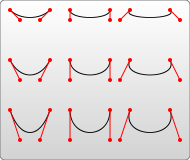

# svg 基础

<script setup>
import CustomComponent from '../components/svg.vue'
</script>

可缩放矢量图形（Scalable Vector Graphics，SVG），是一种用于描述二维的矢量图形。

## 坐标定位

### 网格


计算机绘图都差不多使用网格系统。这种系统以页面的左上角为(0,0)坐标点，坐标以像素为单位，x轴正方向是向右，y轴正方向是向下.

```html
<!-- 定义一个矩形，即从左上角开始，向右延展50px，向下延展50px，形成一个50*50大的矩形。 -->
<svg width="50" height="50">
  <rect width="50" height="50" fill="#42b883" />
</svg>
```

<svg width="50" height="50">

  <rect width="50" height="50" fill="#42b883" />
</svg>

### 像素

基本上，在 SVG 文档中的1个像素对应输出设备（比如显示屏）上的1个像素。SVG也可以定义绝对大小，来实现svg中可缩放的特性。只需给出数字，不标明单位，输出时就会采用用户的单位。

- 定义了一个50*50px的SVG画布，这里1用户单位等同于1屏幕单位。

```html
<svg width="50" height="50">
  <rect width="50%" height="50%" fill="#42b883" />
</svg>
```

<svg width="50" height="50">

  <rect width="100%" height="100%" fill="#42b883" />
</svg>

- 这里定义的画布尺寸是 `100*100px`。但是，`viewBox` 属性定义了画布上可以显示的区域：从(0,0)点开始，`50宽*50` 高的区域。这个`50*50`的区域，会放到`100*100`的画布上显示。于是就形成了放大两倍的效果。

```html
<svg width="100" height="100" viewBox="0 0 50 50">
  <rect width="100%" height="100%" fill="#42b883" />
</svg>
```

<svg width="100" height="100" viewBox="0 0 50 50">

  <rect width="100%" height="100%" fill="#42b883" />
</svg>

## 基本形状

svg 有不同的形状，并且使用不同的属性来定义图形的大小和位置

### 矩形

`rect` 元素会在屏幕上绘制一个矩形 。其6个基本属性就可以控制它在屏幕上的位置和形状。

- x: 矩形左上角的x位置
- y: 矩形左上角的y位置
- width: 矩形的宽度
- height: 矩形的高度
- rx: 圆角的x方位的半径
- ry: 圆角的y方位的半径

```html
<svg width="50" height="50">
  <rect x="10" y="10" width="30" height="30" fill="#42b883"/>
  <rect x="60" y="10" rx="10" ry="10" width="30" height="30" fill="#42b883"/>
</svg>
```
<svg width="100" height="100">

  <rect x="10" y="10" width="30" height="30" fill="#42b883"/>
  <rect x="60" y="10" rx="10" ry="10" width="30" height="30" fill="#42b883"/>
</svg>

### 圆形

`circle` 只有3个属性用来设置圆形。

- r: 圆的半径
- cx: 圆心的x位置
- cy: 圆心的y位置

```html
<svg width="50" height="50">
  <circle cx="25" cy="75" r="20" fill="#42b883"/>
</svg>
```

<svg width="50" height="50">

  <circle cx="25" cy="25" r="25" fill="#42b883"/>
</svg>

### 椭圆

`Ellipse` 是 `circle` 元素更通用的形式,以分别缩放圆的x半径和y半径（通常称之为长轴半径和短轴半径）。

- rx: 椭圆的x半径
- ry: 椭圆的y半径
- cx: 椭圆中心的x位置
- cy: 椭圆中心的y位置

```html
<svg width="50" height="50">
  <ellipse cx="25" cy="25" rx="25" ry="20" fill="#42b883"/>
</svg>
```

<svg width="50" height="50">

  <ellipse cx="25" cy="25" rx="25" ry="20" fill="#42b883"/>
</svg>

### 线条

`Line` 绘制直线。它取两个点的位置作为属性，指定这条线的起点和终点位置。

- x1: 起点的x位置
- y1: 起点的y位置
- x2: 终点的x位置
- y2: 终点的y位置

```html
<svg width="50" height="50">
  <line x1="10" x2="50" y1="110" y2="150" fill="#42b883"/>
</svg>
```

<svg width="50" height="50">

  <line x1="10" x2="50" y1="10" y2="50" stroke="#42b883" stroke-width="5"/>
</svg>

### 折线

`Polyline` 是一组连接在一起的直线。因为它可以有很多的点，折线的的所有点位置都放在一个 `points` 属性中：

```html
<svg width="50" height="50">
  <polyline points="10 10, 10 20, 20 30, 30 20, 50 50" stroke="#42b883" stroke-width="2" fill="transparent"/>
</svg>
```

<svg width="50" height="50">

  <polyline points="10 10, 10 20, 20 30, 30 20, 50 50" stroke="#42b883" stroke-width="2" fill="transparent"/>
</svg>

### 多边形

polygon和折线很像，它们都是由连接一组点集的直线构成。不同的是，polygon的路径在最后一个点处自动回到第一个点。需要注意的是，矩形也是一种多边形，如果需要更多灵活性的话，你也可以用多边形创建一个矩形。

```html
<svg width="50" height="50">
  <polyline points="0 0, 0 50, 50 50, 50 0, 0 0" stroke="#42b883" stroke-width="5" fill="transparent"/>
</svg>

```

<svg width="50" height="50">

  <polyline points="0 0, 0 50, 50 50, 50 0, 0 0" stroke="#42b883" stroke-width="5" fill="transparent"/>
</svg>


## 路径

`path` 可能是 `SVG` 中最强大的基本形状。你可以用 `path` 元素绘制任何形状。另外，path只需要设定很少的点，就可以创建平滑流畅的线条（比如曲线）。`path` 元素的形状是通过属性 `d` 定义的，属性d的值是一个“命令+参数”的序列。

### 直线命令

元素里有5个画直线的命令：

#### M

画笔当前位于一个点，在使用M命令移动画笔后，只会移动画笔，但不会在两点之间画线

```text
M x y 或者 m dx dy
```

#### L & H & V

L命令将会在当前位置和新位置（L前面画笔所在的点）之间画一条线段。L需要两个参数，分别是一个点的x轴和y轴坐标，L命令将会在当前位置和新位置（L前面画笔所在的点）之间画一条线段。

```text
L x y (or l dx dy)
```

另外还有两个简写命令，用来绘制水平线和垂直线。H，绘制水平线。V，绘制垂直线。这两个命令都只带一个参数，标明在x轴或y轴移动到的位置，因为它们都只在坐标轴的一个方向上移动。

```text
H x (or h dx)
V y (or v dy)
```

```html
<!-- 从 10，10开始，绘制一条 到50的水平线，再绘制一条到50的垂直线，再绘制一条到10的水平线，最后z命令图形绘制回到起点 -->
<svg width="60" height="60">
  <path d="M10 50 H 90 V 50 H 10 Z" fill="transparent" stroke="#42b883"/>
</svg>
```

<svg width="60" height="60">

  <path d="M10 10 H 50 V 50 H 10 Z" fill="transparent" stroke="#42b883"/>
</svg>

### 曲线命令

绘制平滑曲线的命令有三个，其中两个用来绘制贝塞尔曲线，另外一个用来绘制弧形或者说是圆的一部分。

三次贝塞尔曲线需要定义一个点和两个控制点，所以用C命令创建三次贝塞尔曲线，需要设置三组坐标参数：

#### C命令

```text
C x1 y1, x2 y2, x y (or c dx1 dy1, dx2 dy2, dx dy)
```

这里的最后一个坐标(x,y)表示的是曲线的终点，另外两个坐标是控制点，(x1,y1)是起点的控制点，(x2,y2)是终点的控制点。如果你熟悉代数或者微积分的话，会更容易理解控制点，控制点描述的是曲线起始点的斜率，曲线上各个点的斜率，是从起点斜率到终点斜率的渐变过程.



```html
<svg width="190px" height="160px" version="1.1" xmlns="http://www.w3.org/2000/svg">
  <path d="M10 10 C 20 20, 40 20, 50 10" stroke="black" fill="transparent"/>
  <path d="M70 10 C 70 20, 120 20, 120 10" stroke="black" fill="transparent"/>
  <path d="M130 10 C 120 20, 180 20, 170 10" stroke="black" fill="transparent"/>
  <path d="M10 60 C 20 80, 40 80, 50 60" stroke="black" fill="transparent"/>
  <path d="M70 60 C 70 80, 110 80, 110 60" stroke="black" fill="transparent"/>
  <path d="M130 60 C 120 80, 180 80, 170 60" stroke="black" fill="transparent"/>
  <path d="M10 110 C 20 140, 40 140, 50 110" stroke="black" fill="transparent"/>
  <path d="M70 110 C 70 140, 110 140, 110 110" stroke="black" fill="transparent"/>
  <path d="M130 110 C 120 140, 180 140, 170 110" stroke="black" fill="transparent"/>
</svg>
```

<svg width="190px" height="160px" version="1.1" xmlns="http://www.w3.org/2000/svg">

  <path d="M10 10 C 20 20, 40 20, 50 10" stroke="black" fill="transparent"/>
  <path d="M70 10 C 70 20, 120 20, 120 10" stroke="black" fill="transparent"/>
  <path d="M130 10 C 120 20, 180 20, 170 10" stroke="black" fill="transparent"/>
  <path d="M10 60 C 20 80, 40 80, 50 60" stroke="black" fill="transparent"/>
  <path d="M70 60 C 70 80, 110 80, 110 60" stroke="black" fill="transparent"/>
  <path d="M130 60 C 120 80, 180 80, 170 60" stroke="black" fill="transparent"/>
  <path d="M10 110 C 20 140, 40 140, 50 110" stroke="black" fill="transparent"/>
  <path d="M70 110 C 70 140, 110 140, 110 110" stroke="black" fill="transparent"/>
  <path d="M130 110 C 120 140, 180 140, 170 110" stroke="black" fill="transparent"/>

</svg>

#### S

S命令可以用来创建与前面一样的贝塞尔曲线，但是，如果S命令跟在一个C或S命令后面，则它的第一个控制点会被假设成前一个命令曲线的第二个控制点的中心对称点。果S命令单独使用，前面没有C或S命令，那当前点将作为第一个控制点。相当于C的快捷命令。

```html
<svg width="190px" height="160px" version="1.1" xmlns="http://www.w3.org/2000/svg">
  <path d="M10 80 C 40 10, 65 10, 95 80 S 150 150, 180 80" stroke="black" fill="transparent"/>
</svg>
```

<svg width="190px" height="160px" version="1.1" xmlns="http://www.w3.org/2000/svg">
  <path d="M10 80 C 40 10, 65 10, 95 80 S 150 150, 180 80" stroke="black" fill="transparent"/>
</svg>

### Q

二次贝塞尔曲线Q，它比三次贝塞尔曲线简单，只需要一个控制点，用来确定起点和终点的曲线斜率。因此它需要两组参数，控制点和终点坐标。

```html
<svg width="190px" height="160px" version="1.1" xmlns="http://www.w3.org/2000/svg">
  <path d="M10 80 Q 95 10 180 80" stroke="black" fill="transparent"/>
</svg>
```

<svg width="190px" height="160px" version="1.1" xmlns="http://www.w3.org/2000/svg">
  <path d="M10 80 Q 95 10 180 80" stroke="black" fill="transparent"/>
</svg>

### T

快捷命令T会通过前一个控制点，推断出一个新的控制点。在你的第一个控制点后面，可以只定义终点，就创建出一个相当复杂的曲线。需要注意的是，T命令前面必须是一个Q命令，或者是另一个T命令，才能达到这种效果。
如果T单独使用，那么控制点就会被认为和终点是同一个点，所以画出来的将是一条直线。

```html
<svg width="190px" height="160px" version="1.1" xmlns="http://www.w3.org/2000/svg">
  <path d="M10 80 Q 52.5 10, 95 80 T 180 80" stroke="black" fill="transparent"/>
</svg>
```

<svg width="190px" height="160px" version="1.1" xmlns="http://www.w3.org/2000/svg">
  <path d="M10 80 Q 52.5 10, 95 80 T 180 80" stroke="black" fill="transparent"/>
</svg>

## Fill 和 Stroke 属性

大多数基本的涂色可以通过在元素上设置两个属性来搞定：fill属性和stroke属性。

- fill属性设置对象内部的颜色
- stroke属性设置绘制对象的线条的颜色

## 渐变

## Patterns 图案

## Texts 文字